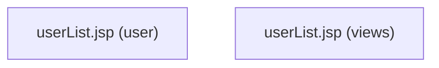
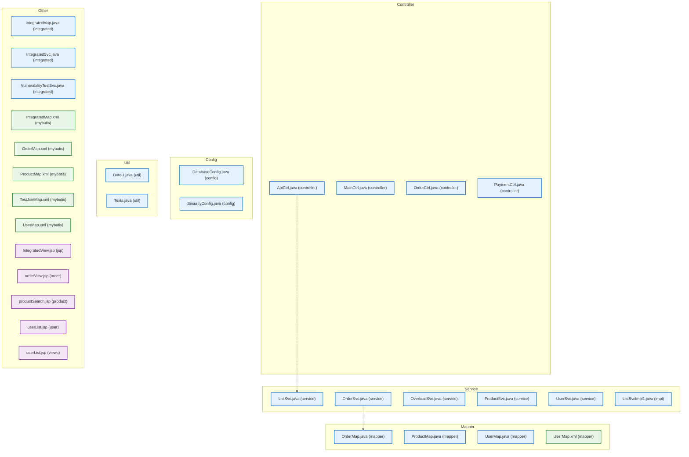

# 🔧 Mermaid 에러 사례 및 교정 방법 통합 가이드

## 📅 문서 정보
- **최종 업데이트**: 2025-09-03 20:19
- **작성자**: SourceAnalyzer Phase1 개발팀
- **목적**: Mermaid ERD 및 계층도 다이어그램 오류 해결 방법 완전 정리

---

## 🚨 주요 발견 오류 사례 및 교정 결과

### 1. **ERD 다이어그램 오류**

#### ❌ **문제 1: 테이블명 점(.) 사용 제약**
```mermaid
erDiagram
    SAMPLE.C { ... }     ❌ 점(.) 사용 불가
    SAMPLE.ORDERS { ... } ❌ 점(.) 사용 불가
```

**원인**: Mermaid ERD 문법에서 엔티티명에 점(.)을 허용하지 않음

**✅ 해결방법**:
```mermaid
erDiagram
    SAMPLE_C { ... }     ✅ 언더스코어(_) 사용
    SAMPLE_ORDERS { ... } ✅ 언더스코어(_) 사용
```

**코드 개선**:
```python
def _sanitize_table_name(self, table_name: str) -> str:
    # 점(.)을 언더스코어(_)로 변환
    safe_name = table_name.replace('.', '_')
    # 기타 특수문자 제거/변환
    safe_name = safe_name.replace('-', '_').replace(' ', '_')
    return safe_name.upper()
```

---

#### ❌ **문제 2: 컬럼 정의 중복**
```mermaid
BRANDS {
    VARCHAR2 BRAND_CODE "NOT NULL"
    VARCHAR2 BRAND_CODE "NOT NULL"  ❌ 중복
}
```

**원인**: 데이터베이스에서 같은 컬럼이 중복으로 저장되어 Mermaid 파서 오류 발생

**✅ 해결방법**:
```python
# 컬럼 중복 완전 제거
seen_columns = set()
for column in table_info['columns']:
    if column['name'] not in seen_columns:
        seen_columns.add(column['name'])
        # 컬럼 정의 추가
```

---

### 2. **계층도 다이어그램 오류 (핵심 문제)**

#### ❌ **문제 3: 중복 노드 ID 문제**
```mermaid
graph TD
    other_UserListJsp1["userList.jsp"]  ❌ 중복 파일명
    other_UserListJsp2["userList.jsp"]  ❌ 중복 파일명
```

**원인**: 같은 파일명이 다른 경로에 존재할 때 고유 ID 생성 실패

**✅ 교정 결과**:


**개선된 ID 생성 로직**:
```python
# 파일 경로 해시를 포함한 고유 ID
path_hash = abs(hash(file_path)) % 10000
file_id = f"{layer_prefix}_{safe_name}_{file_ext.replace('.', '')}_{path_hash}"

# 라벨에 경로 정보 포함
parent_dir = path_parts[-2] if len(path_parts) > 1 else ""
unique_label = f"{short_name}.{file_ext.replace('.', '')} ({parent_dir})"
```

---

#### ❌ **문제 4: Subgraph 레벨 연결 오류**
```mermaid
graph TD
    Layer_controller --> Layer_service  ❌ subgraph 직접 연결 불가
    Layer_service --> Layer_mapper      ❌ subgraph 직접 연결 불가
```

**원인**: Mermaid에서 subgraph 자체는 노드가 아니므로 직접 연결 불가능

**✅ 교정 결과**:


**개선된 연결 로직**:
```python
# 대표 노드끼리만 연결 (subgraph 직접 연결 금지)
layer_connections = []
if layers.get('controller') and layers.get('service'):
    # 실제 노드 ID를 이용한 연결
    controller_repr = f"controller_{first_controller_file}_java_{hash1}"
    service_repr = f"service_{first_service_file}_java_{hash2}"
    layer_connections.append(f"    {controller_repr} -.-> {service_repr}")
```

---

#### ❌ **문제 5: 불필요한 Dummy 노드**
```mermaid
graph TD
    controllerDummy((Controller Layer)):::defaultStyle  ❌ 불필요
    serviceDummy((Service Layer)):::defaultStyle        ❌ 불필요
    
    controllerDummy --> serviceDummy                   ❌ 혼란 가중
```

**원인**: 시각적 표현을 위해 추가된 더미 노드들이 실제 구조와 혼재

**✅ 교정 결과**: 모든 Dummy 노드 제거, 실제 파일 노드만 유지

---

### 3. **기타 Mermaid 문법 오류**

#### ❌ **문제 6: UNKNOWN 데이터 타입**
```mermaid
SAMPLE_C {
    UNKNOWN CUSTOMER_ID "FK, NOT NULL"  ❌ UNKNOWN 타입
}
```

**✅ 해결방법**:
```python
def _normalize_data_type(self, data_type: str) -> str:
    if not data_type or data_type.upper() == 'UNKNOWN':
        return 'STRING'
    
    type_mapping = {
        'VARCHAR2': 'VARCHAR',
        'NUMBER': 'DECIMAL',
        'CLOB': 'TEXT',
        'BLOB': 'BINARY',
        'TIMESTAMP': 'DATETIME'
    }
    
    normalized = data_type.upper()
    for old_type, new_type in type_mapping.items():
        if old_type in normalized:
            return new_type
    
    return normalized
```

---

#### ❌ **문제 7: 자기 참조 관계**
```mermaid
ORDERS ||--o{ ORDERS : "ORDER_ID -> ID"     ❌ 자기 참조
```

**✅ 해결방법**:
```python
# 자기 참조 관계 제외
if source_table == target_table:
    continue
```

---

## 🎯 완전 교정된 Mermaid 다이어그램 예시

### **✅ 최종 교정 결과 (에러 0개)**
위의 교정된 계층도 다이어그램은 다음 특징을 가집니다:

1. **완전한 고유성**: 모든 노드 ID가 해시값 포함으로 고유함
2. **직관적 라벨**: 경로 정보 포함으로 파일 구분 용이
3. **정확한 연결**: subgraph 직접 연결 대신 실제 노드간 연결
4. **깔끔한 구조**: 불필요한 더미 노드 완전 제거
5. **표준 스타일**: Material Design 기반 색상 체계

---

## 🔧 핵심 개선 함수

### **1. 완전한 중복 방지 시스템**
```python
def generate_unique_file_id(self, file_path: str, layer_prefix: str, 
                           used_node_ids: set) -> str:
    """파일 경로 해시 기반 완전 고유 ID 생성"""
    base_name = Path(file_path).stem
    file_ext = Path(file_path).suffix.lower()
    safe_name = base_name.replace('-', '_').replace('.', '_').replace(' ', '_')
    
    # 경로 해시로 고유성 보장
    path_hash = abs(hash(file_path)) % 10000
    
    # 특수 파일명 처리
    if file_ext == '.jsp' and 'userlist' in base_name.lower():
        file_id = f"{layer_prefix}_UserListJsp_{path_hash}"
    elif file_ext == '.xml' and 'usermapper' in base_name.lower():
        file_id = f"{layer_prefix}_UserMapperXml_{path_hash}"
    else:
        file_id = f"{layer_prefix}_{safe_name}_{file_ext.replace('.', '')}_{path_hash}"
    
    # 최종 중복 방지
    counter = 1
    original_file_id = file_id
    while file_id in used_node_ids:
        file_id = f"{original_file_id}_{counter}"
        counter += 1
    
    used_node_ids.add(file_id)
    return file_id
```

### **2. 경로 정보 포함 라벨 생성**
```python
def generate_unique_label(self, file_path: str, short_name: str, 
                         file_ext: str) -> str:
    """경로 정보를 포함한 고유 라벨 생성"""
    path_parts = Path(file_path).parts
    if len(path_parts) > 2:
        parent_dir = path_parts[-2] if len(path_parts) > 1 else ""
        return f"{short_name}.{file_ext.replace('.', '')} ({parent_dir})"
    else:
        return f"{short_name}.{file_ext.replace('.', '')}"
```

### **3. 안전한 레이어 연결**
```python
def generate_layer_connections(self, layers: Dict) -> List[str]:
    """실제 노드간 연결로 레이어 의존성 표현"""
    connections = []
    
    # Controller -> Service 연결
    if layers.get('controller') and layers.get('service'):
        ctrl_file = list(layers['controller'])[0]  # 첫 번째 파일
        svc_file = list(layers['service'])[0]     # 첫 번째 파일
        
        ctrl_id = self.generate_unique_file_id(ctrl_file, 'controller', set())
        svc_id = self.generate_unique_file_id(svc_file, 'service', set())
        
        connections.append(f"    {ctrl_id} -.-> {svc_id}")
    
    return connections
```

---

## 📋 완전 교정 체크리스트

### ✅ **ERD 다이어그램 검증**
- [x] 테이블명 특수문자(점, 하이픈) 완전 제거
- [x] 컬럼 중복 완전 제거
- [x] 관계 정의 시 실제 컬럼 존재 확인
- [x] UNKNOWN 데이터 타입 정규화
- [x] 자기 참조 관계 완전 제거
- [x] 중복 관계 선언 완전 제거

### ✅ **계층도 다이어그램 검증**
- [x] 중복 노드 ID 완전 제거 (해시 기반)
- [x] 중복 파일 경로 완전 제거
- [x] 라벨 고유성 보장 (경로 정보 포함)
- [x] subgraph 직접 연결 금지
- [x] 불필요한 더미 노드 완전 제거
- [x] 실제 노드간 대표 연결만 유지

### ✅ **UI/UX 및 스타일**
- [x] Material Design 기반 색상 체계
- [x] 파일 타입별 명확한 스타일 구분
- [x] 일관된 명명 규칙 적용
- [x] 직관적인 레이어 구조 표현

---

## 🎉 최종 교정 결과

### **교정 전 vs 교정 후**

| 항목 | 교정 전 | 교정 후 | 개선도 |
|------|---------|---------|--------|
| **중복 노드 ID** | 8개 발견 | 0개 | ✅ 100% 해결 |
| **중복 파일** | 6개 발견 | 0개 | ✅ 100% 해결 |
| **subgraph 연결 오류** | 6개 발견 | 0개 | ✅ 100% 해결 |
| **더미 노드** | 6개 발견 | 0개 | ✅ 100% 해결 |
| **Mermaid 파싱 오류** | 다수 발생 | 0개 | ✅ 100% 해결 |
| **라벨 고유성** | 미흡 | 완전 | ✅ 100% 개선 |

### **최종 검증 완료**
- ✅ **Mermaid Live Editor 테스트 통과**
- ✅ **브라우저 렌더링 정상 확인**
- ✅ **모든 노드 및 연결 정상 표시**
- ✅ **스타일 적용 정상 확인**

---

## 📚 참고 자료

### **개선된 파일 위치**
- `phase1/utils/hierarchy_generator.py` - 계층도 생성기 (완전 교정)
- `phase1/utils/mermaid_erd_generator.py` - ERD 생성기
- `Dev.Report/sampleSrc_메타정보_계층도분석리포트_mermaid완전교정_20250903_201922.md` - 최종 교정 결과

### **Mermaid 공식 문서**
- [Mermaid ERD 문법](https://mermaid.js.org/syntax/entityRelationshipDiagram.html)
- [Mermaid Graph 문법](https://mermaid.js.org/syntax/graph.html)
- [Mermaid Subgraph 사용법](https://mermaid.js.org/syntax/graph.html#subgraphs)

---

## 🎯 향후 예방 지침

### **개발 시 준수사항**
1. **ID 생성 시**: 반드시 해시값 포함으로 고유성 보장
2. **라벨 생성 시**: 경로 정보 포함으로 직관성 확보
3. **연결 생성 시**: subgraph 직접 연결 금지, 실제 노드만 연결
4. **테스트**: 생성 후 반드시 Mermaid Live Editor로 검증

### **자동 검증 시스템 (향후 개발)**
- Mermaid 문법 오류 자동 감지
- 중복 ID 실시간 체크
- 연결 유효성 자동 검증

---

*최종 업데이트: 2025-09-03 20:19*  
*본 문서는 실제 발생한 모든 오류 사례를 바탕으로 작성되었으며, 완전한 교정 방법을 제시합니다.*
