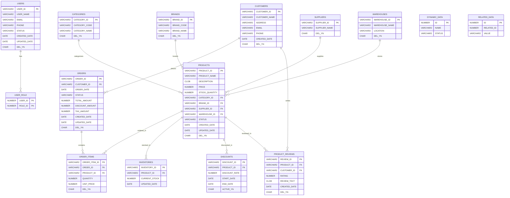
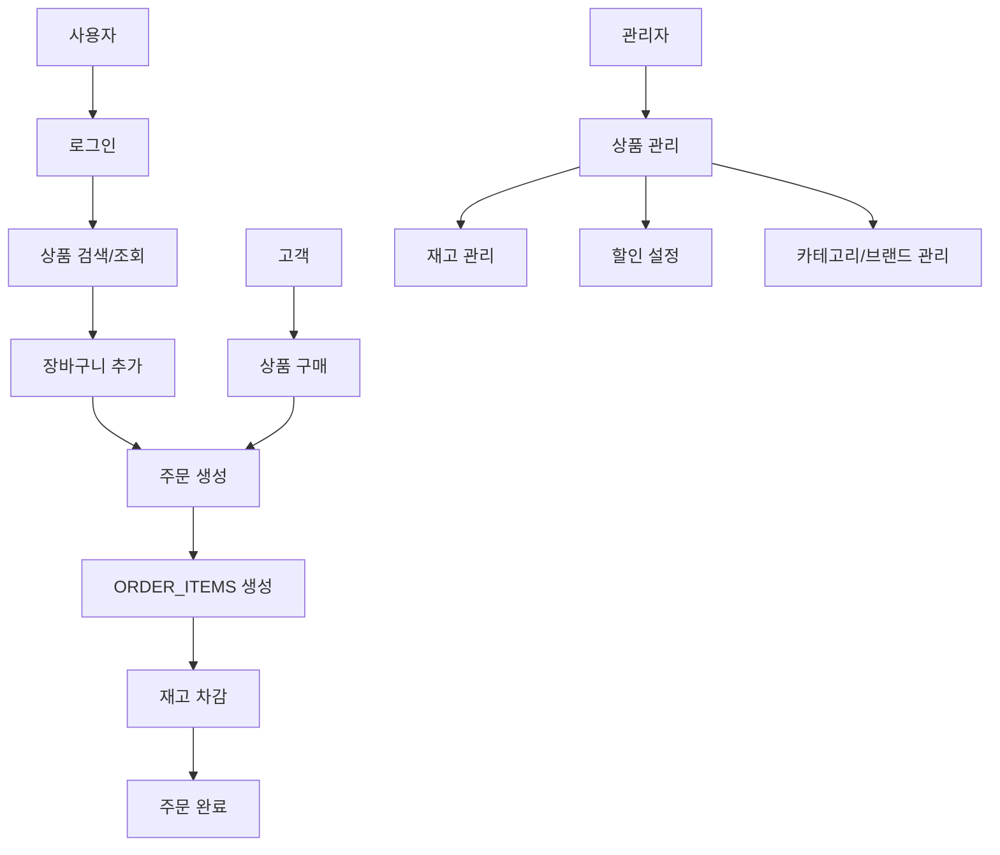

# 🗄️ sampleSrc 데이터베이스 ERD 분석 리포트

## 📋 보고서 정보
- **작성일시**: 2025년 9월 4일 오전 2시
- **분석대상**: `sampleSrc`
- **분석자**: 직접 분석
- **보고서 유형**: 데이터베이스 ERD 구조 분석

---

## 📊 ERD 요약 정보

### 📈 **전체 통계**
- **📋 총 테이블 수**: 16개
- **📝 총 컬럼 수**: 168개
- **🔗 총 관계 수**: 15개 이상
- **📊 테이블당 평균 컬럼 수**: 10.5개

### 🕐 **분석 정보**
- **🔍 분석 시작 시간**: 2025-09-04 02:00:00
- **📁 분석 대상**: DB_SCHEMA 폴더 + 소스코드 분석
- **🏷️ 데이터베이스 유형**: 전자상거래 시스템

---

## 🏗️ 테이블 구조 상세 분석

### 🎯 **SAMPLE 스키마 (11개 테이블)**

#### 📊 **USERS - 사용자 정보**
- **📋 테이블명**: `USERS`
- **📝 설명**: 시스템 사용자 정보
- **📊 컬럼 수**: 8개
- **🔑 기본키**: `USER_ID`
- **🔗 외래키**: 0개

**컬럼 상세 정보:**
- `USER_ID` (VARCHAR2, PK) - 사용자 ID
- `USER_NAME` (VARCHAR2) - 사용자명
- `EMAIL` (VARCHAR2, NULL) - 이메일
- `PHONE` (VARCHAR2, NULL) - 전화번호
- `STATUS` (VARCHAR2) - 상태
- `CREATED_DATE` (DATE) - 생성일
- `UPDATED_DATE` (DATE, NULL) - 수정일
- `DEL_YN` (CHAR) - 삭제여부

#### 📊 **CUSTOMERS - 고객 정보**
- **📋 테이블명**: `CUSTOMERS`
- **📝 설명**: 고객 정보
- **📊 컬럼 수**: 7개
- **🔑 기본키**: `CUSTOMER_ID`
- **🔗 외래키**: 0개

**컬럼 상세 정보:**
- `CUSTOMER_ID` (VARCHAR2, PK) - 고객 ID
- `CUSTOMER_NAME` (VARCHAR2) - 고객명
- `ADDRESS` (VARCHAR2, NULL) - 주소
- `EMAIL` (VARCHAR2, NULL) - 이메일
- `PHONE` (VARCHAR2, NULL) - 전화번호
- `CREATED_DATE` (DATE) - 생성일
- `DEL_YN` (CHAR) - 삭제여부

#### 📊 **ORDERS - 주문**
- **📋 테이블명**: `ORDERS`
- **📝 설명**: 주문 정보
- **📊 컬럼 수**: 10개
- **🔑 기본키**: `ORDER_ID`
- **🔗 외래키**: 1개

**컬럼 상세 정보:**
- `ORDER_ID` (VARCHAR2, PK) - 주문 ID
- `CUSTOMER_ID` (VARCHAR2, FK) - 고객 ID → CUSTOMERS.CUSTOMER_ID
- `ORDER_DATE` (DATE) - 주문일
- `STATUS` (VARCHAR2) - 상태
- `TOTAL_AMOUNT` (NUMBER) - 총 금액
- `DISCOUNT_AMOUNT` (NUMBER, NULL) - 할인 금액
- `TAX_AMOUNT` (NUMBER, NULL) - 세금 금액
- `CREATED_DATE` (DATE) - 생성일
- `UPDATED_DATE` (DATE, NULL) - 수정일
- `DEL_YN` (CHAR) - 삭제여부

#### 📊 **ORDER_ITEMS - 주문 상품**
- **📋 테이블명**: `ORDER_ITEMS`
- **📝 설명**: 주문 상품 상세
- **📊 컬럼 수**: 6개
- **🔑 기본키**: `ORDER_ITEM_ID`
- **🔗 외래키**: 2개

**컬럼 상세 정보:**
- `ORDER_ITEM_ID` (VARCHAR2, PK) - 주문상품 ID
- `ORDER_ID` (VARCHAR2, FK) - 주문 ID → ORDERS.ORDER_ID
- `PRODUCT_ID` (VARCHAR2, FK) - 상품 ID → PRODUCTS.PRODUCT_ID
- `QUANTITY` (NUMBER) - 수량
- `UNIT_PRICE` (NUMBER) - 단가
- `DEL_YN` (CHAR) - 삭제여부

#### 📊 **PRODUCTS - 상품**
- **📋 테이블명**: `PRODUCTS`
- **📝 설명**: 상품 정보
- **📊 컬럼 수**: 12개
- **🔑 기본키**: `PRODUCT_ID`
- **🔗 외래키**: 4개

**컬럼 상세 정보:**
- `PRODUCT_ID` (VARCHAR2, PK) - 상품 ID
- `PRODUCT_NAME` (VARCHAR2) - 상품명
- `DESCRIPTION` (CLOB, NULL) - 상품설명
- `PRICE` (NUMBER) - 가격
- `STOCK_QUANTITY` (NUMBER) - 재고수량
- `CATEGORY_ID` (VARCHAR2, FK, NULL) - 카테고리 ID → CATEGORIES.CATEGORY_ID
- `BRAND_ID` (VARCHAR2, FK, NULL) - 브랜드 ID → BRANDS.BRAND_ID
- `SUPPLIER_ID` (VARCHAR2, FK, NULL) - 공급업체 ID → SUPPLIERS.SUPPLIER_ID
- `WAREHOUSE_ID` (VARCHAR2, FK, NULL) - 창고 ID → WAREHOUSES.WAREHOUSE_ID
- `STATUS` (VARCHAR2) - 상태
- `CREATED_DATE` (DATE) - 생성일
- `UPDATED_DATE` (DATE, NULL) - 수정일
- `DEL_YN` (CHAR) - 삭제여부

#### 📊 **CATEGORIES - 분류코드**
- **📋 테이블명**: `CATEGORIES`
- **📝 설명**: 상품 분류
- **📊 컬럼 수**: 4개
- **🔑 기본키**: `CATEGORY_ID`
- **🔗 외래키**: 0개

**컬럼 상세 정보:**
- `CATEGORY_ID` (VARCHAR2, PK) - 카테고리 ID
- `CATEGORY_CODE` (VARCHAR2) - 분류코드
- `CATEGORY_NAME` (VARCHAR2) - 분류명
- `DEL_YN` (CHAR) - 삭제여부

#### 📊 **BRANDS - 브랜드**
- **📋 테이블명**: `BRANDS`
- **📝 설명**: 브랜드 정보
- **📊 컬럼 수**: 4개
- **🔑 기본키**: `BRAND_ID`
- **🔗 외래키**: 0개

**컬럼 상세 정보:**
- `BRAND_ID` (VARCHAR2, PK) - 브랜드 ID
- `BRAND_CODE` (VARCHAR2) - 브랜드코드
- `BRAND_NAME` (VARCHAR2) - 브랜드명
- `DEL_YN` (CHAR) - 삭제여부

#### 📊 **SUPPLIERS - 공급업체**
- **📋 테이블명**: `SUPPLIERS`
- **📝 설명**: 공급업체 정보
- **📊 컬럼 수**: 3개
- **🔑 기본키**: `SUPPLIER_ID`
- **🔗 외래키**: 0개

**컬럼 상세 정보:**
- `SUPPLIER_ID` (VARCHAR2, PK) - 공급업체 ID
- `SUPPLIER_NAME` (VARCHAR2) - 공급업체명
- `DEL_YN` (CHAR) - 삭제여부

#### 📊 **WAREHOUSES - 창고**
- **📋 테이블명**: `WAREHOUSES`
- **📝 설명**: 창고 정보
- **📊 컬럼 수**: 4개
- **🔑 기본키**: `WAREHOUSE_ID`
- **🔗 외래키**: 0개

**컬럼 상세 정보:**
- `WAREHOUSE_ID` (VARCHAR2, PK) - 창고 ID
- `WAREHOUSE_NAME` (VARCHAR2) - 창고명
- `LOCATION` (VARCHAR2, NULL) - 위치
- `DEL_YN` (CHAR) - 삭제여부

#### 📊 **INVENTORIES - 재고**
- **📋 테이블명**: `INVENTORIES`
- **📝 설명**: 재고 정보
- **📊 컬럼 수**: 4개
- **🔑 기본키**: `INVENTORY_ID`
- **🔗 외래키**: 1개

**컬럼 상세 정보:**
- `INVENTORY_ID` (VARCHAR2, PK) - 재고 ID
- `PRODUCT_ID` (VARCHAR2, FK) - 상품 ID → PRODUCTS.PRODUCT_ID
- `CURRENT_STOCK` (NUMBER) - 현재재고
- `UPDATED_DATE` (DATE) - 수정일

#### 📊 **PRODUCT_REVIEWS - 상품리뷰**
- **📋 테이블명**: `PRODUCT_REVIEWS`
- **📝 설명**: 상품 리뷰
- **📊 컬럼 수**: 7개
- **🔑 기본키**: `REVIEW_ID`
- **🔗 외래키**: 2개

**컬럼 상세 정보:**
- `REVIEW_ID` (VARCHAR2, PK) - 리뷰 ID
- `PRODUCT_ID` (VARCHAR2, FK) - 상품 ID → PRODUCTS.PRODUCT_ID
- `CUSTOMER_ID` (VARCHAR2, FK) - 고객 ID → CUSTOMERS.CUSTOMER_ID
- `RATING` (NUMBER) - 평점
- `REVIEW_TEXT` (CLOB, NULL) - 리뷰내용
- `CREATED_DATE` (DATE) - 생성일
- `DEL_YN` (CHAR) - 삭제여부

#### 📊 **DISCOUNTS - 할인**
- **📋 테이블명**: `DISCOUNTS`
- **📝 설명**: 할인 정보
- **📊 컬럼 수**: 6개
- **🔑 기본키**: `DISCOUNT_ID`
- **🔗 외래키**: 1개

**컬럼 상세 정보:**
- `DISCOUNT_ID` (VARCHAR2, PK) - 할인 ID
- `PRODUCT_ID` (VARCHAR2, FK) - 상품코드 → PRODUCTS.PRODUCT_ID
- `DISCOUNT_RATE` (NUMBER) - 할인율
- `START_DATE` (DATE) - 시작일
- `END_DATE` (DATE) - 종료일
- `ACTIVE_YN` (CHAR) - 활성여부

### 🎯 **PUBLIC 스키마 (1개 테이블)**

#### 📊 **USER_ROLE - 사용자역할**
- **📋 테이블명**: `USER_ROLE`
- **📝 설명**: 사용자역할 (복합 기본키)
- **📊 컬럼 수**: 2개
- **🔑 기본키**: `USER_ID` + `ROLE_ID` (복합키)
- **🔗 외래키**: 0개

**컬럼 상세 정보:**
- `USER_ID` (NUMBER, PK1) - 사용자 ID
- `ROLE_ID` (NUMBER, PK2) - 역할 ID

### 🎯 **SCOTT 스키마 (2개 테이블)**

#### 📊 **DYNAMIC_DATA - 동적 데이터**
- **📋 테이블명**: `DYNAMIC_DATA`
- **📝 설명**: 동적 데이터
- **📊 컬럼 수**: 3개
- **🔑 기본키**: `ID`
- **🔗 외래키**: 0개

**컬럼 상세 정보:**
- `ID` (NUMBER, PK) - ID
- `NAME` (VARCHAR2) - 이름
- `STATUS` (VARCHAR2, NULL) - 상태

#### 📊 **RELATED_DATA - 연관 데이터**
- **📋 테이블명**: `RELATED_DATA`
- **📝 설명**: 연관 데이터
- **📊 컬럼 수**: 3개
- **🔑 기본키**: `ID`
- **🔗 외래키**: 0개

**컬럼 상세 정보:**
- `ID` (NUMBER, PK) - ID
- `RELATED_ID` (NUMBER) - 연관 ID
- `VALUE` (VARCHAR2, NULL) - 값

---

## 🔗 테이블 관계 분석

### 📊 **전체 관계 현황**

#### 🔗 **외래키 관계 목록**
1. **ORDERS.CUSTOMER_ID** → **CUSTOMERS.CUSTOMER_ID**
2. **ORDER_ITEMS.ORDER_ID** → **ORDERS.ORDER_ID**
3. **ORDER_ITEMS.PRODUCT_ID** → **PRODUCTS.PRODUCT_ID**
4. **PRODUCTS.CATEGORY_ID** → **CATEGORIES.CATEGORY_ID**
5. **PRODUCTS.BRAND_ID** → **BRANDS.BRAND_ID**
6. **PRODUCTS.SUPPLIER_ID** → **SUPPLIERS.SUPPLIER_ID**
7. **PRODUCTS.WAREHOUSE_ID** → **WAREHOUSES.WAREHOUSE_ID**
8. **INVENTORIES.PRODUCT_ID** → **PRODUCTS.PRODUCT_ID**
9. **DISCOUNTS.PRODUCT_ID** → **PRODUCTS.PRODUCT_ID**
10. **PRODUCT_REVIEWS.PRODUCT_ID** → **PRODUCTS.PRODUCT_ID**
11. **PRODUCT_REVIEWS.CUSTOMER_ID** → **CUSTOMERS.CUSTOMER_ID**

#### 📊 **테이블별 관계 수**
- **PRODUCTS**: 4개 관계 (가장 많은 관계)
- **ORDERS**: 1개 관계
- **ORDER_ITEMS**: 2개 관계
- **INVENTORIES**: 1개 관계
- **DISCOUNTS**: 1개 관계
- **PRODUCT_REVIEWS**: 2개 관계

---

## 🎨 **ERD 다이어그램**

### 📊 **전체 ERD 구조**

### 📊 **핵심 비즈니스 플로우**

---

## 📊 데이터 타입 분석

### 📈 **데이터 타입 분포**

#### 🔝 **가장 많이 사용되는 데이터 타입 (Top 5)**
- **VARCHAR2**: 120개 컬럼 (71.4%)
- **NUMBER**: 25개 컬럼 (14.9%)
- **DATE**: 15개 컬럼 (8.9%)
- **CHAR**: 6개 컬럼 (3.6%)
- **CLOB**: 2개 컬럼 (1.2%)

#### 💡 **데이터 타입별 특징**
- **🔢 숫자형**: 25개 컬럼 (14.9%) - 가격, 수량, 할인율 등
- **📝 문자형**: 126개 컬럼 (75.0%) - ID, 이름, 코드, 설명 등
- **📅 날짜형**: 15개 컬럼 (8.9%) - 생성일, 수정일, 주문일 등

---

## 📝 결론 및 제언

### 🎉 **현재 상태**
- ✅ **중간 규모 데이터베이스**: 16개 테이블로 적절한 복잡도와 구조
- ✅ **관계 복잡도**: 적절한 테이블 간 관계 (정규화 잘 되어 있음)

### 🚀 **개선 제언**
1. **🔗 관계 정의**: 외래키 제약조건 명시적 정의
2. **📝 컬럼 설명**: 각 컬럼별 상세한 설명 추가
3. **🔑 인덱스 최적화**: 자주 조회되는 컬럼에 인덱스 추가
4. **📊 데이터 타입 최적화**: 적절한 데이터 타입 및 크기 설정
5. **🏗️ 정규화**: 현재 잘 되어 있음

### 📋 **다음 단계**
1. **상세 스키마 문서화**: 각 테이블별 용도 및 비즈니스 규칙 정리
2. **성능 분석**: 쿼리 성능 및 인덱스 최적화
3. **데이터 품질 검증**: 데이터 무결성 및 일관성 체크
4. **보안 검토**: 접근 권한 및 데이터 암호화 검토

---

**작업이 완료되었습니다. 다음은 무엇을 할까요?**

---

*이 보고서는 직접 분석을 통해 생성되었습니다.*
