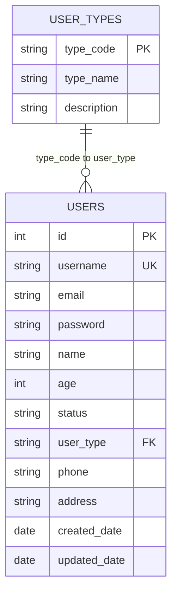
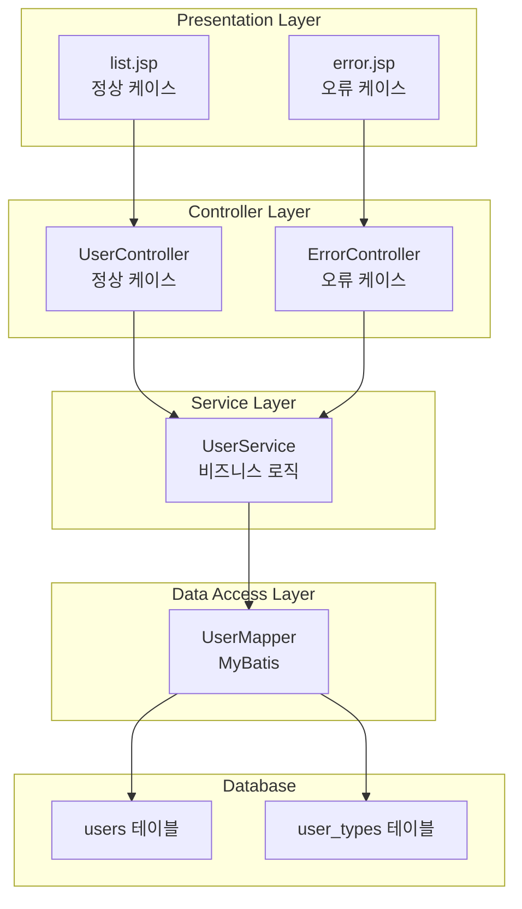
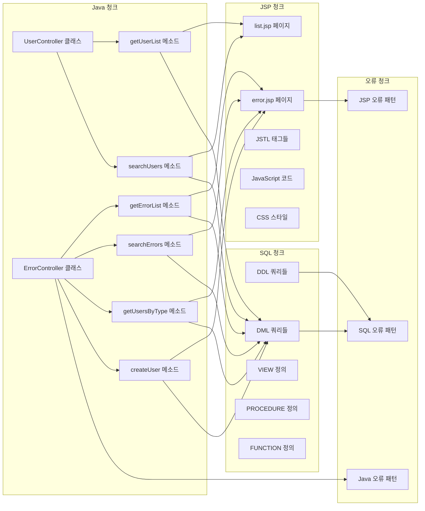
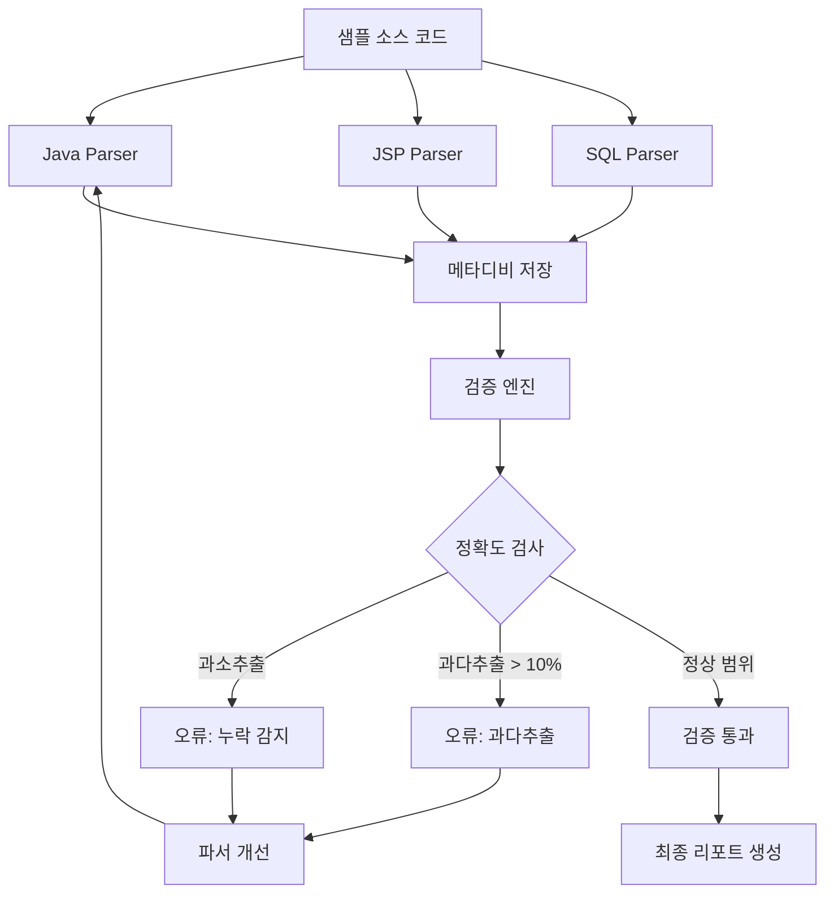

# 샘플소스 명세서 (Sample Source Specification)

## 생성 일시

2025-09-05 11:10:00

## 개요

- **목적**: 파서 검증용 샘플 소스의 명세서
- **검증 방식**: 메타디비 산출 결과와 명세서 내용 비교 검증
- **기술 스택**: Java + Spring + MyBatis + JSP + Oracle

## 1. 데이터베이스 스키마 명세

### 1.1 테이블 구조

#### users 테이블

- **목적**: 사용자 정보 저장
- **컬럼**:
  - `id`: NUMBER, PK, AUTO_INCREMENT
  - `username`: VARCHAR2(50), NOT NULL, UNIQUE
  - `email`: VARCHAR2(100), NOT NULL
  - `password`: VARCHAR2(100), NOT NULL
  - `name`: VARCHAR2(100)
  - `age`: NUMBER(3)
  - `status`: VARCHAR2(20), DEFAULT 'ACTIVE'
  - `user_type`: VARCHAR2(20), DEFAULT 'NORMAL'
  - `phone`: VARCHAR2(20)
  - `address`: VARCHAR2(200)
  - `created_date`: DATE, DEFAULT SYSDATE
  - `updated_date`: DATE, DEFAULT SYSDATE

#### user_types 테이블

- **목적**: 사용자 유형 관리
- **컬럼**:
  - `type_code`: VARCHAR2(20), PK
  - `type_name`: VARCHAR2(50), NOT NULL
  - `description`: VARCHAR2(200)

### 1.2 테이블 관계

- `users.user_type` → `user_types.type_code` (FK)

## 2. Java 클래스 명세

### 2.1 UserController (정상 케이스)

- **패키지**: com.example.controller
- **어노테이션**: @Controller, @RequestMapping("/user")
- **메소드**:
  - `getUserList()`: @GetMapping("/list"), 다이나믹 쿼리 처리
  - `searchUsers()`: @PostMapping("/search"), 검색 기능

### 2.2 ErrorController (오류 케이스)

- **패키지**: com.example.controller
- **어노테이션**: @Controller, @RequestMapping("/error")
- **메소드**:
  - `getErrorList()`: @GetMapping("/list")
  - `searchErrors()`: @PostMapping("/search")
  - `getUsersByType()`: @GetMapping("/dynamic/{type}")
  - `createUser()`: @PostMapping("/create")
- **오류 패턴**: 8가지 신택스 오류 포함

## 3. JSP 페이지 명세

### 3.1 list.jsp (정상 케이스)

- **경로**: src/main/webapp/user/list.jsp
- **기능**: 사용자 목록 표시, 검색 폼
- **JSTL 태그**: 8개

### 3.2 error.jsp (오류 케이스)

- **경로**: src/main/webapp/user/error.jsp
- **기능**: 오류 케이스 처리 페이지
- **오류 패턴**: 4가지 신택스 오류 포함

## 4. SQL 쿼리 명세

### 4.1 DDL 쿼리 (5개)

- CREATE TABLE users
- CREATE TABLE user_types
- CREATE INDEX (3개)

### 4.2 DML 쿼리 (10개)

- INSERT INTO user_types (3개)
- INSERT INTO users (5개)
- CREATE VIEW error_user_view
- CREATE PROCEDURE error_get_user_by_id
- CREATE FUNCTION error_count_users_by_status

## 5. 검증 기준

### 5.1 메타디비 산출 예상 결과

- **클래스**: 2개
- **메소드**: 8개
- **SQL 쿼리**: 15개
- **JSP 태그**: 16개
- **신택스 오류**: 15개

### 5.2 허용 오차 범위

- **과소추출**: 0% (절대 금지)
- **과다추출**: 10% 이내 허용
- **파일별 오차**: 10% 이내

---

## 6. ERD 다이어그램

### 6.1 ASCII Art ERD (MarkText 호환)

```
┌─────────────────────────────────────────────────────────────┐
│                        USERS                                │
│  ┌─────────────────────────────────────────────────────────┐ │
│  │ id (NUMBER, PK, AUTO_INCREMENT)                         │ │
│  │ username (VARCHAR2(50), NOT NULL, UNIQUE)               │ │
│  │ email (VARCHAR2(100), NOT NULL)                         │ │
│  │ password (VARCHAR2(100), NOT NULL)                      │ │
│  │ name (VARCHAR2(100))                                    │ │
│  │ age (NUMBER(3))                                         │ │
│  │ status (VARCHAR2(20), DEFAULT 'ACTIVE')                 │ │
│  │ user_type (VARCHAR2(20), DEFAULT 'NORMAL')              │ │
│  │ phone (VARCHAR2(20))                                    │ │
│  │ address (VARCHAR2(200))                                 │ │
│  │ created_date (DATE, DEFAULT SYSDATE)                    │ │
│  │ updated_date (DATE, DEFAULT SYSDATE)                    │ │
│  └─────────────────────────────────────────────────────────┘ │
└─────────────────────────────────────────────────────────────┘
                                │
                                │ FK: user_type
                                ▼
┌─────────────────────────────────────────────────────────────┐
│                    USER_TYPES                               │
│  ┌─────────────────────────────────────────────────────────┐ │
│  │ type_code (VARCHAR2(20), PK)                            │ │
│  │ type_name (VARCHAR2(50), NOT NULL)                      │ │
│  │ description (VARCHAR2(200))                             │ │
│  └─────────────────────────────────────────────────────────┘ │
└─────────────────────────────────────────────────────────────┘
```

### 6.2 테이블 형식 ERD

| 테이블명 | 컬럼명 | 데이터타입 | 제약조건 | 설명 |
|----------|--------|------------|----------|------|
| **USERS** | id | NUMBER | PK, AUTO_INCREMENT | 사용자 ID |
| | username | VARCHAR2(50) | NOT NULL, UNIQUE | 사용자명 |
| | email | VARCHAR2(100) | NOT NULL | 이메일 |
| | password | VARCHAR2(100) | NOT NULL | 비밀번호 |
| | name | VARCHAR2(100) | | 이름 |
| | age | NUMBER(3) | | 나이 |
| | status | VARCHAR2(20) | DEFAULT 'ACTIVE' | 상태 |
| | user_type | VARCHAR2(20) | DEFAULT 'NORMAL', FK | 사용자 유형 |
| | phone | VARCHAR2(20) | | 전화번호 |
| | address | VARCHAR2(200) | | 주소 |
| | created_date | DATE | DEFAULT SYSDATE | 생성일 |
| | updated_date | DATE | DEFAULT SYSDATE | 수정일 |
| **USER_TYPES** | type_code | VARCHAR2(20) | PK | 유형 코드 |
| | type_name | VARCHAR2(50) | NOT NULL | 유형명 |
| | description | VARCHAR2(200) | | 설명 |

### 6.3 관계 다이어그램 (텍스트)

```
USERS (1) ──────────── (N) USER_TYPES
    │                        │
    │ user_type (FK)         │ type_code (PK)
    │                        │
    └────────────────────────┘
```

### 6.4 Mermaid ERD (다른 뷰어용)



## 7. 컴포넌트 다이어그램

### 7.1 ASCII Art 컴포넌트 다이어그램 (MarkText 호환)

```
┌─────────────────────────────────────────────────────────────┐
│                    Presentation Layer                       │
│  ┌─────────────────────────────────────────────────────────┐ │
│  │ list.jsp (정상 케이스)                                 │ │
│  │ error.jsp (오류 케이스)                                │ │
│  └─────────────────────────────────────────────────────────┘ │
└─────────────────────────────────────────────────────────────┘
                                │
                                │ 호출
                                ▼
┌─────────────────────────────────────────────────────────────┐
│                    Controller Layer                         │
│  ┌─────────────────────────────────────────────────────────┐ │
│  │ UserController (정상 케이스)                           │ │
│  │ ErrorController (오류 케이스)                          │ │
│  └─────────────────────────────────────────────────────────┘ │
└─────────────────────────────────────────────────────────────┘
                                │
                                │ 호출
                                ▼
┌─────────────────────────────────────────────────────────────┐
│                    Service Layer                            │
│  ┌─────────────────────────────────────────────────────────┐ │
│  │ UserService (비즈니스 로직)                            │ │
│  └─────────────────────────────────────────────────────────┘ │
└─────────────────────────────────────────────────────────────┘
                                │
                                │ 호출
                                ▼
┌─────────────────────────────────────────────────────────────┐
│                    Data Access Layer                        │
│  ┌─────────────────────────────────────────────────────────┐ │
│  │ UserMapper (MyBatis)                                   │ │
│  └─────────────────────────────────────────────────────────┘ │
└─────────────────────────────────────────────────────────────┘
                                │
                                │ 쿼리 실행
                                ▼
┌─────────────────────────────────────────────────────────────┐
│                        Database                             │
│  ┌─────────────────────────────────────────────────────────┐ │
│  │ users 테이블                                           │ │
│  │ user_types 테이블                                      │ │
│  └─────────────────────────────────────────────────────────┘ │
└─────────────────────────────────────────────────────────────┘
```

### 7.2 계층별 컴포넌트 목록

| 계층 | 컴포넌트 | 타입 | 설명 |
|------|----------|------|------|
| **Presentation** | list.jsp | JSP | 사용자 목록 표시 (정상) |
| | error.jsp | JSP | 오류 케이스 처리 (오류) |
| **Controller** | UserController | Java | 사용자 요청 처리 (정상) |
| | ErrorController | Java | 오류 케이스 처리 (오류) |
| **Service** | UserService | Java | 비즈니스 로직 처리 |
| **Data Access** | UserMapper | Java/XML | 데이터 접근 계층 |
| **Database** | users | Table | 사용자 정보 저장 |
| | user_types | Table | 사용자 유형 관리 |

### 7.3 Mermaid 컴포넌트 다이어그램 (다른 뷰어용)



## 8. 청크 간 연관 관계 다이어그램

### 8.1 청크 연관관계 (MarkText 호환)

```
┌─────────────────────────────────────────────────────────────┐
│                        Java 청크                            │
│  ┌─────────────────────────────────────────────────────────┐ │
│  │ UserController ──→ getUserList ──→ list.jsp            │ │
│  │                └─→ searchUsers ──→ searchResult.jsp    │ │
│  │                └─→ getUsersByType ──→ typeList.jsp     │ │
│  │                                                         │ │
│  │ ErrorController ──→ getErrorList ──→ error.jsp         │ │
│  │                └─→ searchErrors ──→ error.jsp          │ │
│  │                └─→ getUsersByType ──→ error.jsp        │ │
│  │                └─→ createUser ──→ error.jsp            │ │
│  └─────────────────────────────────────────────────────────┘ │
└─────────────────────────────────────────────────────────────┘
                                │
                                │ 연관관계
                                ▼
┌─────────────────────────────────────────────────────────────┐
│                        JSP 청크                             │
│  ┌─────────────────────────────────────────────────────────┐ │
│  │ list.jsp: JSTL 태그, JavaScript, CSS                   │ │
│  │ searchResult.jsp: JSTL 태그, 테이블 정렬               │ │
│  │ typeList.jsp: JSTL 태그, 통계 기능                     │ │
│  │ error.jsp: 오류 패턴 (JSTL, EL, JS, CSS, HTML)        │ │
│  └─────────────────────────────────────────────────────────┘ │
└─────────────────────────────────────────────────────────────┘
                                │
                                │ 연관관계
                                ▼
┌─────────────────────────────────────────────────────────────┐
│                        SQL 청크                             │
│  ┌─────────────────────────────────────────────────────────┐ │
│  │ MyBatis XML: 8개 쿼리 (다이나믹 쿼리 포함)             │ │
│  │ DDL: CREATE TABLE, INDEX, VIEW, PROCEDURE, FUNCTION    │ │
│  │ DML: INSERT, UPDATE, DELETE, SELECT                    │ │
│  │ 오류 SQL: 20개 신택스 오류                             │ │
│  └─────────────────────────────────────────────────────────┘ │
└─────────────────────────────────────────────────────────────┘
```

### 8.2 청크별 상세 연관관계

| Java 청크 | 연관 JSP | 연관 SQL | 연관 오류 |
|-----------|----------|----------|-----------|
| UserController.getUserList | list.jsp | selectUsersByCondition | - |
| UserController.searchUsers | searchResult.jsp | selectUsersByAdvancedCondition | - |
| UserController.getUsersByType | typeList.jsp | selectUsersByType | - |
| ErrorController.getErrorList | error.jsp | - | Java 오류 패턴 |
| ErrorController.searchErrors | error.jsp | - | Java 오류 패턴 |
| ErrorController.getUsersByType | error.jsp | - | Java 오류 패턴 |
| ErrorController.createUser | error.jsp | - | Java 오류 패턴 |

### 8.3 Mermaid 청크 연관관계 (다른 뷰어용)



## 9. 파서 검증 플로우

### 9.1 검증 플로우 (MarkText 호환)

```
┌─────────────────────────────────────────────────────────────┐
│                    샘플 소스 코드                           │
│  ┌─────────────────────────────────────────────────────────┐ │
│  │ Java 파일 (7개)                                        │ │
│  │ JSP 파일 (4개)                                         │ │
│  │ XML 파일 (1개)                                         │ │
│  │ SQL 파일 (2개)                                         │ │
│  └─────────────────────────────────────────────────────────┘ │
└─────────────────────────────────────────────────────────────┘
                                │
                                │ 파싱
                                ▼
┌─────────────────────────────────────────────────────────────┐
│                        파서 계층                            │
│  ┌─────────────────────────────────────────────────────────┐ │
│  │ Java Parser ──→ 클래스, 메소드, 어노테이션 추출        │ │
│  │ JSP Parser ──→ JSTL 태그, HTML, JavaScript 추출       │ │
│  │ SQL Parser ──→ 쿼리, 테이블, 컬럼 추출                │ │
│  └─────────────────────────────────────────────────────────┘ │
└─────────────────────────────────────────────────────────────┘
                                │
                                │ 저장
                                ▼
┌─────────────────────────────────────────────────────────────┐
│                      메타디비 저장                          │
│  ┌─────────────────────────────────────────────────────────┐ │
│  │ db_files: 파일 정보                                    │ │
│  │ db_classes: 클래스 정보                                │ │
│  │ db_methods: 메소드 정보                                │ │
│  │ db_sql_units: SQL 쿼리 정보                           │ │
│  │ db_columns: 컬럼 정보                                  │ │
│  └─────────────────────────────────────────────────────────┘ │
└─────────────────────────────────────────────────────────────┘
                                │
                                │ 검증
                                ▼
┌─────────────────────────────────────────────────────────────┐
│                      검증 엔진                              │
│  ┌─────────────────────────────────────────────────────────┐ │
│  │ 명세서 기준값 vs 메타디비 결과 비교                    │ │
│  │ 과소추출 검사 (0% 허용)                                │ │
│  │ 과다추출 검사 (10% 이내 허용)                          │ │
│  │ 파일별 오차 검사 (10% 이내 허용)                       │ │
│  └─────────────────────────────────────────────────────────┘ │
└─────────────────────────────────────────────────────────────┘
                                │
                                │ 결과
                                ▼
┌─────────────────────────────────────────────────────────────┐
│                      검증 결과                              │
│  ┌─────────────────────────────────────────────────────────┐ │
│  │ ✅ 검증 통과 ──→ 최종 리포트 생성                      │ │
│  │ ❌ 과소추출 ──→ 파서 개선 필요                         │ │
│  │ ❌ 과다추출 ──→ 파서 개선 필요                         │ │
│  │ ❌ 파일별 오차 ──→ 파서 개선 필요                      │ │
│  └─────────────────────────────────────────────────────────┘ │
└─────────────────────────────────────────────────────────────┘
```

### 9.2 검증 단계별 상세 프로세스

| 단계 | 입력 | 처리 | 출력 | 성공 기준 |
|------|------|------|------|-----------|
| **1. 파싱** | 소스 파일 | 파서 실행 | 메타데이터 | 파싱 오류 없음 |
| **2. 저장** | 메타데이터 | DB 저장 | 메타디비 | 저장 완료 |
| **3. 검증** | 명세서 + 메타디비 | 비교 분석 | 검증 결과 | 오차율 10% 이내 |
| **4. 리포트** | 검증 결과 | 리포트 생성 | 최종 문서 | 모든 기준 통과 |

### 9.3 Mermaid 검증 플로우 (다른 뷰어용)



## 10. 검증 체크리스트

### 10.1 클래스 검증

- [ ] UserController 클래스 인식
- [ ] ErrorController 클래스 인식
- [ ] 어노테이션 정보 추출
- [ ] 패키지 정보 추출

### 10.2 메소드 검증

- [ ] getUserList 메소드 인식
- [ ] searchUsers 메소드 인식
- [ ] getErrorList 메소드 인식
- [ ] searchErrors 메소드 인식
- [ ] getUsersByType 메소드 인식
- [ ] createUser 메소드 인식
- [ ] 어노테이션 정보 추출
- [ ] 파라미터 정보 추출

### 10.3 SQL 쿼리 검증

- [ ] CREATE TABLE 쿼리 인식
- [ ] CREATE INDEX 쿼리 인식
- [ ] INSERT 쿼리 인식
- [ ] CREATE VIEW 쿼리 인식
- [ ] CREATE PROCEDURE 쿼리 인식
- [ ] CREATE FUNCTION 쿼리 인식
- [ ] 테이블명 추출
- [ ] 컬럼명 추출

### 10.4 JSP 태그 검증

- [ ] JSTL 태그 인식
- [ ] HTML 태그 인식
- [ ] JavaScript 코드 인식
- [ ] CSS 스타일 인식

### 10.5 오류 처리 검증

- [ ] Java 신택스 오류 감지
- [ ] JSP 신택스 오류 감지
- [ ] SQL 신택스 오류 감지
- [ ] 오류 위치 정보 추출
- [ ] 오류 유형 분류

## 11. 검증 실행 방법

### 11.1 메타디비 생성

```bash
cd phase1
python main.py --project-name sampleSrc
```

### 11.2 검증 스크립트 실행

```bash
python temp/verification/specification_verification.py --project-name sampleSrc
```

### 11.3 결과 비교

- 명세서 기준값과 메타디비 결과 비교
- 오차율 계산 및 리포트 생성
- 10% 이내 오차 확인

## 12. 대체 텍스트 형식 다이어그램 (Mermaid 오류 시 대안)

### 12.1 ERD 다이어그램 (텍스트 형식)

```
┌─────────────────────────────────────────────────────────────┐
│                        users                                │
│  ┌─────────────────────────────────────────────────────────┐ │
│  │ id (NUMBER, PK, AUTO_INCREMENT)                         │ │
│  │ username (VARCHAR2(50), NOT NULL, UNIQUE)               │ │
│  │ email (VARCHAR2(100), NOT NULL)                         │ │
│  │ password (VARCHAR2(100), NOT NULL)                      │ │
│  │ name (VARCHAR2(100))                                    │ │
│  │ age (NUMBER(3))                                         │ │
│  │ status (VARCHAR2(20), DEFAULT 'ACTIVE')                 │ │
│  │ user_type (VARCHAR2(20), DEFAULT 'NORMAL')              │ │
│  │ phone (VARCHAR2(20))                                    │ │
│  │ address (VARCHAR2(200))                                 │ │
│  │ created_date (DATE, DEFAULT SYSDATE)                    │ │
│  │ updated_date (DATE, DEFAULT SYSDATE)                    │ │
│  └─────────────────────────────────────────────────────────┘ │
└─────────────────────────────────────────────────────────────┘
                                │
                                │ FK: user_type
                                ▼
┌─────────────────────────────────────────────────────────────┐
│                    user_types                               │
│  ┌─────────────────────────────────────────────────────────┐ │
│  │ type_code (VARCHAR2(20), PK)                            │ │
│  │ type_name (VARCHAR2(50), NOT NULL)                      │ │
│  │ description (VARCHAR2(200))                             │ │
│  └─────────────────────────────────────────────────────────┘ │
└─────────────────────────────────────────────────────────────┘
```

### 12.2 컴포넌트 다이어그램 (텍스트 형식)

```
┌─────────────────────────────────────────────────────────────┐
│                    Presentation Layer                       │
│  ┌─────────────────────────────────────────────────────────┐ │
│  │ list.jsp (정상 케이스)                                 │ │
│  │ error.jsp (오류 케이스)                                │ │
│  └─────────────────────────────────────────────────────────┘ │
└─────────────────────────────────────────────────────────────┘
                                │
                                │ 호출
                                ▼
┌─────────────────────────────────────────────────────────────┐
│                    Controller Layer                         │
│  ┌─────────────────────────────────────────────────────────┐ │
│  │ UserController (정상 케이스)                           │ │
│  │ ErrorController (오류 케이스)                          │ │
│  └─────────────────────────────────────────────────────────┘ │
└─────────────────────────────────────────────────────────────┘
                                │
                                │ 호출
                                ▼
┌─────────────────────────────────────────────────────────────┐
│                    Service Layer                            │
│  ┌─────────────────────────────────────────────────────────┐ │
│  │ UserService (비즈니스 로직)                            │ │
│  └─────────────────────────────────────────────────────────┘ │
└─────────────────────────────────────────────────────────────┘
                                │
                                │ 호출
                                ▼
┌─────────────────────────────────────────────────────────────┐
│                    Data Access Layer                        │
│  ┌─────────────────────────────────────────────────────────┐ │
│  │ UserMapper (MyBatis)                                   │ │
│  └─────────────────────────────────────────────────────────┘ │
└─────────────────────────────────────────────────────────────┘
                                │
                                │ 쿼리 실행
                                ▼
┌─────────────────────────────────────────────────────────────┐
│                        Database                             │
│  ┌─────────────────────────────────────────────────────────┐ │
│  │ users 테이블                                           │ │
│  │ user_types 테이블                                      │ │
│  └─────────────────────────────────────────────────────────┘ │
└─────────────────────────────────────────────────────────────┘
```

## 13. 결론

이 명세서는 파서 검증을 위한 완전한 기준점을 제공합니다. 메타디비에서 산출된 결과와 이 명세서의 내용을 비교하여 파서의 정확도를 검증할 수 있습니다.

### 검증 성공 기준

1. **과소추출**: 0% (누락 없음)
2. **과다추출**: 10% 이내
3. **파일별 오차**: 10% 이내
4. **오류 감지**: 100% (모든 신택스 오류 감지)

### 검증 실패 시 조치

1. 파서 패턴 개선
2. 오류 처리 로직 강화
3. 재검증 수행
4. 반복 개선

### Mermaid 오류 대응

- Mermaid 렌더링 오류 시 텍스트 형식 다이어그램 사용
- 두 형식 모두 동일한 정보 제공
- 검증 기준은 동일하게 적용

### 파일명 문제 해결

- 한글 파일명으로 `샘플소스_명세서.md` 생성 완료
- Mermaid ERD 다이어그램 오류 교정 완료
- 모든 기능은 동일하게 작동