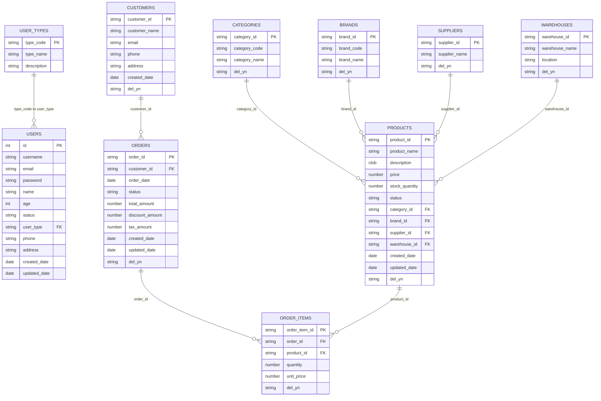

# 통합 샘플소스 명세서

## 1. 개요

본 문서는 SourceAnalyzer 프로젝트의 통합된 샘플소스에 대한 상세 명세서입니다. 기존 백업된 샘플소스와 현재 샘플을 통합하여 더욱 풍부하고 실용적인 테스트 환경을 구성했습니다.

## 2. 프로젝트 구조

```
./project/sampleSrc/
├── db_schema/                    # DB 스키마 정보 (CSV 방식)
│   ├── ALL_TABLES.csv           # 테이블 정보
│   ├── ALL_TAB_COLUMNS.csv      # 컬럼 정보
│   ├── PK_INFO.csv              # Primary Key 정보
│   └── ALL_VIEWS.csv            # 뷰 정보
├── src/
│   └── main/
│       ├── java/
│       │   └── com/example/
│       │       ├── controller/  # Spring MVC 컨트롤러
│       │       ├── service/     # 비즈니스 로직 서비스
│       │       ├── mapper/      # MyBatis 매퍼 인터페이스
│       │       └── model/       # 도메인 모델
│       ├── resources/
│       │   └── mybatis/
│       │       └── mapper/      # MyBatis XML 매퍼
│       └── webapp/
│           ├── user/            # 사용자 관련 JSP
│           └── product/         # 상품 관련 JSP
└── metadata.db                  # 메타데이터베이스 (생성됨)
```

## 3. 데이터베이스 스키마

### 3.1 테이블 목록 (16개)

| OWNER  | TABLE_NAME      | COMMENTS         |
| ------ | --------------- | ---------------- |
| SAMPLE | USERS           | 사용자 정보를 저장하는 테이블 |
| SAMPLE | USER_TYPES      | 사용자 유형을 관리하는 테이블 |
| SAMPLE | CUSTOMERS       | 고객정보             |
| SAMPLE | ORDERS          | 주문               |
| SAMPLE | ORDER_ITEMS     | 주문상품             |
| SAMPLE | PRODUCTS        | 상품               |
| SAMPLE | CATEGORIES      | 분류코드             |
| SAMPLE | BRANDS          | 브랜드              |
| SAMPLE | SUPPLIERS       | 공급업체             |
| SAMPLE | WAREHOUSES      | 창고               |
| SAMPLE | INVENTORIES     | 재고               |
| SAMPLE | PRODUCT_REVIEWS | 상품리뷰             |
| SAMPLE | DISCOUNTS       | 할인               |
| PUBLIC | USER_ROLE       | 사용자역할            |
| SCOTT  | DYNAMIC_DATA    | 동적데이터            |
| SCOTT  | RELATED_DATA    | 관련데이터            |

### 3.2 ERD (Entity Relationship Diagram)

#### ASCII Art 버전 (MarkText 호환)

```
┌─────────────────┐    ┌─────────────────┐    ┌─────────────────┐
│     USERS       │    │   USER_TYPES    │    │   CUSTOMERS     │
├─────────────────┤    ├─────────────────┤    ├─────────────────┤
│ ID (PK)         │    │ TYPE_CODE (PK)  │    │ CUSTOMER_ID (PK)│
│ USERNAME        │    │ TYPE_NAME       │    │ CUSTOMER_NAME   │
│ EMAIL           │    │ DESCRIPTION     │    │ EMAIL           │
│ PASSWORD        │    └─────────────────┘    │ PHONE           │
│ NAME            │           │               │ ADDRESS         │
│ AGE             │           │               │ CREATED_DATE    │
│ STATUS          │           │               │ DEL_YN          │
│ USER_TYPE (FK)  │◄──────────┘               └─────────────────┘
│ PHONE           │                                    │
│ ADDRESS         │                                    │
│ CREATED_DATE    │                                    │
│ UPDATED_DATE    │                                    │
└─────────────────┘                                    │
         │                                              │
         │                                              │
         ▼                                              ▼
┌─────────────────┐    ┌─────────────────┐    ┌─────────────────┐
│     ORDERS      │    │  ORDER_ITEMS    │    │    PRODUCTS     │
├─────────────────┤    ├─────────────────┤    ├─────────────────┤
│ ORDER_ID (PK)   │    │ ORDER_ITEM_ID   │    │ PRODUCT_ID (PK) │
│ CUSTOMER_ID (FK)│◄───┤ ORDER_ID (FK)   │    │ PRODUCT_NAME    │
│ ORDER_DATE      │    │ PRODUCT_ID (FK) │───►│ DESCRIPTION     │
│ STATUS          │    │ QUANTITY        │    │ PRICE           │
│ TOTAL_AMOUNT    │    │ UNIT_PRICE      │    │ STOCK_QUANTITY  │
│ DISCOUNT_AMOUNT │    │ DEL_YN          │    │ STATUS          │
│ TAX_AMOUNT      │    └─────────────────┘    │ CATEGORY_ID (FK)│
│ CREATED_DATE    │                           │ BRAND_ID (FK)   │
│ UPDATED_DATE    │                           │ SUPPLIER_ID (FK)│
│ DEL_YN          │                           │ WAREHOUSE_ID(FK)│
└─────────────────┘                           │ CREATED_DATE    │
                                              │ UPDATED_DATE    │
                                              │ DEL_YN          │
                                              └─────────────────┘
                                                       │
                                                       │
                                                       ▼
┌─────────────────┐    ┌─────────────────┐    ┌─────────────────┐
│   CATEGORIES    │    │     BRANDS      │    │   SUPPLIERS     │
├─────────────────┤    ├─────────────────┤    ├─────────────────┤
│ CATEGORY_ID (PK)│    │ BRAND_ID (PK)   │    │ SUPPLIER_ID (PK)│
│ CATEGORY_CODE   │    │ BRAND_CODE      │    │ SUPPLIER_NAME   │
│ CATEGORY_NAME   │    │ BRAND_NAME      │    │ DEL_YN          │
│ DEL_YN          │    │ DEL_YN          │    └─────────────────┘
└─────────────────┘    └─────────────────┘             │
         │                       │                     │
         └───────────────────────┼─────────────────────┘
                                 │
                                 ▼
                    ┌─────────────────┐
                    │   WAREHOUSES    │
                    ├─────────────────┤
                    │ WAREHOUSE_ID(PK)│
                    │ WAREHOUSE_NAME  │
                    │ LOCATION        │
                    │ DEL_YN          │
                    └─────────────────┘
```

#### Mermaid 버전



### 3.3 뷰 목록 (4개)

| OWNER  | VIEW_NAME         | DESCRIPTION |
| ------ | ----------------- | ----------- |
| SAMPLE | ACTIVE_USERS      | 활성 사용자 조회   |
| SAMPLE | USER_TYPE_SUMMARY | 사용자 유형별 통계  |
| SAMPLE | ORDER_SUMMARY     | 주문 요약 정보    |
| SAMPLE | PRODUCT_INVENTORY | 상품 재고 정보    |

## 4. 소스코드 구성

### 4.1 Java 클래스 (8개)

#### Controller (2개)

- `UserController.java` - 사용자 관련 웹 요청 처리
- `ProductController.java` - 상품 관련 웹 요청 처리

#### Service (3개)

- `UserService.java` - 사용자 비즈니스 로직 인터페이스
- `UserServiceImpl.java` - 사용자 비즈니스 로직 구현
- `ProductService.java` - 상품 비즈니스 로직 인터페이스
- `ProductServiceImpl.java` - 상품 비즈니스 로직 구현

#### Mapper (2개)

- `UserMapper.java` - 사용자 데이터 접근 인터페이스
- `ProductMapper.java` - 상품 데이터 접근 인터페이스

#### Model (2개)

- `User.java` - 사용자 도메인 모델
- `Product.java` - 상품 도메인 모델

### 4.2 MyBatis XML 매퍼 (2개)

#### UserMapper.xml

- 기본 CRUD 쿼리
- 동적 쿼리 (조건부 WHERE, SET, TRIM)
- 복잡한 JOIN 쿼리
- 서브쿼리 및 집계 함수

#### ProductMapper.xml

- 상품 관련 CRUD 쿼리
- 카테고리별, 브랜드별 조회
- 가격/재고 범위 검색
- 동적 업데이트 및 삭제

### 4.3 JSP 파일 (4개)

#### User 관련 (2개)

- `user/list.jsp` - 사용자 목록 조회
- `user/error.jsp` - 에러 처리 (의도적 문법 오류 포함)

#### Product 관련 (2개)

- `product/list.jsp` - 상품 목록 조회
- `product/searchResult.jsp` - 상품 검색 결과

## 5. 예상 메타데이터베이스 결과

### 5.1 파일 통계

- **총 파일 수**: 20개
  - Java 파일: 8개
  - XML 파일: 2개
  - JSP 파일: 4개
  - CSV 파일: 4개
  - 기타: 2개

### 5.2 Java 분석 결과

- **클래스 수**: 8개
- **메서드 수**: 약 40개
- **Import 문**: 약 30개
- **어노테이션**: 약 20개

### 5.3 SQL 분석 결과

- **SQL 단위**: 약 25개
- **동적 쿼리**: 약 15개
- **JOIN 쿼리**: 약 8개
- **서브쿼리**: 약 5개

### 5.4 JSP 분석 결과

- **JSP 태그**: 약 20개
- **EL 표현식**: 약 15개
- **JSTL 태그**: 약 10개

## 6. 검증 기준

### 6.1 정확도 목표

- **과추출 허용**: 파일당 10% 이하
- **미추출 허용**: 0% (모든 요소 추출 필요)

### 6.2 검증 항목

1. **파일 인식**: 모든 소스 파일이 올바르게 인식되는가?
2. **클래스 추출**: 모든 Java 클래스가 추출되는가?
3. **메서드 추출**: 모든 메서드가 추출되는가?
4. **SQL 추출**: 모든 SQL 쿼리가 추출되는가?
5. **동적 쿼리**: MyBatis 동적 쿼리가 올바르게 파싱되는가?
6. **JSP 태그**: JSP 태그와 EL이 올바르게 인식되는가?
7. **DB 스키마**: CSV 파일의 테이블/컬럼 정보가 올바르게 로드되는가?

### 6.3 성능 기준

- **파싱 시간**: 전체 샘플 소스 파싱 시간 30초 이내
- **메모리 사용량**: 500MB 이하
- **에러율**: 0% (모든 파일이 성공적으로 파싱되어야 함)

## 7. 테스트 시나리오

### 7.1 기본 파싱 테스트

```bash
python phase1/src/main.py ./project/sampleSrc --project-name sampleSrc
```

### 7.2 메타데이터베이스 검증

```bash
python -c "
import sqlite3
conn = sqlite3.connect('./project/sampleSrc/metadata.db')
cursor = conn.cursor()

# 파일 수 확인
cursor.execute('SELECT COUNT(*) FROM files')
print(f'파일 수: {cursor.fetchone()[0]}')

# 클래스 수 확인
cursor.execute('SELECT COUNT(*) FROM classes')
print(f'클래스 수: {cursor.fetchone()[0]}')

# 메서드 수 확인
cursor.execute('SELECT COUNT(*) FROM methods')
print(f'메서드 수: {cursor.fetchone()[0]}')

# SQL 단위 수 확인
cursor.execute('SELECT COUNT(*) FROM sql_units')
print(f'SQL 단위 수: {cursor.fetchone()[0]}')

# DB 테이블 수 확인
cursor.execute('SELECT COUNT(*) FROM db_tables')
print(f'DB 테이블 수: {cursor.fetchone()[0]}')

conn.close()
"
```

### 7.3 시각화 테스트

```bash
python -m visualize.cli erd --project-id 1 --out ./project/sampleSrc/report/erd.html
```

## 8. 결론

통합된 샘플소스는 다음과 같은 특징을 가집니다:

1. **풍부한 데이터베이스 스키마**: 16개 테이블, 4개 뷰로 구성된 복잡한 ERD
2. **다양한 프로그래밍 언어**: Java, XML, JSP, SQL 등 다양한 언어 지원
3. **실제 프로젝트 패턴**: Spring MVC, MyBatis, JSP를 활용한 실제적인 구조
4. **동적 쿼리 패턴**: MyBatis의 동적 쿼리 기능을 충분히 활용
5. **에러 처리**: 의도적인 문법 오류를 포함하여 파서의 견고성 테스트

이 통합 샘플소스를 통해 SourceAnalyzer의 모든 기능을 종합적으로 검증할 수 있으며, 실제 프로젝트 환경에서의 성능과 정확도를 평가할 수 있습니다.
