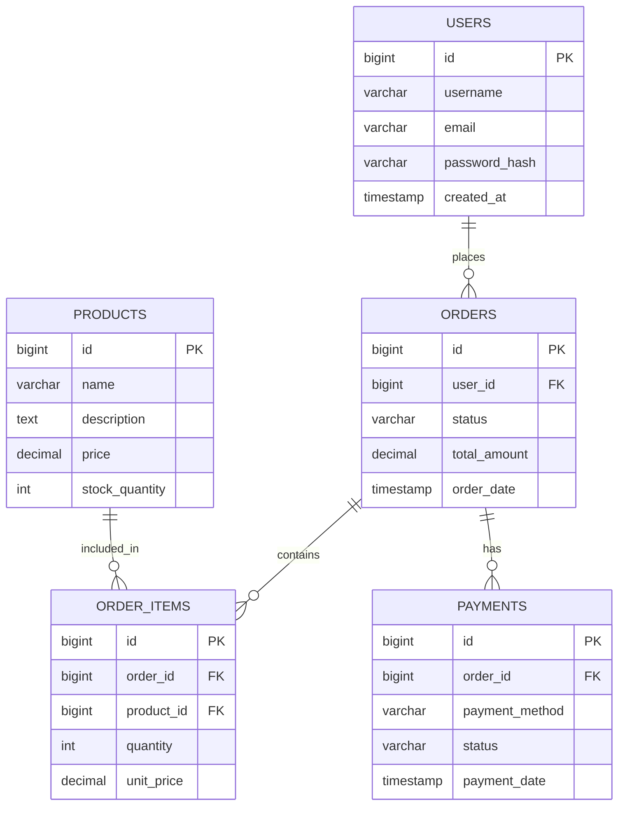
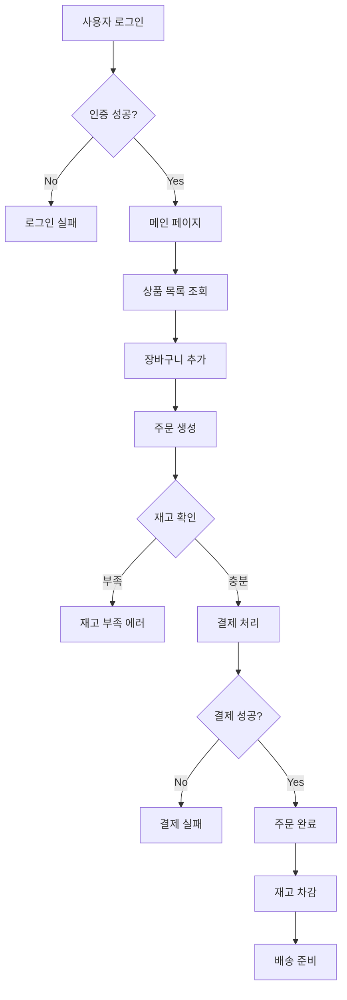

# 🚀 소스분석 지원 도구들 - 신규 개발자 가이드

## 📋 문서 정보
- **작성일시**: 2025년 1월 19일 20:00
- **작성자**: AI 어시스턴트
- **대상**: 신규 투입 개발자
- **목적**: 소스코드 분석 및 이해를 위한 도구 및 문서 가이드

---

## 🎯 **개요**

이 문서는 **SourceAnalyzer 프로젝트**에 신규 투입된 개발자가 기존 소스코드를 빠르게 이해하고 분석할 수 있도록 도와주는 **지원 도구들**과 **문서들**에 대한 가이드입니다.

신규 개발자는 이 도구들을 활용하여:
- ✅ **코드 구조를 빠르게 파악**
- ✅ **핵심 비즈니스 로직 이해**
- ✅ **개발 환경 설정 및 문제 해결**
- ✅ **코드 품질 및 보안 이슈 파악**

---

## 📚 **1. 코드 구조 분석 리포트**

### ✅ **완성된 문서**
- **`sampleSrc_계층도분석리포트_yyyymmdd_hms.md`**
  - 📁 Java 소스코드 패키지별 계층도
  - 🏗️ 전체 프로젝트 구조
  - 📊 파일 통계 정보
  - 🔍 아키텍처 분석

### 🆕 **추가 제안 문서**
```
📋 코드 구조 분석 리포트 (신규)
├── 📊 클래스별 의존성 맵
│   ├── 어떤 클래스가 어떤 클래스를 사용하는지
│   ├── import 관계 분석
│   └── 순환 의존성 체크
│
├── 🔗 메서드 호출 관계도
│   ├── API 엔드포인트 → 컨트롤러 → 서비스 → 매퍼 흐름
│   ├── 핵심 비즈니스 메서드 호출 체인
│   └── 이벤트 핸들러 연결 관계
│
├── 📈 코드 복잡도 분석 리포트
│   ├── 클래스별 복잡도 점수
│   ├── 메서드별 라인 수 및 복잡도
│   └── 리팩토링 우선순위 제안
│
└── 🎯 핵심 비즈니스 로직 플로우차트
    ├── 주문 → 결제 → 배송 프로세스
    ├── 사용자 인증 → 권한 체크 → 리소스 접근
    └── 데이터 동기화 및 연동 프로세스
```

---

## 🧭 **2. 코드 탐색 가이드**

### 📖 **신규 개발자 온보딩 문서**
```
📚 온보딩 가이드 문서
├── 🚀 진입점 가이드
│   ├── "어디서부터 시작할까?" - 단계별 학습 경로
│   ├── 핵심 클래스 및 패키지 소개
│   └── 첫 번째 코드 수정 가이드
│
├── 🗺️ 코드 네비게이션 맵
│   ├── 프로젝트 루트부터 각 모듈까지 경로
│   ├── 주요 디렉토리별 역할 설명
│   └── 파일 명명 규칙 및 구조
│
├── 🔍 자주 찾는 코드 위치 인덱스
│   ├── "로그인 기능은 어디에?" - 기능별 코드 위치
│   ├── "에러 처리는 어떻게?" - 예외 처리 패턴
│   └── "설정은 어디서?" - 환경별 설정 파일 위치
│
└── 📚 코드 이해를 위한 핵심 개념 정리
    ├── MVC 패턴, DAO 패턴 등 디자인 패턴
    ├── Spring Framework 핵심 개념
    ├── MyBatis 사용법 및 쿼리 패턴
    └── 데이터베이스 트랜잭션 관리
```

---

## 🎨 **3. 시각화 도구들**

### 📊 **다이어그램 & 차트**
```
🎨 시각화 도구 모음
├── 🏗️ 아키텍처 다이어그램
│   ├── PlantUML을 이용한 시스템 아키텍처
│   ├── Mermaid를 이용한 클래스 다이어그램
│   └── C4 모델을 이용한 컨텍스트 다이어그램
│
├── 🔄 시퀀스 다이어그램
│   ├── API 호출 흐름 (사용자 → 프론트엔드 → 백엔드 → DB)
│   ├── 비즈니스 프로세스 흐름
│   └── 에러 처리 및 복구 시나리오
│
├── 🌳 패키지 구조 트리맵
│   ├── 계층별 패키지 구조 시각화
│   ├── 의존성 강도별 색상 구분
│   └── 인터랙티브 확대/축소 기능
│
├── 🔗 의존성 그래프
│   ├── D3.js를 이용한 인터랙티브 그래프
│   ├── Cytoscape를 이용한 네트워크 분석
│   └── 노드별 상세 정보 팝업
│
└── 📈 코드 메트릭 대시보드
    ├── 클래스별 복잡도, 라인 수, 테스트 커버리지
    ├── 시간별 코드 변경 이력
    └── 품질 지표 트렌드 차트
```

---

## 📖 **4. 코드 문서화**

### 📚 **상세 코드 문서**
```
📖 코드 문서 모음
├── 🎯 API 명세서
│   ├── Swagger/OpenAPI 자동 생성 문서
│   ├── 엔드포인트별 요청/응답 스키마
│   ├── 인증/인가 요구사항
│   └── 에러 코드 및 메시지 정의
│
├── 📋 데이터베이스 스키마 문서
│   ├── 테이블별 상세 스키마
│   ├── 인덱스 및 제약조건
│   ├── 테이블 간 관계 및 외래키
│   └── 샘플 데이터 및 쿼리 예시
│
├── ⚙️ 설정 파일 가이드
│   ├── 환경별 설정 파일 (dev, test, prod)
│   ├── 주요 설정 항목별 설명
│   ├── 설정 변경 시 주의사항
│   └── 환경 변수 및 외부 설정 연동
│
├── 🚨 에러 코드 & 해결방법 가이드
│   ├── 자주 발생하는 에러 코드별 원인
│   ├── 단계별 문제 해결 방법
│   ├── 로그 분석 가이드
│   └── 디버깅 팁 및 도구
│
└── 🛠️ 개발 환경 설정 가이드
    ├── IDE 설정 (IntelliJ, Eclipse, VS Code)
    ├── 빌드 도구 설정 (Maven, Gradle)
    ├── 데이터베이스 연결 설정
    └── 로컬 개발 환경 구축 단계
```

---

## 🔬 **5. 코드 분석 도구**

### 🧪 **분석 & 테스트 도구**
```
🔍 코드 분석 도구 모음
├── 📊 정적 코드 분석 리포트
│   ├── SonarQube 분석 결과
│   ├── 코드 품질 지표 (복잡도, 중복도, 유지보수성)
│   ├── 코딩 표준 준수 현황
│   └── 개선 권장사항 및 우선순위
│
├── 🧪 테스트 커버리지 리포트
│   ├── 클래스별 테스트 커버리지
│   ├── 메서드별 테스트 케이스 현황
│   ├── 테스트되지 않은 코드 영역
│   └── 테스트 코드 작성 가이드
│
├── 🐛 버그 패턴 분석
│   ├── 자주 발생하는 버그 유형별 분석
│   ├── 버그 발생 위치 및 원인 패턴
│   ├── 예방 방법 및 코딩 가이드라인
│   └── 디버깅 도구 및 기법
│
├── 📈 성능 프로파일링 리포트
│   ├── 메서드별 실행 시간 분석
│   ├── 메모리 사용량 패턴
│   ├── 병목 구간 식별
│   └── 성능 최적화 제안
│
└── 🔒 보안 취약점 스캔 리포트
    ├── OWASP Top 10 취약점 체크
    ├── SQL Injection, XSS 등 보안 이슈
    ├── 취약점별 위험도 및 대응방법
    └── 보안 코딩 가이드라인
```

---

## 🚀 **6. 우선순위별 구현 계획**

### **🔥 High Priority (즉시 구현 - 1주 내)**
```
🎯 최우선 구현 항목
├── 📊 API 엔드포인트 맵
│   ├── 어떤 API가 어디에 있는지
│   ├── 컨트롤러 → 서비스 → 매퍼 연결 관계
│   └── API 버전별 변경 이력
│
├── 🗄️ 데이터베이스 테이블 관계도
│   ├── ERD + 테이블별 용도 설명
│   ├── 주요 쿼리 패턴 및 성능 이슈
│   └── 데이터 마이그레이션 가이드
│
└── 🔄 핵심 비즈니스 로직 플로우차트
    ├── 주문 → 결제 → 배송 프로세스
    ├── 사용자 인증 → 권한 체크 → 리소스 접근
    └── 에러 처리 및 복구 시나리오
```

### **⚡ Medium Priority (1-2주 내)**
```
📈 중간 우선순위 구현 항목
├── 🔗 클래스별 의존성 그래프
│   ├── 어떤 클래스가 어떤 클래스를 사용하는지
│   ├── 순환 의존성 체크 및 해결방법
│   └── 인터페이스 및 추상클래스 활용 현황
│
├── ⚙️ 설정 파일 가이드
│   ├── 환경별 설정 방법 및 주의사항
│   ├── 외부 설정 연동 방법
│   └── 설정 변경 시 영향도 분석
│
└── 🚨 에러 해결 가이드
    ├── 자주 발생하는 문제와 해결책
    ├── 로그 분석 및 디버깅 방법
    └── 문제 해결을 위한 도구 및 기법
```

### **💡 Low Priority (1개월 내)**
```
🎨 장기 구현 계획
├── 📊 코드 메트릭 대시보드
│   ├── 복잡도, 테스트 커버리지 등 실시간 모니터링
│   ├── 코드 품질 트렌드 분석
│   └── 팀별 개발 현황 대시보드
│
├── 📈 성능 프로파일링 리포트
│   ├── 정기적인 성능 분석 및 리포트
│   ├── 성능 개선 효과 측정
│   └── 성능 테스트 자동화
│
└── 🔒 보안 취약점 분석 리포트
    ├── 정기적인 보안 스캔 및 리포트
    ├── 보안 코딩 교육 자료
    └── 보안 인시던트 대응 가이드
```

---

## 🎯 **7. 구체적인 구현 예시**

### **예시 1: API 엔드포인트 맵**
```markdown
## 🚀 API 엔드포인트 맵

### 📍 주문 관련 API
- `POST /api/v1/orders` → OrderController.createOrder()
  - 📝 주문 생성
  - 🔐 인증 필요
  - 📊 요청: OrderRequest, 응답: OrderResponse

- `GET /api/v1/orders/{id}` → OrderController.getOrder()
  - 📖 주문 조회
  - 🔐 인증 필요
  - 📊 응답: OrderDetailResponse

- `PUT /api/v1/orders/{id}` → OrderController.updateOrder()
  - ✏️ 주문 수정
  - 🔐 인증 + 권한 체크 필요
  - 📊 요청: OrderUpdateRequest
```

### **예시 2: 데이터베이스 테이블 관계도**


### **예시 3: 핵심 비즈니스 로직 플로우차트**


---

## 📋 **8. 다음 단계 및 액션 아이템**

### **🎯 즉시 실행 가능한 작업**
1. **API 엔드포인트 맵 작성** - 기존 코드 분석하여 API 목록 정리
2. **데이터베이스 ERD 생성** - 테이블 스키마 분석하여 관계도 작성
3. **핵심 비즈니스 로직 플로우차트** - 주요 프로세스 흐름도 작성

### **📚 문서화 작업**
1. **신규 개발자 온보딩 가이드** 작성
2. **설정 파일 가이드** 작성
3. **에러 해결 가이드** 작성

### **🛠️ 도구 개발**
1. **의존성 분석 스크립트** 개발
2. **코드 메트릭 수집 도구** 개발
3. **자동 문서 생성 도구** 개발

---

## 💭 **9. 결론**

이 문서는 신규 개발자가 **SourceAnalyzer 프로젝트**를 빠르게 이해하고 효과적으로 개발에 참여할 수 있도록 도와주는 **종합적인 지원 도구 가이드**입니다.

### **🎉 기대 효과**
- ✅ **온보딩 시간 단축**: 신규 개발자의 적응 기간 단축
- ✅ **코드 이해도 향상**: 체계적인 문서화로 빠른 학습
- ✅ **개발 생산성 증대**: 명확한 가이드로 효율적인 개발
- ✅ **코드 품질 향상**: 분석 도구를 통한 지속적인 개선
- ✅ **팀 협업 강화**: 공통된 이해와 표준화된 접근 방법

### **🚀 향후 발전 방향**
1. **자동화**: 문서 생성 및 업데이트 자동화
2. **실시간성**: 실시간 코드 분석 및 모니터링
3. **인터랙티브**: 사용자 참여형 문서 및 가이드
4. **AI 지원**: AI 기반 코드 분석 및 제안

---

**작업이 완료되었습니다. 다음은 무엇을 할까요?**

이제 이 가이드에 따라 실제 구현을 시작할까요? 
API 엔드포인트 맵부터 시작하는 것을 추천합니다! 🎯

---
*이 문서는 SourceAnalyzer 프로젝트의 신규 개발자 지원을 위한 종합 가이드입니다.*
