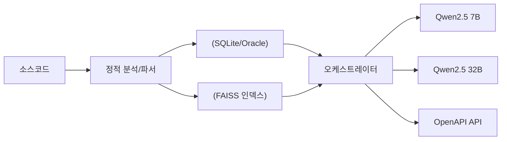

# 소스 분석·영향평가 에이전트 PRD

**버전**: v3.0
**작성일**: 2025-08-27
**대상 환경**: 인터넷이 안되는 폐쇄망 온프레미스 서버, RHEL (A30 GPU 1장), Java 8, Python 3.10+, vLLM(Qwen2.5 7B/32B), Oracle 11g 사전정보 CSV 제공, 사용자는 Windows PC.

---

## 1. 프로젝트 개요 및 목표

### 1.1. 개요

- 목적: 대규모 레거시(Java/JSP/Spring/MyBatis/Oracle) 소스 정적 분석 및 자연어 질의응답/영향평가 제공
- 원칙: 코드/SQL 원문 미저장, 경로·라인·구조 기반 메타정보 저장
- 정책: 재현율 우선(누락 최소화), CONFIDENCE 추적, LLM 보강 로그 기록

### 1.2. 배경 및 핵심 목표

● 1.2.1. **배경**: JSP·Spring·Java·MyBatis·Oracle DB 기반 레거시/현행 시스템의 대규모 소스를 정적 분석하여 **정확하고 풍부한 메타정보**를 생성하고, 이를 기반으로 **자연어 질의/영향평가**를 제공합니다.
● 1.2.2. **핵심 목표**:
  ○ 1.2.2.1. (1단계) 원문 코드/SQL 미저장(경로/라인Range·구조만) 원칙 하에 메타정보 생성/저장 (재현율 우선(보수적 포괄 응답))
  ○ 1.2.2.2. (2단계) Qwen2.5 기반 RAG+오케스트레이터로 요약/탐색/영향평가 제공
  ○ 1.2.2.3. 대규모 소스/다국어(한국어/영어) 인식·검색, **성능·스토리지 효율** 및 **증분 분석** 지원
  ○ 1.2.2.4. **CONFIDENCE** 및 **LLM 보강 이력**(추론 전/후 신뢰도) 전구간 추적

### 1.3. 용어 정의

● 1.3.1. **메타정보**: 코드/SQL로부터 추출/요약된 구조적·서술적 정보(원문 비저장)
● 1.3.2. **보강 이력**: LLM 전/후 비교 및 출처 모델/프롬프트/파라미터 기록
● 1.3.3. **보수적 포괄 응답**: 정확성-재현율 트레이드오프 시 재현율(누락 최소화) 우선. (영향평가시 정확성 보다는 누락이 없는게 우선)
● 1.3.4. **CONFIDENCE**: [0.0~1.0] 신뢰도. 1.0=확실, 0.5=정적 추정 등. 다이나믹 쿼리 등 정확한 분석이 어려운 경우 그 정확성의 정도에 따라 신뢰도 점수 산정.

### 1.4. 사용자 스토리 (예시)

● 1.4.1. 개발자: “메소드 A 수정 시 영향받는 SQL/테이블/다른 메소드를 **빠짐없이** 보고 싶다.”
● 1.4.2. 데이터모델러: “ALL_* 코멘트가 부실/오류라서, 메타정보에 **소스 기반 의미 보강 코멘트**를 생성하고 싶다.”
● 1.4.3. "해약환급금 계산하는 소스 찾아줘"
● 1.4.4. 아키텍트: “원문 미저장 원칙을 지키면서도 **실제 조인 조건/필수 필터**(예: `DEL_YN <> 'N'`)를 추출해 RAG로 활용하고 싶다.”
● 1.4.5. 아키텍트: "월별 신계약 건수를 구하는 쿼리 개발해줘" 등과 같이 LLM이 자연어->SQL 자동 개발할 수 있도록 메타정보 구축.

---

## 2. 시스템 아키텍처 및 데이터 모델

### 2.1. 상위 아키텍처 (v2.0 요약 및 Mermaid 쌍따옴표 반영)

- **Phase 1 (메타정보 생성)**: 정적 파서 + LLM 보강 → SQLite/Oracle, FAISS 인덱스 저장
- **Phase 2 (오케스트레이터/RAG)**: LangChain/LangGraph + vLLM(Qwen2.5 7B 기본, 32B 폴백) → API 제공



● 2.1.1. 1단계: 정적 파이프라인(멀티스레드) + 선택적 LLM 보강 워커(동일 서버)
● 2.1.2. 2단계: 오케스트레이터(파이썬, LangChain or LangGraph) + RAG + vLLM 클라이언트(HTTP)
● 2.1.3. 저장소: SQLite(메타) Oracle 11g 전환 고려해 DDL 호환 설계, FAISS(벡터), Neo4j

### 2.2. 데이터 모델 (v2.0 요약 및 v1.0 상세 유지)

- projects, files, classes, methods, sql_units, db_tables, db_columns 등
- edges: 호출·의존·참조 관계 저장
- joins, required_filters: 실제 조인 조건, 필수 필터 보관
- summaries, enrichment_logs, vulnerability_fixes 등 보강 정보 저장

● 2.2.1. **원문 비저장 원칙**. 문자열 요약/코멘트는 별도 테이블로 분리하여 I/O 최소화.

```sql
-- 프로젝트/파일
CREATE TABLE projects (
  project_id INTEGER PRIMARY KEY,
  root_path TEXT NOT NULL,
  created_at TEXT, updated_at TEXT
);
CREATE TABLE files (
  file_id INTEGER PRIMARY KEY,
  project_id INTEGER, path TEXT, language TEXT,
  hash TEXT, loc INTEGER, mtime TEXT,
  FOREIGN KEY(project_id) REFERENCES projects(project_id)
);

-- 자바 구조
CREATE TABLE classes (
  class_id INTEGER PRIMARY KEY,
  file_id INTEGER, fqn TEXT, name TEXT,
  start_line INTEGER, end_line INTEGER,
  modifiers TEXT, annotations TEXT,
  FOREIGN KEY(file_id) REFERENCES files(file_id)
);
CREATE TABLE methods (
  method_id INTEGER PRIMARY KEY,
  class_id INTEGER, name TEXT, signature TEXT, return_type TEXT,
  start_line INTEGER, end_line INTEGER, annotations TEXT,
  FOREIGN KEY(class_id) REFERENCES classes(class_id)
);

-- MyBatis/SQL
CREATE TABLE sql_units (
  sql_id INTEGER PRIMARY KEY,
  file_id INTEGER, origin TEXT, mapper_ns TEXT, stmt_id TEXT,
  start_line INTEGER, end_line INTEGER, stmt_kind TEXT, -- select/insert/update/delete/procedure/function (SP/SF 포함)
  normalized_fingerprint TEXT, -- 원문 대신 구조 기반 지문
  FOREIGN KEY(file_id) REFERENCES files(file_id)
);

-- DB 사전(원 CSV)
CREATE TABLE db_tables (
  table_id INTEGER PRIMARY KEY,
  owner TEXT, table_name TEXT, status TEXT
);
CREATE TABLE db_columns (
  column_id INTEGER PRIMARY KEY,
  table_id INTEGER, column_name TEXT, data_type TEXT, nullable TEXT,
  FOREIGN KEY(table_id) REFERENCES db_tables(table_id)
);
CREATE TABLE db_pk (
  table_id INTEGER, column_name TEXT, pk_pos INTEGER,
  PRIMARY KEY(table_id, column_name),
  FOREIGN KEY(table_id) REFERENCES db_tables(table_id)
);

-- DB View 정보 (ALL_VIEWS.csv에서 로드)
CREATE TABLE db_views (
  view_id INTEGER PRIMARY KEY,
  owner TEXT, view_name TEXT, text CLOB -- 뷰 정의 SQL
);

-- 그래프(호출·의존·참조)
CREATE TABLE edges (
  edge_id INTEGER PRIMARY KEY,
  src_type TEXT, src_id INTEGER,
  dst_type TEXT, dst_id INTEGER,
  edge_kind TEXT, -- call, use_table, use_column, call_sql, calls_sp, references_view, write_table, extends, implements ...
  confidence REAL
);

-- 조인/필수 필터
CREATE TABLE joins (
  join_id INTEGER PRIMARY KEY,
  sql_id INTEGER,
  l_table TEXT, l_col TEXT, op TEXT,
  r_table TEXT, r_col TEXT,
  inferred_pkfk INTEGER, confidence REAL,
  FOREIGN KEY(sql_id) REFERENCES sql_units(sql_id)
);
CREATE TABLE required_filters (
  filter_id INTEGER PRIMARY KEY,
  sql_id INTEGER,
  table_name TEXT, column_name TEXT, op TEXT, value_repr TEXT, -- 'N', :param 등
  always_applied INTEGER, confidence REAL,
  FOREIGN KEY(sql_id) REFERENCES sql_units(sql_id)
);

-- 요약/코멘트/임베딩
CREATE TABLE summaries (
  summary_id INTEGER PRIMARY KEY,
  target_type TEXT, target_id INTEGER,
  summary_type TEXT, -- logic|vuln|perf|db_comment_suggestion
  lang TEXT, content TEXT, confidence REAL,
  created_at TEXT
);
CREATE TABLE enrichment_logs (
  enrich_id INTEGER PRIMARY KEY,
  target_type TEXT, target_id INTEGER,
  pre_conf REAL,
  post_conf REAL,
  model TEXT,
  prompt_id TEXT,
  params TEXT,
  created_at TEXT
);
CREATE TABLE chunks (
  chunk_id INTEGER PRIMARY KEY,
  target_type TEXT, target_id INTEGER,
  content TEXT, token_count INTEGER, hash TEXT,
  created_at TEXT
);
CREATE TABLE embeddings (
  chunk_id INTEGER PRIMARY KEY,
  model TEXT, dim INTEGER, faiss_vector_id INTEGER, created_at TEXT,
  FOREIGN KEY(chunk_id) REFERENCES chunks(chunk_id)
);
-- 취약점 수정 제안 저장
CREATE TABLE vulnerability_fixes (
  fix_id INTEGER PRIMARY KEY,
  target_type TEXT, target_id INTEGER,
  vulnerability_type TEXT, -- sql_injection, xss, path_traversal, etc.
  severity TEXT, -- critical, high, medium, low
  owasp_category TEXT, -- A01, A02, A03 등 OWASP Top 10 분류
  cwe_id TEXT, -- CWE-89, CWE-79 등
  reference_urls TEXT, -- 관련 OWASP, CVE URL (JSON 배열)
  description TEXT, -- 취약점 상세 설명
  fix_description TEXT, -- 해결방안 설명
  original_code TEXT, -- 취약한 원본 코드 (일부 범위)
  fixed_code TEXT, -- 수정 제안 코드
  start_line INTEGER, end_line INTEGER,
  confidence REAL,
  created_at TEXT,
  FOREIGN KEY target based on target_type
);

CREATE INDEX idx_edges_src ON edges(src_type, src_id);
CREATE INDEX idx_edges_dst ON edges(dst_type, dst_id);
CREATE INDEX idx_sql_units_file ON sql_units(file_id);
CREATE INDEX idx_joins_sql ON joins(sql_id);
CREATE INDEX idx_filters_sql ON required_filters(sql_id);
CREATE INDEX idx_vuln_fixes_target ON vulnerability_fixes(target_type, target_id);
```

● 2.2.2. Oracle 11g 전환 가이드: INTEGER→NUMBER, TEXT→CLOB/VARCHAR2, BOOLEAN은 NUMBER(1)로 매핑, FK/INDEX 동일.

---

## 3. 1단계: 메타정보 생성 및 저장

### 3.1. 분석 대상 및 지원 언어/프레임워크

- Python 3.10+, FastAPI, LangChain/LangGraph
- JavaParser/Tree-sitter, JSQLParser/SQLGlot
- DB: SQLite(개발), Oracle 11g(운영), FAISS, Neo4j
- LLM: vLLM 기반 Qwen2.5 (7B/32B)
- 임베딩: BGE-m3, ko-sentence-transformers

● 3.1.1. **지원 언어/프레임워크**: Java(8 호환), JSP, Spring Framework, MyBatis XML, SQL(Oracle 방언)

● 3.1.2. **제안 기술 스택**:
  ○ 3.1.2.1. **백엔드 (핵심 로직 및 오케스트레이터)**:
    - **언어**: Python 3.10+
    - **웹 프레임워크**: FastAPI (OpenAPI, 고성능, 비동기 지원)
    - **RAG/오케스트레이션**: LangChain 또는 LangGraph
    - **정적 분석**:
      · **Java AST**: JavaParser (또는 유사 라이브러리)
      · **JSP/MyBatis/SQL**: ANTLR 기반 커스텀 파서, JSQLParser (PL/SQL)
      · **Python AST**: Python 내장 `ast` 모듈
      · **다국어 파싱**: JavaParser를 보완하기 위해 Tree‑Sitter 기반 파서를 도입합니다. Tree‑Sitter는 언어별 grammar 파일만으로 Java, JSP, JavaScript/TypeScript, Python 등 다양한 언어를 빠르게 증분 파싱할 수 있어, 증분 분석과 에디터 통합을 지원합니다. C 또는 Rust FFI를 통한 파이썬 바인딩을 사용해 오프라인 환경에서도 배포 가능합니다.
      · **SQL/PL‑SQL 확장**: Oracle PL/SQL과 동적 SQL 처리를 강화하기 위해 `antlr‑plsql`(ANTLR 기반) 및 SQLGlot를 병행 도입하여 Stored Procedure/Function, 트리거, 동적 SQL 변형을 정밀하게 파싱합니다. Oracle dialect용 grammar를 확장함으로써 복잡한 PL/SQL 구문을 정규화하고 `JOIN`/필수 필터 추출 알고리즘의 정확도를 높입니다.
      · **TypeScript/프론트엔드 분석**: 향후 확장을 대비하여 Tree‑Sitter grammar와 TypeScript 컴파일러 API, `pyright` 등을 활용한 TypeScript/JavaScript/Vue.js 컴포넌트 구조 및 타입 정보 추출 기능을 포함합니다. 이를 통해 프론트엔드까지 전체 호출 그래프를 연결할 수 있습니다.

  ○ 3.1.2.2. **데이터베이스**:
    - **메타데이터**: SQLite (개발/테스트) -> Oracle 11g (운영)
    - **벡터 스토어**: FAISS
    - **그래프 데이터베이스**: Neo4j

  ○ 3.1.2.3. **LLM 서빙**: vLLM 기반 Qwen2.5 (7B/32B)

● 3.1.3. **분석 대상 소스 관리**: PROJECTS 폴더 하위에 프로젝트명 폴더에 저장되며 1단계 메타정보 생성 및 2단계 검색 단계에서 활용. CLOB 성격의 데이터는 PROJECTS 폴더 내 정보를 이용. (e.g. .\PROJECT\sample-app)

● 3.1.4. **스토리지 효율**: 메타 정보에 원문 코드/SQL 저장 금지(경로·라인 범위·파생 구조만 저장). **성능·스토리지 효율**을 위한 설계.

● 3.1.5. **DB 사전 CSV**: PROJECT폴더 하위 프로젝트명 폴더 아래 DB_SCHEMA 폴더(e.g. .\PROJECT\sample-app\DB_SCHEMA)에 ALL_TABLES, ALL_TAB_COLUMNS, ALL_TAB_COMMENTS, ALL_COL_COMMENTS, PK 정보(테이블별 PK컬럼) CSV 파일 업로드 (사용자 수작업)

● 3.1.6. **메타정보 활용**: 메타정보(요약, 호출·의존 그래프, 실제 조인·필수 필터(DEL_YN='N'등))를 저장하고 2단계에서 사용.

● 3.1.7. **임베딩 인덱스 및 RAG 기반 질의응답 평가 API**: 임베딩 인덱스(FAISS) 및 RAG, 오케스트레이터 기반 질의응답평가 API

● 3.1.8. **다국어 지원**: 다국어(ko/en), 소스코드 특화된 모델을 사용하여 검색 및 응답

### 3.2. 입력 및 처리 개요

● 3.2.1. **입력**: 프로젝트 Root(매개변수), 파일 필터: `*.java, *.jsp, *.xml(MyBatis), *.properties`, DB 사전 CSV: `ALL_TABLES, ALL_TAB_COLUMNS, ALL_TAB_COMMENTS, ALL_COL_COMMENTS, PK정보`
● 3.2.2. **구문/의미 분석 (다중 언어 및 프레임워크 지원)**
  ○ 3.2.2.1. **Java / Spring Framework**: JavaParser를 활용한 Java AST 분석을 기반으로, `@RestController`, `@GetMapping`, `@Autowired` 등 Spring의 핵심 어노테이션을 심층 분석하여 HTTP API 엔드포인트, 서비스 간 의존성(DI) 등 프레임워크 수준의 컨텍스트를 추출하고 의존성 그래프를 고도화합니다.

  ○ 3.2.2.2. **JSP, MyBatis, SQL**: 다른 언어와의 연관 관계 분석을 강화합니다. ANTLR 기반 커스텀 파서를 활용한 JSP 태그, 스크립틀릿, JSTL 등 구문 분석 및 정보 추출. JSP 페이지 간 포함 관계 (`<jsp:include>`) 및 백엔드 Java 코드(Servlet, Spring Controller)와의 연동 관계 분석 및 `edges` 테이블 저장.
    - **의존성 연결**: Java(JDBC `CallableStatement`) 또는 MyBatis(`<select statementType="CALLABLE">`)에서 SP/SF를 호출하는 구문을 탐지합니다. 탐지된 호출 정보를 바탕으로, 해당 Java 메소드나 MyBatis 쿼리와 SP/SF 간의 `calls_sp` 의존성 관계를 `edges` 테이블에 기록하여 전체 호출 흐름을 연결합니다.
● 3.2.3. **요약 생성 및 보안 취약점 분석 (고도화)**
  ○ 3.2.3.1. **로직/성능 요약**: 정적 규칙의 신뢰도가 떨어지는 경우 LLM 보강을 통해 로직, 성능 이슈 가능성에 대한 요약을 생성.

  ○ 3.2.3.2. **결과 통합**: 모든 로직 분석 결과는 `summaries` 테이블에 통합 저장되어 RAG 파이프라인에서 일관성 있게 활용됩니다.

- **보강 메타정보(enrichment) 생성**: 규칙 기반 결과가 불충분하면 LLM에 코드/SQL 문맥 전달 → 보강된 JSON 결과 생성 → 메타DB에 직접 추가. 메타데이터 필드 예시: summaries, edges, joins, filters (source='llm', confidence 포함).

● 3.2.4. **정교한 코드 품질 메트릭 분석**
● 3.2.5. **데이터 흐름 분석 (Source to Sink 추적)**: 코드 내 데이터의 이동 경로를 정적으로 추적하여, "어떤 데이터가 어디에서 와서 어디로 흘러가는지"를 분석합니다. AST와 심볼 테이블을 기반으로 메소드 내 데이터 흐름을 분석하며, 식별된 데이터 흐름(Source to Sink)은 메타정보에 저장됩니다. 이는 정밀 영향 평가 및 Taint Analysis(오염원 분석) 탐지에 활용됩니다.
● 3.2.6. **호출·의존 그래프 고도화**: Java 메서드 호출 및 MyBatis SQL 유닛 간 `<include>`, `<sql>` 참조 관계 등 명시적인 의존성 관계를 파서에서 추출하여 `edges` 테이블에 저장. 메소드↔메소드 (Java 메서드 호출), MyBatis SQL 유닛 간 `<include>` 및 `<sql>` 참조 관계, 메소드↔ SQL, SQL↔테이블 /컬럼(읽기/쓰기) 방향성/가중치/CONFIDENCE 저장. 신뢰도가 낮은 경우만 더 정교한 방법으로 처리하도록 구상.
● 3.2.7. **실제 조인 조건·필수 필터 추출**: JOIN: `ON A.col = B.col`/조인 연쇄/서브쿼리 조인 조건 파악. 필수 필터: 상수/파라미터 WHERE 항 중 **동적 태그 밖** 또는 **항상 포함되는 조건**을 마크. MyBatis 동적 SQL은 ‘**최대 포함 변형**’(superset) 분석으로 **누락 최소화**.

- **동적 SQL과 누락 최소화**: MyBatis <if>, <choose> 등으로 인해 정적 분석에서 누락 발생 가능. 이때 `recall_priority`는 **메타정보 생성기/보강기 단계에서** 적용: 낮은 신뢰도의 간접 증거도 메타DB에 보강 저장.
  ● 3.2.8. **DB 사전 보강 코멘트 생성 (LLM 기반)**: 각 데이터베이스 컬럼에 대해, 소스 코드 전체에서 해당 컬럼을 사용하는 모든 SQL 쿼리와 Java 메소드를 역추적하여 종합적인 사용 맥락을 메타정보에 수집. 수집된 실제 사용 맥락을 근거로, LLM에게 해당 컬럼의 역할과 의미를 설명하는 고품질의 한글 코멘트를 생성(별도 필드)하도록 요청합니다. 생성된 코멘트 제안은 `summaries` 테이블에 `db_comment_suggestion` 타입으로 저장.
  ● 3.2.9. **메타정보 생성 작업의 선택적 실행 및 대상 지정 기능 확장**: 특정 폴더 또는 특정 파일을 지정하여 분석을 수행하는 기능 구현.
  ● 3.2.10. **원문 비저장 원칙**: 경로/라인Range/시그니처/정규화 토큰/해시만 저장. 변동분만 인식할 수 있도록 **암호학적 해시로 변경 추적**.

### 3.3. 에러 및 신뢰도 정책

● 3.3.1. **파서 불가/모호 구문**: `confidence ≤ 0.5`로 표시, LLM 보강 시도 후 `llm_confidence` 필드에 반영
● 3.3.2. **동적 SQL/리플렉션/프록시**: **낮은 신뢰도**로 표기하고 영향평가 시 **포괄 확장**

### 3.4. 성능 및 병렬화 (파일 단위 멀티스레드, 증분 분석)

● 3.4.1. **파일 단위 멀티스레드 파싱**, 대용량 XML 스트리밍 파서 구현.
● 3.4.2. **증분 분석**: 파일 해시/mtime 비교를 통한 증분 분석 및 그래프 ‘국소’ 재계산 기능 구현.

### 3.5. 산출물 (저장)

● 3.5.1. **SQLite 스키마(요약)** + FAISS 인덱스 파일
● 3.5.2. **코드/SQL 원문 없음**, 요약/구조/참조/라인Range만 유지