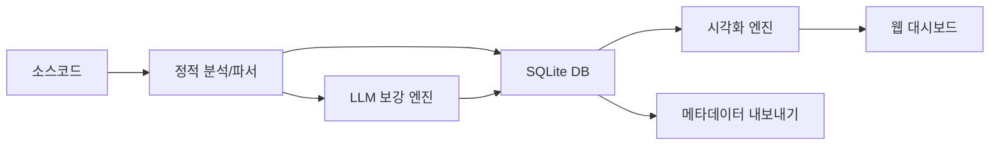

# 소스 분석·영향평가 에이전트 PRD

**버전**: v4.0 (현행화)
**작성일**: 2025-08-30
**대상 환경**: 인터넷이 안되는 폐쇄망 온프레미스 서버, RHEL (A30 GPU 1장), Java 8, Python 3.10+, vLLM(Qwen2.5 7B/32B), Oracle 11g 사전정보 CSV 제공, 사용자는 Windows PC.

---

## 1. 프로젝트 개요 및 목표

### 1.1. 개요

- **목적**: 대규모 레거시(Java/JSP/Spring/MyBatis/Oracle) 소스 정적 분석 및 자연어 질의응답/영향평가 제공
- **원칙**: 코드/SQL 원문 미저장, 경로·라인·구조 기반 메타정보 저장
- **정책**: 재현율 우선(누락 최소화), CONFIDENCE 추적, LLM 보강 로그 기록

### 1.2. 배경 및 핵심 목표

● **배경**: JSP·Spring·Java·MyBatis·Oracle DB 기반 레거시/현행 시스템의 대규모 소스를 정적 분석하여 **정확하고 풍부한 메타정보**를 생성하고, 이를 기반으로 **자연어 질의/영향평가**를 제공합니다.

● **핵심 목표**:

- **(Phase1 - 완료)** 원문 코드/SQL 미저장(경로/라인Range·구조만) 원칙 하에 메타정보 생성/저장 (재현율 우선)
- **(Phase2 - 계획)** Qwen2.5 기반 RAG+오케스트레이터로 요약/탐색/영향평가 제공
- **대규모 소스/다국어(한국어/영어) 인식·검색, 성능·스토리지 효율** 및 **증분 분석** 지원
- **CONFIDENCE** 및 **LLM 보강 이력**(추론 전/후 신뢰도) 전구간 추적

### 1.3. 용어 정의

- **메타정보**: 코드/SQL로부터 추출/요약된 구조적·서술적 정보(원문 비저장)
- **보강 이력**: LLM 전/후 비교 및 출처 모델/프롬프트/파라미터 기록
- **보수적 포괄 응답**: 정확성-재현율 트레이드오프 시 재현율(누락 최소화) 우선
- **CONFIDENCE**: [0.0~1.0] 신뢰도. 1.0=확실, 0.5=정적 추정 등

### 1.4. 사용자 스토리

- 개발자: "메소드 A 수정 시 영향받는 SQL/테이블/다른 메소드를 **빠짐없이** 보고 싶다."
- 데이터모델러: "ALL_* 코멘트가 부실/오류라서, 메타정보에 **소스 기반 의미 보강 코멘트**를 생성하고 싶다."
- 아키텍트: "해약환급금 계산하는 소스 찾아줘"
- 아키텍트: "월별 신계약 건수를 구하는 쿼리 개발해줘" 등과 같이 LLM이 자연어->SQL 자동 개발

---

## 2. 시스템 아키텍처 및 데이터 모델

### 2.1. 현재 구현 아키텍처 (Phase1)



- **Phase 1 (구현 완료)**: 정적 파서 + LLM 보강 → SQLite 저장, 시각화/웹 대시보드 제공
- **데이터 저장**: SQLite (Oracle 호환 DDL 설계)
- **시각화**: 의존성 그래프, ERD, 컴포넌트/클래스/시퀀스 다이어그램
- **내보내기**: JSON, CSV, Markdown(Mermaid), HTML 형식 지원

### 2.2. 핵심 데이터 모델

```sql
-- 프로젝트/파일 관리
CREATE TABLE projects (
  project_id INTEGER PRIMARY KEY,
  project_name TEXT NOT NULL,
  root_path TEXT NOT NULL,
  created_at TEXT,
  updated_at TEXT
);

CREATE TABLE files (
  file_id INTEGER PRIMARY KEY,
  project_id INTEGER,
  relative_path TEXT NOT NULL,
  absolute_path TEXT,
  language TEXT,
  file_hash TEXT,
  size INTEGER,
  last_modified TEXT,
  confidence REAL,
  created_at TEXT,
  updated_at TEXT,
  FOREIGN KEY(project_id) REFERENCES projects(project_id)
);

-- Java 구조 분석
CREATE TABLE classes (
  class_id INTEGER PRIMARY KEY,
  file_id INTEGER,
  name TEXT NOT NULL,
  package TEXT,
  modifiers TEXT,
  start_line INTEGER,
  end_line INTEGER,
  confidence REAL,
  FOREIGN KEY(file_id) REFERENCES files(file_id)
);

CREATE TABLE methods (
  method_id INTEGER PRIMARY KEY,
  class_id INTEGER,
  name TEXT NOT NULL,
  signature TEXT,
  return_type TEXT,
  parameters TEXT,
  modifiers TEXT,
  start_line INTEGER,
  end_line INTEGER,
  confidence REAL,
  FOREIGN KEY(class_id) REFERENCES classes(class_id)
);

-- MyBatis/SQL 분석
CREATE TABLE sql_units (
  sql_id INTEGER PRIMARY KEY,
  file_id INTEGER,
  origin TEXT, -- 'mybatis', 'jsp', 'java'
  mapper_namespace TEXT,
  statement_id TEXT,
  statement_kind TEXT, -- 'SELECT', 'INSERT', 'UPDATE', 'DELETE'
  start_line INTEGER,
  end_line INTEGER,
  confidence REAL,
  FOREIGN KEY(file_id) REFERENCES files(file_id)
);

-- 데이터베이스 스키마 정보
CREATE TABLE db_tables (
  table_id INTEGER PRIMARY KEY,
  owner TEXT,
  table_name TEXT NOT NULL,
  status TEXT,
  comments TEXT
);

CREATE TABLE db_columns (
  column_id INTEGER PRIMARY KEY,
  table_id INTEGER,
  column_name TEXT NOT NULL,
  data_type TEXT,
  nullable TEXT,
  comments TEXT,
  FOREIGN KEY(table_id) REFERENCES db_tables(table_id)
);

-- 관계 및 의존성
CREATE TABLE edges (
  edge_id INTEGER PRIMARY KEY,
  source_type TEXT, -- 'file', 'class', 'method', 'sql_unit'
  source_id INTEGER,
  target_type TEXT,
  target_id INTEGER,
  edge_type TEXT, -- 'call', 'use_table', 'extends', 'implements'
  confidence REAL
);

-- LLM 보강 로그
CREATE TABLE enrichment_logs (
  log_id INTEGER PRIMARY KEY,
  target_type TEXT,
  target_id INTEGER,
  pre_confidence REAL,
  post_confidence REAL,
  model TEXT,
  prompt_id TEXT,
  parameters TEXT,
  created_at TEXT
);
```

---

## 3. Phase1 구현 완료 기능

### 3.1. 코드 분석 엔진

#### 3.1.1. Java 파서

- **JavaParser 기반**: 클래스, 메서드, 패키지 구조 추출
- **지원 기능**: 상속 관계, 인터페이스 구현, 메서드 호출 관계
- **신뢰도 계산**: 파싱 성공률 기반 신뢰도 점수 부여

#### 3.1.2. JSP/MyBatis 파서

- **ANTLR 기반**: JSP 파일에서 SQL 구문 추출
- **MyBatis XML**: 매퍼 파일에서 SQL statement 분석
- **SQL 파싱**: JSQLParser를 통한 테이블/컬럼 사용 관계 추출

#### 3.1.3. SQL 파서

- **JSQLParser 통합**: SELECT, INSERT, UPDATE, DELETE 구문 분석
- **Oracle 방언 지원**: Oracle 특화 문법 처리
- **조인 관계 추출**: 테이블 간 조인 조건 분석

### 3.2. LLM 기반 메타데이터 보강

#### 3.2.1. 신뢰도 기반 보강

- **임계값 기반**: 낮은 신뢰도(기본 0.6 미만) 파일 대상 LLM 보강
- **다중 제공자 지원**: Ollama, vLLM, OpenAI 호환 엔드포인트
- **캐싱 시스템**: 파일 해시 기반 LLM 응답 캐싱으로 성능 최적화

#### 3.2.2. 보강 항목

- **Java 클래스/메서드 요약**: 코드 구조 기반 의미 추출
- **SQL 요약**: 쿼리 의도 및 사용 테이블 분석
- **JSP 페이지 요약**: 페이지 기능 및 데이터 흐름 분석

#### 3.2.3. 신뢰도 업데이트

- **모델 품질 가중치**: 사용 모델에 따른 품질 점수 적용  
- **증거 강도**: 추출된 정보의 구체성에 따른 점수 조정
- **보강 전후 추적**: 모든 신뢰도 변경사항 로그 기록

### 3.3. 데이터베이스 통합

#### 3.3.1. CSV 스키마 로더

- **ALL_TABLES.csv**: 테이블 정보 로드
- **ALL_TAB_COLUMNS.csv**: 컬럼 상세 정보 로드  
- **PK_INFO.csv**: 기본키 정보 로드

#### 3.3.2. 증분 분석

- **파일 해시 비교**: 변경된 파일만 재분석
- **의존성 업데이트**: 영향받는 관계 정보 자동 갱신

### 3.4. 시각화 및 내보내기

#### 3.4.1. 다이어그램 생성

- **의존성 그래프**: 파일, 클래스, 메서드 간 호출 관계
- **ERD**: SQL에서 추출한 테이블 관계도  
- **컴포넌트 다이어그램**: 시스템 아키텍처 구조
- **클래스 다이어그램**: Java 클래스 상속/구현 관계
- **시퀀스 다이어그램**: 메서드 호출 흐름

#### 3.4.2. 내보내기 형식

- **JSON**: 구조화된 메타데이터 내보내기
- **CSV**: 테이블 형태 데이터 내보내기
- **Markdown (Mermaid)**: 문서화용 다이어그램
- **HTML**: 인터랙티브 시각화
- **MD 보고서**: 메타데이터 요약 보고서 (신규)

### 3.5. 웹 대시보드

#### 3.5.1. 백엔드 API

- **FastAPI/Flask 기반**: RESTful API 제공
- **메타데이터 조회**: 파일, 클래스, 메서드 정보 API
- **시각화 데이터**: 다이어그램용 JSON 데이터 제공
- **오프라인 문서**: 내장 OWASP/CWE 취약점 가이드

#### 3.5.2. 설정 관리

- **config.yaml 기반**: 환경변수 대신 YAML 설정 파일 사용
- **Phase별 분리**: 각 Phase의 독립적 설정 관리
- **CORS 설정**: 웹 대시보드 통신을 위한 CORS 지원

### 3.6. 성능 및 확장성

#### 3.6.1. 병렬 처리

- **멀티스레드 파싱**: 파일 분석 병렬 처리
- **비동기 LLM**: 논블로킹 LLM 호출
- **배치 처리**: 대용량 프로젝트 최적화

#### 3.6.2. 메모리 최적화

- **원문 비저장**: 메타데이터만 저장으로 메모리 효율성
- **청크 단위 처리**: 대용량 파일 분할 처리
- **캐시 관리**: LRU 캐시로 메모리 사용량 제어

---

## 4. 사용법 및 예시

### 4.1. 기본 사용법

```bash
# 전체 분석 (코드 분석 + 시각화 생성)
python phase1/main.py --input-path PROJECT/sampleSrc --all

# 코드 분석만 실행
python phase1/main.py --input-path PROJECT/sampleSrc --project-name MyProject

# 증분 분석 (변경된 파일만)  
python phase1/main.py --input-path PROJECT/sampleSrc --incremental

# 메타데이터 MD 내보내기
python phase1/main.py --input-path PROJECT/sampleSrc --export-md ./output/reports
```

### 4.2. 시각화 생성

```bash
# ERD 생성
python visualize/cli.py erd --project-name sampleSrc --export-html erd.html

# 의존성 그래프 생성
python visualize/cli.py graph --project-name sampleSrc --export-html graph.html

# 컴포넌트 다이어그램
python visualize/cli.py component --project-name sampleSrc --export-html components.html
```

### 4.3. 웹 대시보드 실행

```bash
# 백엔드 서버 실행 (config.yaml의 server 설정 사용)
python web-dashboard/backend/app.py

# 브라우저에서 http://127.0.0.1:8000 접속
```

### 4.4. LLM 설정 예시

```yaml
# config/phase1/config.yaml
llm_assist:
  enabled: true
  provider: "ollama"                # ollama, vllm, openai
  low_conf_threshold: 0.6          # 0.6 미만 신뢰도 파일만 보강
  max_calls_per_run: 50            # 한 실행당 최대 LLM 호출 수
  temperature: 0.0                 # 0.0=결정적, 1.0=창의적
  max_tokens: 512                  # 응답 최대 길이
  cache: true                      # 캐싱 활성화
  cache_dir: "./output/llm_cache"  # 캐시 저장 위치
```

---

## 5. 시스템 요구사항

### 5.1. 하드웨어 요구사항

- **CPU**: Intel/AMD x64, 4코어 이상 권장
- **메모리**: 8GB 이상 (대규모 프로젝트의 경우 16GB 권장)
- **저장소**: SSD 100GB 이상 여유 공간
- **GPU**: A30 등 CUDA 지원 GPU (LLM 사용 시)

### 5.2. 소프트웨어 요구사항

- **OS**: RHEL 8+, Ubuntu 20.04+, Windows 10+
- **Python**: 3.10 이상
- **Java**: JRE 8 이상 (JavaParser 의존성)
- **데이터베이스**: SQLite 3.35+ (또는 Oracle 11g+)

### 5.3. 오프라인 환경 준비

```bash
# Python 패키지 휠 생성
pip wheel -r requirements.txt -w wheelhouse/

# 오프라인 설치
pip install --no-index --find-links wheelhouse -r requirements.txt
```

---

## 6. 품질 보증 및 테스트

### 6.1. 신뢰도 검증

- **Ground Truth 데이터셋**: 수동 검증된 테스트케이스
- **신뢰도 캘리브레이션**: 실제 정확도와 예측 신뢰도 비교
- **A/B 테스트**: 다양한 신뢰도 공식 성능 비교

### 6.2. 성능 테스트

- **대규모 프로젝트**: 10,000+ 파일 처리 성능 측정
- **메모리 프로파일링**: 메모리 사용량 최적화 검증
- **병렬 처리**: 멀티코어 활용 효율성 측정

### 6.3. 테스트 자동화

- **단위 테스트**: 각 파서별 정확성 검증
- **통합 테스트**: 전체 파이프라인 동작 확인
- **회귀 테스트**: 업데이트 시 기존 기능 보장

---

## 7. 미구현 내역 (향후 개발)

### 7.1. Phase2 - RAG 기반 질의응답 시스템

#### 7.1.1. 오케스트레이터 아키텍처

- **LangChain/LangGraph**: 복잡한 질의 처리 워크플로우
- **벡터 검색**: FAISS 인덱스 기반 의미적 유사도 검색
- **하이브리드 검색**: 키워드 + 벡터 검색 결합

#### 7.1.2. 자연어 질의 처리

- **의도 파악**: 질문 유형 분류 (조회, 영향분석, 코드생성)
- **컨텍스트 구성**: 관련 메타데이터 수집 및 정리
- **응답 생성**: Qwen2.5 기반 자연어 답변 생성

### 7.2. 분석 대상 확장

#### 7.2.1. Oracle Stored Procedure/Function

- **ANTLR-PLSQL**: PL/SQL AST 파싱
- **SP/SF 간 호출 관계**: 프로시저 함수 의존성 추적
- **동적 SQL 분석**: 런타임 SQL 구문 추정

#### 7.2.2. 추가 언어 지원

- **Python**: AST 모듈 기반 파싱
- **JavaScript/TypeScript**: Babel/TSC 통합
- **React/Vue.js**: 컴포넌트 구조 분석

### 7.3. 고급 보안/품질 분석

#### 7.3.1. SAST 통합

- **정적 보안 분석**: CodeQL, Semgrep 통합
- **취약점 탐지**: OWASP Top 10 기반 보안 검사
- **자동 수정 제안**: LLM 기반 보안 개선안 생성

#### 7.3.2. 코드 품질 메트릭

- **복잡도 분석**: 순환 복잡도, 인지 복잡도
- **중복 코드 탐지**: PMD CPD 통합
- **기술 부채 측정**: 코드 스멜 탐지

### 7.4. UI/UX 고도화

#### 7.4.1. 고급 시각화

- **인터랙티브 그래프**: 드릴다운, 필터링, 검색
- **대시보드 커스터마이징**: 사용자별 뷰 설정
- **실시간 업데이트**: WebSocket 기반 라이브 모니터링

#### 7.4.2. 협업 기능

- **주석 시스템**: 메타데이터에 사용자 코멘트 추가
- **북마크**: 중요한 코드 구간 즐겨찾기
- **리포트 공유**: 분석 결과 PDF/PPT 내보내기

### 7.5. 성능 및 확장성 개선

#### 7.5.1. 분산 처리

- **클러스터 지원**: 다중 노드 분산 분석
- **작업 큐**: Redis/Celery 기반 비동기 작업 처리
- **로드 밸런싱**: 여러 LLM 서버 부하 분산

#### 7.5.2. 스토리지 최적화

- **그래프 DB**: Neo4j 통합으로 관계 쿼리 성능 향상
- **컬럼 스토어**: ClickHouse 등 분석용 DB 도입
- **압축**: 메타데이터 압축 저장으로 용량 절약

---

## 8. 버전 히스토리

- **v1.0**: 기본 Java/JSP 파싱 기능
- **v2.0**: MyBatis SQL 분석, 기본 시각화 추가
- **v3.0**: LLM 보강 기능, 신뢰도 시스템 도입
- **v4.0**: 웹 대시보드, MD 내보내기, Phase별 설정 분리 (현재)