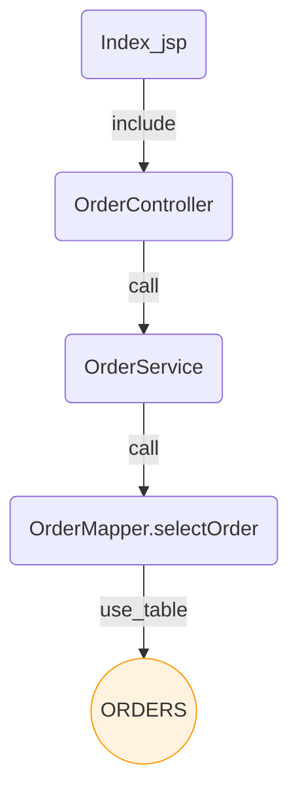
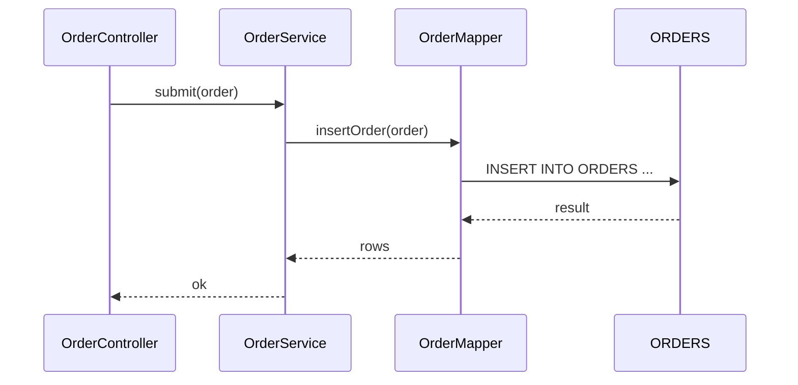
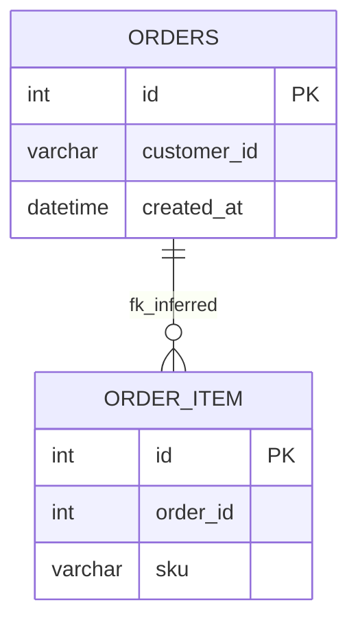
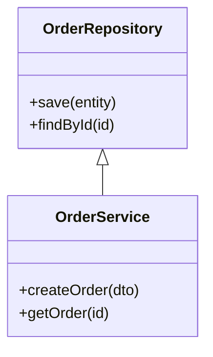

# Source Analyzer 데이터 플로우 가이드

본 문서는 Source Analyzer가 제공하는 데이터 흐름 시각화를 한곳에 정리한 실무 가이드입니다. 대화형 HTML 그래프, Markdown(Mermaid) 다이어그램, JSON/CSV 내보내기까지 한 번에 이해하고 바로 적용할 수 있도록 구성했습니다.

- 핵심 CLI: `visualize/cli.py`
- Mermaid/Markdown Exporter: `visualize/exporters/mermaid_exporter.py`
- 템플릿(대화형 HTML): `visualize/templates/*.html`
- 빌더: `visualize/builders/*` (graph/sequence/erd/component/class)

## 개요
- 목적: 프로젝트의 “데이터 흐름”과 “의존 관계”를 빠르게 파악하고, 리뷰/PR/위키/리포트 등 다양한 맥락에서 공유 가능하도록 문서화합니다.
- 산출물 채널
  - 대화형 HTML: 확대/검색/레이아웃/PNG 저장 지원(권장, 내부 탐색용)
  - Markdown(.md) + Mermaid: 문서 공유/PR 첨부/위키 게시에 최적
  - Mermaid 원본(.mmd): Mermaid Live Editor에서 편집·토론용
  - JSON/CSV: 2차 분석/커스텀 대시보드/BI 도구 연계용

## 다이어그램 종류와 쓰임새
- Graph(의존/데이터 흐름): JSP→Controller→Service→Mapper→Table까지 시스템 흐름 전반을 한눈에 파악
- Sequence(호출 시퀀스): 특정 시작 파일/메서드 중심의 호출 플로우 추적
- ERD(데이터 모델): 테이블/추론 조인 관계 시각화
- Component(컴포넌트 경계): 컴포넌트 레벨의 상호작용
- Class(클래스 구조): 상속/구현 + 속성/메서드 요약(노이즈 억제 옵션 제공)

## 의존 흐름도 vs 데이터 흐름도
- 의존 흐름도
  - 정의: 코드/아티팩트 간 “의존 관계”를 보여줌
  - 예시: 클래스 상속(`extends`), 인터페이스 구현(`implements`), 파일 `include`/`import`, 메서드 간 호출(`call`), 미해결 호출(`call_unresolved`)
  - 목적: 아키텍처 구조 파악(누가 누구에 기대는가)
  - 관련 엣지: `extends`, `implements`, `include`, `call`, `call_unresolved`
- 데이터 흐름도
  - 정의: “데이터가 어디서 와서 어디로 가는가”를 보여줌
  - 예시: JSP/컨트롤러 → 서비스 → Mapper/SQL → DB 테이블로의 흐름
  - 목적: 입·출력 경로, 저장소 접근, 처리 경유지 파악
  - 관련 엣지: `use_table`(SQL이 사용하는 테이블), `call`(데이터 경로 연결), 필요 시 `call_sql` 등

## 데이터 흐름을 찾는 방식(코드 기준)
- SQL 단위 추출: `phase1/src/parsers/jsp_mybatis_parser.py`
  - DynamicSqlResolver로 MyBatis 동적 SQL을 정규화: `include/bind/choose/foreach/if/trim/where/set` 인라인 및 조건 주석 보존
  - JSP 스크립틀릿/표현식/JSTL 태그에서 SQL 추출(가능하면 Tree-sitter, 폴백 정규식)
  - 결과: SQL 단위(`SqlUnit`), 조인/필수조건 메타(`Join`, `RequiredFilter`), JSP include 관계 등
- 테이블 매핑: `phase1/src/database/metadata_engine.py::_resolve_table_usage`
  - 추출된 SQL의 조인 정보와 DB 스키마(`DbTable`) 매칭 → `use_table` 엣지 생성(출처: `sql_unit` → 대상: `table`)
  - 조인 패턴을 바탕으로 PK–FK 관계 추론(`_infer_pk_fk_relationships`)
- 호출 연결: `phase1/src/parsers/java_parser.py` + `metadata_engine._resolve_method_calls`
  - Java 클래스/메서드/호출 추출 → `call` 엣지 생성
  - 미해결 호출은 후처리로 해석 시도, 실패 시 낮은 confidence의 미해결 호출 유지
- 그래프 구성: `visualize/builders/*`
  - `dependency_graph.py`: `use_table`,`include`,`call` 등 엣지를 조건(`--kinds`, `--min-confidence`)에 맞게 수집해 JSON 생성
  - `sequence_diagram.py`: 시작점 기준 BFS로 호출/DB 사용 흐름(필요 시 JSP→SQL→Table 기본 플로우) 생성
  - ERD/Component/Class: 각 뷰 전용 JSON 생성
- 내보내기/표현: `visualize/exporters/mermaid_exporter.py`, `visualize/templates/*.html`
  - Mermaid/Markdown(.md/.mmd)와 대화형 HTML(검색/레이아웃/PNG)로 가시화
  - `--keep-edge-kinds include,call,use_table`로 데이터 경로 핵심 엣지 보존 권장

### 실무 팁(데이터 흐름 강조)
- 데이터 흐름만 강조: `--kinds use_table,include,call` + `--keep-edge-kinds include,call,use_table` + `--min-confidence 0.5`
- 유스케이스 흐름: `sequence`에서 `--start-file`, `--start-method`로 시작점 지정(미지정 시 JSP→SQL→Table 기본 흐름 생성)
- 한계/확장: 변수/필드 단위의 정밀 데이터 라인리지는 제한적(호출 그래프+SQL→테이블 매핑 수준). 필요 시 파라미터 바인딩/HTTP 파라미터→SQL 매핑 확장 고려

## 빠른 시작(명령 예시)
아래 예시는 루트에서 `python -m visualize.cli`로 실행합니다. 필수 인자: `--project-id`, `--out`.

1) 전체 의존/데이터 흐름(HTML + Markdown)

```bash
python -m visualize.cli graph \
  --project-id 1 \
  --kinds use_table,include,extends,implements,call \
  --min-confidence 0.5 \
  --out out/graph.html \
  --export-mermaid out/graph.md \
  --export-strategy balanced \
  --keep-edge-kinds include,call,use_table
```

2) 포커스 중심(특정 화면/모듈 기준, 깊이 제한)

```bash
python -m visualize.cli graph \
  --project-id 1 \
  --kinds use_table,include,call \
  --focus SomePage.jsp \
  --depth 2 \
  --out out/graph_focus.html \
  --export-mermaid out/graph_focus.md \
  --export-strategy minimal \
  --keep-edge-kinds include,call,use_table
```

3) 유스케이스 호출 흐름(시퀀스)

```bash
python -m visualize.cli sequence \
  --project-id 1 \
  --start-file OrderController.java \
  --start-method submit \
  --depth 3 \
  --out out/seq.html \
  --export-mermaid out/seq.md \
  --min-confidence 0.5
```

4) ERD 생성

```bash
python -m visualize.cli erd \
  --project-id 1 \
  --out out/erd.html \
  --export-mermaid out/erd.md
```

5) 클래스 다이어그램(노이즈 억제)

```bash
python -m visualize.cli class \
  --project-id 1 \
  --out out/class.html \
  --export-mermaid out/class.md \
  --class-methods-max 8 \
  --class-attrs-max 8
```

> 참고: Graph의 `--kinds` 기본값은 `use_table,include,extends,implements`입니다. Mermaid 필터링의 `--keep-edge-kinds`는 `include,call,use_table` 권장(데이터 흐름에 유용한 엣지 우선 보존).

## 추천 옵션 세트(현업 기준)
- Export Strategy: `balanced`(기본) → 복잡도/정보량 균형, `minimal` → 리뷰/PR 첨부용 요약, `full` → 상세 분석용
- Confidence 임계값: `--min-confidence 0.5`(권장). 불확실 엣지는 필터링되며, `--keep-edge-kinds`로 핵심 엣지 보존
- Keep Edge Kinds: `include,call,use_table` 권장(파일 include/호출/DB 접근 관점의 데이터 흐름 강조)
- 노이즈 억제: 클래스 다이어그램 `--class-methods-max`, `--class-attrs-max`로 긴 목록 축약

## 산출물 설명
- HTML(`--out`): `visualize/templates/*`를 통해 렌더링
  - 확대/이동/검색/레이아웃 토글(Dagre/COSE) 지원
  - 클릭시 노드 메타 정보 패널, PNG 내보내기 버튼 제공
- Markdown(`--export-mermaid` .md): 개요/범례/요약/접기 섹션 + Mermaid 코드블록 자동 포함
  - GitHub/VS Code에서 바로 렌더링
- Mermaid 원본(.mmd/.mermaid): Mermaid Live Editor에서 시각적으로 편집·리뷰 가능
- JSON/CSV(`--export-json`, `--export-csv-dir`)
  - 스키마: `visualize/schema.py`
  - JSON: `{ nodes:[{id,type,label,group,meta}], edges:[{id,source,target,kind,confidence,meta}] }`

## 디렉터리/모듈 레퍼런스
- CLI: `visualize/cli.py`
  - subcommands: `graph`, `erd`, `component`, `sequence`, `class`
  - 공통 옵션: `--project-id`, `--out`, `--min-confidence`, `--max-nodes`, `--export-*`, `--mermaid-*`, `--keep-edge-kinds`
- Exporter: `visualize/exporters/mermaid_exporter.py`
  - Markdown 문서 구성(개요/범례/요약/접기/overflow 안내) + Mermaid 코드 생성
  - confidence/edge_kind 기반 공통 필터링 내장
- Builders: `visualize/builders/*`
  - `dependency_graph.py`: 의존/데이터 흐름 그래프 JSON 생성
  - `sequence_diagram.py`: 시작점 기반 호출 흐름(BFS) + JSP→SQL→Table 기본 플로우 제공
  - `erd.py`, `component_diagram.py`, `class_diagram.py`: 각 뷰 전용 JSON 생성
- Templates: `visualize/templates/*.html`(Cytoscape + dagre)

## 운영 팁(권장 워크플로우)
1) 문서 스냅샷 폴더 운영: `docs/data-flow/`에 주기적으로 HTML/MD 아티팩트 생성
2) CI 통합: 분석 파이프라인 완료 후 본 CLI로 시각화 산출물 생성 → 아티팩트 업로드/Pages 게시
3) PR 연계: 변화 영향 분석 시 `--focus`/`--depth`로 요약 그래프 생성해 PR에 첨부
4) 대시보드 연동: Web Dashboard(backend/front)에서 JSON을 Cytoscape로 렌더하는 “Data Flow” 탭 추가
5) 신뢰도 표현: `call_unresolved`는 점선·회색, 낮은 confidence는 얇은 선/투명도 처리(템플릿 스타일 참고)

## 문제 해결(FAQ)
- Mermaid가 GitHub에서 깨져 보임
  - 코드블록 시작을 반드시 ```` ```mermaid ````로 사용했는지 확인
  - 너무 큰 그래프는 렌더링이 느릴 수 있으므로 `--export-strategy minimal` 또는 `--max-nodes`/`--depth`로 축약
- 엣지 종류 명칭 주의
  - 데이터 흐름 보존을 위해 `--keep-edge-kinds include,call,use_table` 사용 권장
  - `--kinds`에는 `include,call,use_table,extends,implements` 등 실제 저장된 엣지 타입을 지정
- 시작점이 애매한 시퀀스
  - `--start-file`, `--start-method` 없이 실행 시 JSP→SQL→Table 기본 흐름을 자동 구성
- 프로젝트 ID/데이터 없음
  - `--project-id`가 분석 DB에 존재하는지 확인. Web Dashboard의 `/api/projects`로도 점검 가능

## 부록: 자주 쓰는 명령 모음

```bash
# 전체 그래프(권장 프리셋)
python -m visualize.cli graph \
  --project-id 1 \
  --kinds use_table,include,call \
  --min-confidence 0.5 \
  --out out/graph.html \
  --export-mermaid out/graph.md \
  --export-json out/graph.json \
  --export-csv-dir out/graph_csv \
  --export-strategy balanced \
  --keep-edge-kinds include,call,use_table

# 유스케이스(주요 화면/엔드포인트)
python -m visualize.cli sequence \
  --project-id 1 \
  --start-file LoginController.java \
  --start-method authenticate \
  --depth 3 \
  --out out/seq_login.html \
  --export-mermaid out/seq_login.md

# ERD(요약)
python -m visualize.cli erd \
  --project-id 1 \
  --out out/erd.html \
  --export-mermaid out/erd.md
```

---

문의/개선 제안: 본 문서와 스크립트는 팀 상황에 맞춰 지속 개선합니다. 필요한 프리셋/자동화(스크립트/CI), 대시보드 탭 추가가 필요하면 이슈를 생성해 주세요.

## 실행 캡처(예: 프로젝트 ID 1)

아래는 실제 실행 예시(일부 로그 요약)입니다.

```bash
# 1) 의존/데이터 흐름 그래프 (HTML + MD)
python -m visualize.cli graph \
  --project-id 1 \
  --kinds use_table,include,call \
  --min-confidence 0.5 \
  --out out/graph.html \
  --export-mermaid out/graph.md \
  --export-strategy balanced \
  --keep-edge-kinds include,call,use_table

# 로그 예시
[12:01:02] INFO visualize.cli: 시각화 생성 시작: graph
[12:01:02] INFO visualize.cli: 의존/데이터 그래프 생성: 프로젝트 1
[12:01:03] DEBUG visualize.cli: Generated 428 nodes and 1032 edges
[12:01:03] INFO visualize.cli: Mermaid/Markdown 내보내기: out/graph.md
[12:01:03] INFO visualize.cli: 시각화 HTML 출력: out/graph.html
```

```bash
# 2) 시퀀스 다이어그램 (유스케이스 흐름)
python -m visualize.cli sequence \
  --project-id 1 \
  --start-file OrderController.java \
  --start-method submit \
  --depth 3 \
  --out out/seq_order.html \
  --export-mermaid out/seq_order.md

# 로그 예시
Building sequence diagram for project 1
  Start file: OrderController.java
  Start method: submit
  Max depth: 3
  Generated 26 nodes, 41 edges in sequence
```

```bash
# 3) ERD (요약)
python -m visualize.cli erd \
  --project-id 1 \
  --out out/erd.html \
  --export-mermaid out/erd.md

# 로그 예시
[12:04:11] INFO visualize.cli: ERD 생성: 프로젝트 1
[12:04:12] DEBUG visualize.cli: Generated 52 nodes and 64 edges
```

## Mermaid 예시 다이어그램

아래는 문서/PR에 바로 붙일 수 있는 소형 예시입니다.

### Graph(데이터 흐름 강조)



### Sequence(유스케이스: 주문 제출)



### ERD(요약)



### Class(축약 예시)


