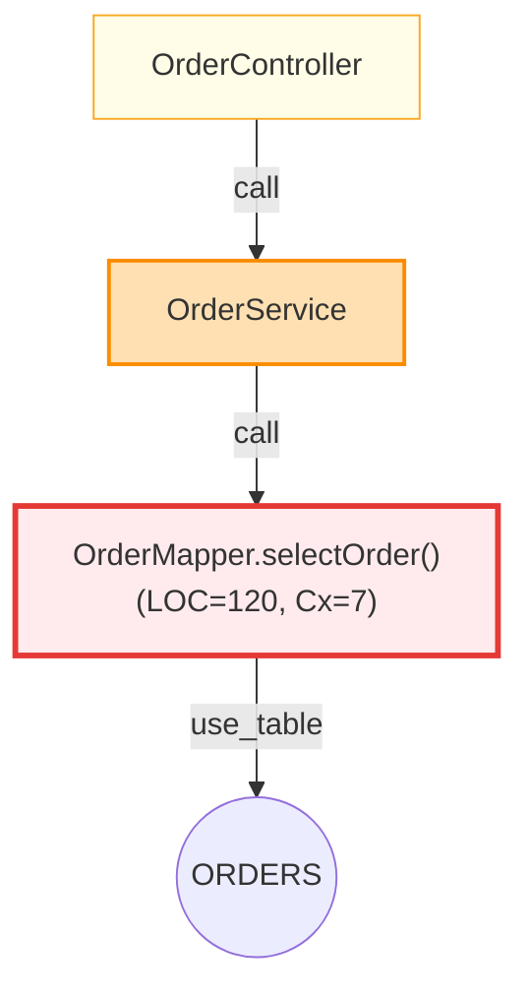
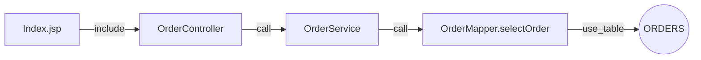
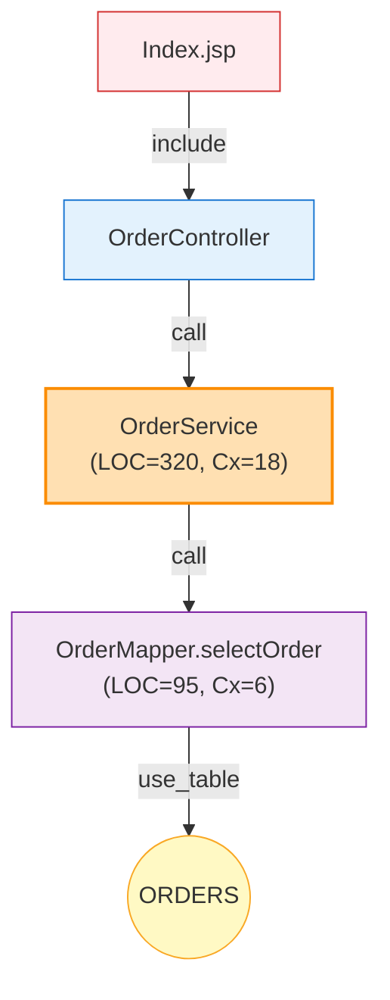

# Visual Dataflow v2 – 설계/구현 계획 (Hotspot, 취약점 레이어, 데이터흐름 시각화)

본 문서는 다음 3가지 기능을 md/Mermaid 중심으로 구현하기 위한 상세 설계입니다. 인터랙티브(HTML/Cytoscape) 없이도 사용자 가치가 충분하도록 우선 설계하되, Mermaid 한계로 인해 시각적 크기(노드 사이즈) 표현이 제한되는 부분은 명확히 기재합니다.

- 핫스팟 맵: LOC/복잡도로 노드 크기·색상 표현
- 취약점 레이어: `vulnerability_fixes` 심각도별 색상 오버레이
- 데이터흐름도: Visual_dataflow_001_req.md의 요구를 반영한 엔드투엔드 흐름 가시화(참고: 파일이 리포지토리에 없으므로 합리적 가정 포함)

## 범위와 산출물
- 산출물 형식: Markdown(.md) + Mermaid 코드블록(.md 내 포함)
- 대상 뷰: Graph(의존/데이터흐름), Sequence(호출 흐름), ERD(데이터 모델)
- 변경 포인트(코드 관점): builders에서 메타 계산/주석 추가, exporter에서 Mermaid 클래스/라벨 반영(본 문서는 설계와 소스 스니펫만 제시)

## 전제/제약
- 노드 사이즈(크기) 표현: Mermaid Graph는 노드 width/height 제어가 제한적입니다. 따라서 노드 “크기”는
  - 1) 색상(heatmap) + 라벨 내 수치 표기(LOC, Cx)
  - 2) 클래스 bin(예: hotspot_small/med/high)으로 시각적 차이를 일부 표현(굵기/색)
  - 필요 시 대화형 HTML(Cytoscape)로 확장하면 width/height/폰트 등 정교한 사이즈 매핑 가능(후속 옵션)
- Visual_dataflow_001_req.md 미존재: 요구 상세가 없는 부분은 다음 가정으로 설계
  - 데이터흐름도는 JSP/Controller → Service → Mapper/SQL → Table 경로를 우선 표시
  - 엣지: `include`, `call`, `use_table` 중심, 미해결 호출은 점선/회색(가독성)
  - 필요 메타: 노드 그룹(fqn/path 기반), 노드 라벨 축약, 필터 정보 기록

---

## 1) 핫스팟 맵 (LOC/복잡도 시각화)

### 목표/UX
- 노드별 LOC/복잡도(Cyclomatic Complexity 대용)를 정량화하여 “문제 가능성이 높은 지점”을 빠르게 식별
- Mermaid에서 표현:
  - 라벨 예: `OrderService.createOrder() (LOC=120, Cx=7)`
  - 색상 bin(예: Green→Yellow→Orange→Red)으로 Hotspot 정도 표현
  - 굵기/외곽선 클래스로 보조

### 데이터·스키마(추가 메타)
- `node.meta.loc`: 정수(파일/클래스/메서드 LOC)
- `node.meta.complexity_est`: 정수(복잡도 추정치)
- `node.meta.hotspot_bin`: 문자열(`low|med|high|crit`)

복잡도 산출 전략(초기):
- 실제 CC가 없으므로 근사치 제안(빌더 레벨):
  - 메서드: 아웃바운드 호출 수 + 조건 키워드 빈도(if/for/while/switch) 간단 점수화
  - 클래스: 소속 메서드 복잡도 합/평균
  - 파일: 클래스/메서드 합
  - 추후 CC 도입 시 교체 가능하도록 키 `complexity_est` 유지

### 구현 포인트(설계 스니펫)
- 위치: `visualize/builders/dependency_graph.py`

```python
# pseudo: builders/dependency_graph.py 내 노드 생성 직후 메타 보강
from collections import Counter

HOTSPOT_BINS = {
    'low':   (0,  100),
    'med':   (101, 300),
    'high':  (301, 800),
    'crit':  (801, 10_000_000),
}

KEYWORDS = ("if", "for", "while", "switch", "case", "catch")

def estimate_complexity(details: dict) -> int:
    # 간단 근사: 메서드 호출 수 + 키워드 점수
    text = (details.get('body', '') or '')
    kw_score = sum(text.count(kw) for kw in KEYWORDS)
    out_calls = len(details.get('out_calls', []) or [])
    return kw_score + out_calls

def bin_hotspot(loc: int, cx: int) -> str:
    # 기본은 LOC 구간으로 분류, cx가 크면 상향 조정
    for name, (lo, hi) in HOTSPOT_BINS.items():
        if lo <= (loc or 0) <= hi:
            base = name
            break
    # 복잡도 보정
    if (cx or 0) >= 20 and base in ("low", "med"):
        return "high"
    return base

# 노드 생성 시:
node = create_node(node_id, node_type, label, group, details)
loc = details.get('loc') or details.get('lines_of_code')
if node_type == 'method':
    cx = estimate_complexity(details)
else:
    cx = details.get('complexity_est', 0)

node['meta']['loc'] = loc or 0
node['meta']['complexity_est'] = cx
node['meta']['hotspot_bin'] = bin_hotspot(node['meta']['loc'], cx)
```

- Exporter(Mermaid): `visualize/exporters/mermaid_exporter.py`
  - Graph 출력 시 `class nX hotspot_high` 식으로 클래스 지정

```python
# pseudo in _export_graph():
for node in data.get('nodes', []):
    node_id = self._sanitize_id(node['id'])
    hotspot = (node.get('meta') or {}).get('hotspot_bin')
    if hotspot:
        lines.append(f"  class {node_id} hotspot_{hotspot}")

# 스타일(legend와 함께):
lines.extend([
  "  %% Hotspot styling",
  "  classDef hotspot_low fill:#e8f5e9,stroke:#43a047",
  "  classDef hotspot_med fill:#fffde7,stroke:#f9a825",
  "  classDef hotspot_high fill:#ffe0b2,stroke:#fb8c00,stroke-width:2px",
  "  classDef hotspot_crit fill:#ffebee,stroke:#e53935,stroke-width:3px",
])
```

- Mermaid 샘플



### 한계/보완
- Mermaid에서 node 크기 자체 조절이 제한적 → 색상/외곽/라벨로 대체
- 정교한 CC는 별도 분석기 필요(후속 옵션). 현재는 근사(`complexity_est`)
- 대화형 필요 시 Cytoscape로 width/height/폰트/툴팁에 수치 매핑 가능(선택사항)

---

## 2) 취약점 레이어 (심각도 색상 표시)

### 목표/UX
- 동일 그래프 위에 취약점 심각도(예: critical/high/medium/low/none)를 색상으로 오버레이
- 노드 테두리/글래스 효과로 충돌 줄이고, Hotspot과 조합 표현 가능

### 데이터·스키마(추가 메타)
- `node.meta.vuln_counts`: {severity: count}
- `node.meta.vuln_max_severity`: 문자열(`critical|high|medium|low|none`)

### 구현 포인트(설계 스니펫)
- 위치: `visualize/data_access.py` 또는 `VizDB` 래퍼에서 `vulnerability_fixes` 조회 API 추가
- 빌더에서 결합: `build_dependency_graph_json()` 내 노드 메타 보강

```python
# pseudo: VizDB API
class VizDB:
    def fetch_vulnerabilities(self, project_id: int):
        # return list of (target_type, target_id, severity, rule, fixed_at, ...)
        ...

# pseudo: builders/dependency_graph.py
SEV_ORDER = {"critical": 4, "high": 3, "medium": 2, "low": 1, "none": 0}

vulns = db.fetch_vulnerabilities(project_id)
by_target = {}
for v in vulns:
    key = f"{v.target_type}:{v.target_id}"
    by_target.setdefault(key, []).append(v)

# 노드 생성 후:
vlist = by_target.get(node['id'], [])
counts = {}
for v in vlist:
    sev = (v.severity or 'none').lower()
    counts[sev] = counts.get(sev, 0) + 1
node['meta']['vuln_counts'] = counts
max_sev = max(counts, key=lambda s: SEV_ORDER.get(s, 0)) if counts else 'none'
node['meta']['vuln_max_severity'] = max_sev
```

- Exporter(Mermaid): 최고 심각도 기반 클래스 부여

```python
# pseudo in _export_graph()
sev = (node.get('meta') or {}).get('vuln_max_severity')
if sev and sev != 'none':
    lines.append(f"  class {node_id} vuln_{sev}")

# 스타일
lines.extend([
  "  %% Vulnerability styling",
  "  classDef vuln_low stroke:#8bc34a,stroke-width:2px,stroke-dasharray:2 2",
  "  classDef vuln_medium stroke:#fbc02d,stroke-width:2px",
  "  classDef vuln_high stroke:#fb8c00,stroke-width:3px",
  "  classDef vuln_critical stroke:#e53935,stroke-width:4px",
])
```

- Mermaid 샘플(Hotspot + 취약점 병행)

```mermaid
graph TD
  A[LoginController] -->|call| B[AuthService]
  B -->|call| C[UserMapper.getUser()]
  C -->|use_table| D((USERS))
  classDef hotspot_low fill:#e8f5e9,stroke:#43a047
  classDef hotspot_med fill:#fffde7,stroke:#f9a825
  classDef hotspot_high fill:#ffe0b2,stroke:#fb8c00,stroke-width:2px
  classDef vuln_high stroke:#fb8c00,stroke-width:3px
  classDef vuln_critical stroke:#e53935,stroke-width:4px

  %% apply classes using class directives
  class A hotspot_low;
  class B hotspot_high,vuln_high;
  class C hotspot_med,vuln_critical;
```

### 한계/보완
- 동일 노드에 Hotspot/취약점 스타일이 겹칠 수 있어 가독성 충돌 가능 → 우선순위 규칙(취약점 테두리, Hotspot 내부 색) 권장
- 세부 룰/유형별 세분화는 legend/필터(나중에 CLI 옵션)로 확장

---

## 3) 데이터흐름도 (엔드투엔드)

### 요구사항 반영(Visual_dataflow_001_req.md 기준)
- 뷰 목적: 화면/엔드포인트 기점의 데이터 경로를 한눈에
- 엣지 구성: `include`, `call`, `use_table` 중심, 미해결 호출은 점선/회색 처리
- 그룹/색상: `JSP`, `Controller`, `Service`, `Mapper`, `DB` 그룹별 컬러/범례 유지
- 실행 캡처/예시: 001 문서 내 graph/sequence/erd 예시와 동일한 흐름을 기본 프리셋으로 제공
- 기본 옵션 권장: `--kinds use_table,include,call`, `--keep-edge-kinds include,call,use_table`, `--min-confidence 0.5`

### 구현 개요
- 빌더: `build_dependency_graph_json(project_id, kinds=['use_table','include','call'], ...)`
  - 포커스 옵션(`--focus`, `--depth`)으로 특정 화면/모듈 중심 축약
  - 메타에 `filters` 기록(시작점, kinds, min_conf 등)
- Exporter: Markdown 문서 상단에 개요/범례/필터, Mermaid 코드블록 포함
- Mermaid 스타일: 그룹별 색상, `call_unresolved` 점선, `use_table`은 주황 등

### 001 요구 ↔ 설계 매핑
- 그래프 프리셋: 001 예시(데이터 흐름 강조)와 동일하게 `use_table,include,call`을 기본 프리셋으로 제공
- 시퀀스: 001의 `OrderController.submit` 유스케이스 흐름을 재현(시작점 미지정 시 JSP→SQL→Table 기본 플로우)
- ERD: 001의 `fk_inferred` 스타일 명시(추론 관계는 점선/주석으로 구분, 스타일 표준화)
- 문서 구성: 001과 동일하게 개요/범례/요약/예시 섹션 포함, 실행 캡처는 md에 로그 요약 삽입

### 인코딩/렌더링 주의(문서 품질)
- md는 UTF-8 저장, Mermaid 코드블록은 ````` ```mermaid `````로 시작해야 GitHub/VS Code에서 정상 렌더링됨
- 큰 그래프는 `--export-strategy minimal` 또는 `--max-nodes`/`--depth`로 축약해 렌더링 품질 확보

### Mermaid 예시



### 메타 생성 수정 가능성
- HTTP 엔드포인트→Controller 매핑, 파라미터→SQL 바인딩 추적 등 고도화가 필요하면
  - 파서/DB 메타 생성 단계 추가 작업이 필요(범위 확장). v2에서는 경로 수준(호출+테이블 접근)로 제공

---

## CLI 옵션(설계)
- `--hotspot-metric loc|complexity|both` (기본: both)
- `--hotspot-bins 100,300,800` (구간 커스터마이즈)
- `--vuln-overlay on|off` (기본: on)
- `--kinds use_table,include,call` (데이터흐름 기본 프리셋)
- `--focus <node or label substring>` / `--depth <n>`

(주의: 본 문서는 설계이며 실제 코드는 반영 전 상태입니다.)

---

## 테스트 계획
- 소형 샘플 그래프에 대해
  - Hotspot bin 분류(경계값) 검사
  - 취약점 최대 심각도 선택 로직 검사
  - Mermaid 코드 생성 시 클래스 부여/스타일 누락 여부 검사
- 문서 렌더링 확인: GitHub/VS Code에서 Mermaid 표시 검증

## 리스크/제약
- Mermaid 노드 크기 제어 한계 → 색상/라벨로 대체(필요 시 대화형 확대)
- 복잡도 정밀도 한계 → `complexity_est`는 근사. 정확한 CC는 후속(도구 도입/AST 분석 필요)
- `Visual_dataflow_001_req.md` 부재로 일부 UX/범례 가정 포함 → 확인 후 보정 필요

## 일정(제안)
- D+1: 빌더/익스포터 프로토타입(Hotspot/Vuln 클래스/라벨)
- D+2: 데이터흐름 프리셋/범례/샘플 문서 생성
- D+3: 경계값 튜닝/문서화/리뷰 반영(필요 시 인터랙티브 옵션 논의)

---

## 부록: 전체 예시(합성)



위 설계를 기반으로 md/Mermaid 만으로도 유의미한 가치를 제공할 수 있습니다. 노드 크기(면적) 자체를 반드시 표현해야 한다면, 후속 단계에서 기존 대화형 템플릿(Cytoscape)에 width/height 매핑을 추가하는 방안을 권장합니다.
