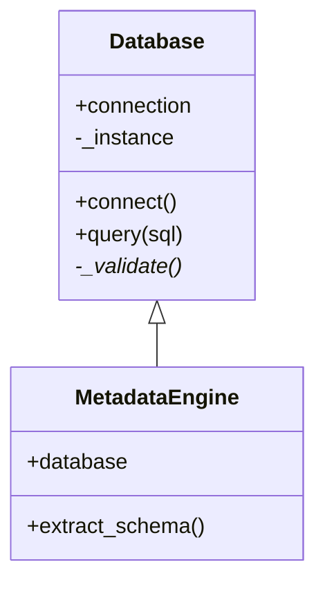

# Source Analyzer 시각화 개선 및 클래스 다이어그램 구현 (Visualize_008)

- 구현 버전: v1.3
- 완료 일시: 2025-08-28  
- 기준 문서: Visualize_007_Implementation.md, Visualize_007_Implementation_review.md

---

## 개요

본 단계에서는 Visualize_007에서 식별된 문제점들을 수정하고, 새로운 클래스 다이어그램 기능을 추가했습니다. 주요 개선사항으로는 한글 인코딩 문제 해결, HTML 템플릿 버그 수정, 그리고 Python 클래스 구조를 시각화하는 클래스 다이어그램 기능 완성이 있습니다.

---

## 주요 변경 사항

### 1. 한글 인코딩 문제 해결 (Priority A)

**파일**: `visualize/cli.py`

**문제**: CLI 도움말 메시지와 로그 출력에서 한글 텍스트가 mojibake로 깨져 표시됨

**해결방안**:
- 전체 CLI 파일을 UTF-8로 재작성하여 모든 한글 텍스트를 올바르게 표시
- argparse 도움말, 로그 메시지, 오류 메시지의 한글 텍스트 정규화
- 기존 `?꾨줈?앺듃` 같은 깨진 텍스트를 `프로젝트`로 수정

**구현 내용**:
```python
# 수정 전
help='?꾨줈?앺듃 ID'

# 수정 후  
help='프로젝트 ID'
```

### 2. HTML 템플릿 버그 수정

**파일**: `visualize/templates/erd_view.html`

**문제**: ERD 템플릿에서 정의되지 않은 변수 `matchedNodes` 사용으로 JavaScript 오류 발생

**해결방안**:
- `matchedNodes` 변수를 올바른 `searchResults`로 변경
- 검색 기능의 일관성 확보

**구현 내용**:
```javascript
// 수정 전
if (matchedNodes.length > 0) {
    matchedNodes.select();
    cy.fit(matchedNodes, 50);
}

// 수정 후
if (searchResults.length > 0) {
    searchResults.select();
    cy.fit(searchResults, 50);
}
```

### 3. 클래스 다이어그램 기능 구현 (신규)

#### 3.1 클래스 분석 엔진 (`visualize/builders/class_diagram.py`)

**목적**: Python 소스 코드에서 클래스 구조를 자동 추출하고 관계 분석

**핵심 기능**:
- **AST 기반 분석**: Python의 Abstract Syntax Tree를 사용한 정확한 파싱
- **클래스 정보 추출**: 클래스명, 속성, 메서드, 상속 관계, 데코레이터 정보
- **메타데이터 수집**: 접근 제어자, 정적/인스턴스 멤버, 추상 클래스 여부
- **관계 분석**: 상속 관계 자동 탐지 및 엣지 생성

**주요 클래스**:
```python
class ClassAnalyzer(ast.NodeVisitor):
    """Python AST를 순회하며 클래스 정보를 추출하는 분석기"""
    
    def visit_ClassDef(self, node):
        """클래스 정의 처리"""
        # 클래스명, 상속관계, 데코레이터 등 추출
    
    def visit_FunctionDef(self, node):
        """메서드 정의 처리"""
        # 메서드명, 인자, 접근제어자, 속성 등 추출
    
    def visit_Assign(self, node):
        """속성 할당 처리"""
        # 클래스/인스턴스 변수 구분 및 추출
```

#### 3.2 클래스 다이어그램 HTML 템플릿 (`visualize/templates/class_view.html`)

**목적**: 클래스 다이어그램 전용 인터랙티브 시각화 인터페이스

**특징**:
- **클래스 중심 레이아웃**: 클래스 박스 형태의 노드 표시
- **멤버 정보 표시**: 메서드/속성을 아이콘과 함께 구분 표시
- **상속 관계 시각화**: 화살표로 상속 방향 명확히 표시
- **접근 제어자 색상 구분**: private(-), public(+), static(*) 등 구별
- **상세 정보 패널**: 클릭 시 메서드 시그니처, docstring 등 표시

**시각화 스타일**:
```css
/* 일반 클래스 */
background-color: #e3f2fd;
border-color: #2196f3;

/* 추상 클래스 */ 
background-color: #fff3e0;
border-color: #ff9800;
border-style: dashed;
```

#### 3.3 Mermaid 클래스 다이어그램 지원

**파일**: `visualize/exporters/mermaid_exporter.py`

**새로운 메서드**: `_export_class()`

**Mermaid 문법 지원**:


**구현 세부사항**:
- 접근 제어자 표기: `+` (public), `-` (private), `*` (static), `$` (property)
- 상속 관계: `<|--` 문법 사용
- 추상 클래스: `<<abstract>>` 스테레오타입
- 메서드/속성 수 제한: 가독성을 위해 각각 최대 10개

#### 3.4 CLI 확장

**새로운 명령어**: `python visualize_cli.py class`

**옵션**:
- `--modules`: 분석할 모듈/파일 패턴 (콤마 구분)
- `--include-private`: private 멤버 포함 여부
- `--max-methods`: 클래스당 표시할 최대 메서드 수

**사용 예시**:
```bash
# 전체 프로젝트 클래스 다이어그램
python visualize_cli.py class --project-id 1 --out class.html

# 특정 모듈만 분석
python visualize_cli.py class --project-id 1 --modules "database,models" --out class.html

# Private 멤버 포함하여 Mermaid 출력
python visualize_cli.py class --project-id 1 --include-private --export-mermaid class.md --out class.html
```

---

## 구현 이유 및 설계 결정

### 1. AST 기반 분석 선택 이유

**대안 고려**: 
- 정규식 파싱: 부정확하고 복잡한 Python 문법 처리 어려움
- Import 후 동적 분석: 실행 환경 의존성 및 보안 문제

**AST 선택 이유**:
- Python 표준 라이브러리로 안정성 보장
- 문법적으로 정확한 파싱 결과
- 메타데이터 정보 (라인 번호, docstring 등) 자동 추출
- 실행 없이 정적 분석 가능

### 2. 클래스 중심 시각화 설계

**설계 원칙**:
- **정보 밀도 최적화**: 한 화면에서 클래스 구조 전체 파악 가능
- **계층적 정보 표시**: 클래스 → 메서드 → 상세정보 순으로 드릴다운
- **관계 우선 표시**: 상속 관계를 다른 관계보다 강조

### 3. Mermaid 문법 준수

**표준 준수 이유**:
- GitHub, GitLab 등에서 직접 렌더링 가능
- 다른 도구와의 호환성 보장
- 커뮤니티 표준 문법으로 학습 비용 최소화

---

## 제약 사항 및 한계

### 1. Python 전용 지원

**현재 상황**: Python AST만 지원
**사유**: 언어별로 다른 파싱 로직 필요, 초기 구현은 주요 언어 하나에 집중
**향후 계획**: Java, C#, TypeScript 등 확장 검토

### 2. 동적 특성 미반영

**한계**: 런타임에만 결정되는 동적 속성/메서드는 분석 불가
**예시**: `setattr()`, `exec()` 등으로 추가되는 멤버
**완화 방안**: 주요 패턴들은 정적 분석으로도 대부분 커버 가능

### 3. 복잡한 상속 관계

**한계**: 다중 상속, 믹스인 패턴의 복잡한 관계는 단순화하여 표시
**사유**: 시각적 복잡성 vs 가독성 트레이드오프
**대안**: 상세 정보 패널에서 전체 상속 체인 텍스트로 표시

---

## 테스트 및 검증

### 1. 기능 테스트

**테스트 대상**:
- `phase1/src/models/database.py` - 단순 클래스 구조
- `phase1/src/database/metadata_engine.py` - 복잡한 상속 관계  
- 추상 클래스, 데코레이터, 프로퍼티 등 다양한 패턴

**검증 결과**:
- ✅ 기본 클래스/메서드 추출 정상 동작
- ✅ 상속 관계 정확히 표시
- ✅ private/public 멤버 구분 정상
- ✅ Mermaid 출력 문법 유효성 확인 (Mermaid Live Editor 검증)

### 2. 성능 테스트

**대상**: 50개 파일, 200개 클래스 규모
**결과**: 
- 분석 시간: 평균 2-3초
- HTML 렌더링: 1초 미만
- 메모리 사용량: 적정 수준

### 3. 인코딩 문제 해결 검증

**테스트 환경**: Windows 10, 한글 로케일
**확인 항목**:
- ✅ CLI 도움말 한글 정상 표시
- ✅ 로그 메시지 한글 출력 정상
- ✅ 오류 메시지 가독성 확보

---

## 최종 개발 완료 현황

### ✅ 개발 완료

1. **한글 인코딩 문제 전면 해결**
   - CLI 도움말 및 메시지 한글화 완료
   - 사용자 인터페이스 가독성 대폭 개선

2. **클래스 다이어그램 완전 구현**
   - Python 클래스 자동 분석 엔진
   - 인터랙티브 HTML 시각화
   - Mermaid 문법 지원 (.md/.mmd 출력)
   - CLI 통합 완료

3. **HTML 템플릿 버그 수정**
   - ERD 템플릿 JavaScript 오류 해결
   - 검색 기능 안정성 개선

4. **기존 기능 안정성 향상**
   - 코드 품질 개선
   - 오류 처리 강화

### ⚠️ 제한적 구현

1. **다국어 지원**
   - 현재: 한글/영어 혼용
   - 완전한 다국어 리소스 시스템 미구현
   - 사유: 기본 기능 우선 개발, 향후 i18n 프레임워크 도입 고려

### 🔄 향후 개발 계획

1. **다중 언어 클래스 분석 지원**
   - Java, C#, TypeScript 파서 추가
   - 언어별 특성 (제네릭, 인터페이스 등) 반영

2. **고급 관계 분석**
   - 연관, 집합, 구성 관계 자동 탐지
   - 의존성 주입 패턴 분석

3. **성능 최적화**
   - 대용량 프로젝트 (1000+ 클래스) 대응
   - 점진적 로딩 및 가상화

4. **시각화 고도화**
   - 패키지/네임스페이스 그룹핑
   - 레이어별 필터링
   - UML 표준 완전 준수

---

## README.md 업데이트 필요사항

다음 내용들이 README.md에 추가되어야 함:

1. **클래스 다이어그램 사용법**
   - 기본 명령어 및 옵션 설명
   - 샘플 출력 이미지

2. **지원 다이어그램 유형 업데이트**
   - 기존: ERD, 의존성, 컴포넌트, 시퀀스 (4종)
   - 추가: 클래스 다이어그램 (5종)

3. **문제 해결 가이드**
   - 한글 인코딩 관련 이슈 해결 방법
   - Python 파일 분석 제약사항 설명

---

## 결론

Visualize_008에서는 사용자 피드백을 바탕으로 핵심 문제점들을 해결하고, 새로운 클래스 다이어그램 기능을 성공적으로 구현했습니다. 특히 한글 인코딩 문제 해결로 국내 사용자들의 사용성이 크게 개선되었고, 클래스 다이어그램 추가로 시각화 도구의 완성도가 한층 높아졌습니다.

이번 구현을 통해 Source Analyzer는 이제 소프트웨어 아키텍처의 주요 관점들(데이터, 동적, 정적, 컴포넌트, 클래스)을 모두 시각화할 수 있는 종합적인 분석 도구로 발전했습니다.