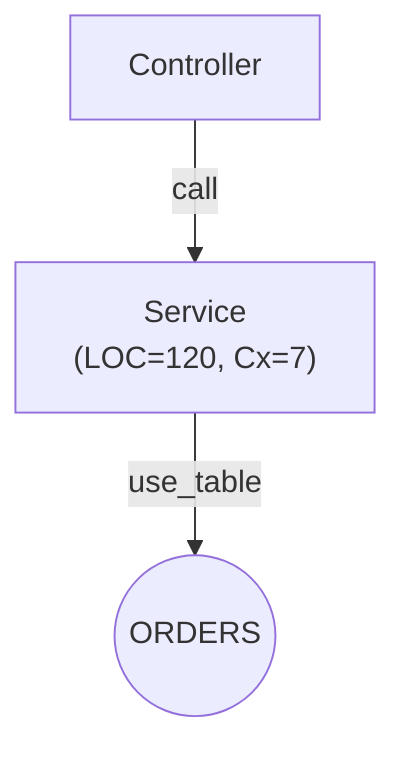
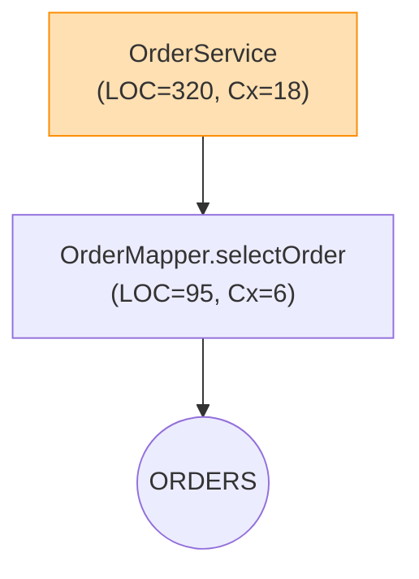
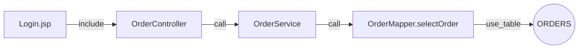

# Visual Dataflow v2 개선안 v4 (Mermaid 안정화, 시각 레이어 정합, 실행 가이드 보강)

본 문서는 Visual_dataflow_003_improve.md를 검토한 뒤, 실사용 안정성과 문서/렌더 품질을 끌어올리기 위해 보완한 개선안입니다. 특히 Mermaid 파서 에러를 일으키는 패턴을 제거하고, Hotspot/취약점 레이어를 충돌 없이 병행 표현할 수 있도록 규칙을 표준화했습니다.

## 개선 요약
- Mermaid invalid 방지 규칙 표준화: 라벨/클래스/줄바꿈 규칙 정리 및 샘플 전면 교정
- 레이어 우선순위 명시: Hotspot(fill) vs Vulnerability(stroke) 충돌 최소화
- 대규모 그래프 운영 가이드 강화: 전략적 축약/분할, 실패 예방 팁
- CLI 사용 표준화: `python -m visualize.cli <subcommand>` 통일, 프리셋 제안

---

## 1) Mermaid 안정성 가이드(표준 규칙)

다음 규칙을 지키면 Mermaid invalid 및 렌더 글리치를 크게 줄일 수 있습니다.

- 라벨 공백/특수문자/줄바꿈
  - 대괄호 라벨에 공백/괄호/콤마 등 복잡 텍스트가 있으면 반드시 쌍따옴표로 감싼다.
  - 줄바꿈은 `\n` 대신 `<br/>`로 표기한다.
  - 예: `X["OrderService<br/>(LOC=120, Cx=7)"]`
- 다중 클래스 지정
  - inline `:::`는 한 번만 허용. 여러 클래스를 적용할 땐 아래쪽에 `class` 지시문을 사용한다.
  - 예: `class X hotspot_med,vuln_high;`
- 그룹/스타일 선언 순서
  - `graph` → 노드/엣지 → classDef(스타일) → class(노드에 스타일 적용) 순서를 권장
- 점선/색상
  - 미해결 호출 표기는 `-.->` 또는 `line-style:dashed`이며, 색상은 회색계로 통일

샘플(유효한 패턴):


---

## 2) Hotspot × Vulnerability 레이어 정합

- 우선순위(권장):
  - Hotspot → `fill` 중심(배경색). 단계: low/med/high/crit
  - Vulnerability → `stroke` 중심(테두리). 단계: low/medium/high/critical
- 권장 classDef(예시 팔레트):
  - Hotspot: low `#e8f5e9/#43a047`, med `#fffde7/#f9a825`, high `#ffe0b2/#fb8c00`, crit `#ffebee/#e53935`
  - Vulnerability: low `stroke:#8bc34a,dasharray`, medium `#fbc02d`, high `#fb8c00`, critical `#e53935`
- 적용 예시(병행):


설명: Hotspot은 배경색으로 한눈에 위험 군집을 드러내고, 취약점은 테두리로 겹치지 않게 표현합니다.

---

## 3) 데이터 흐름 뷰(001 요구 반영) – 안전한 샘플

- 기본 엣지: `use_table, include, call` (데이터경로 강조)
- 기본 옵션: `--keep-edge-kinds include,call,use_table`, `--min-confidence 0.5`
- 그룹 색상: JSP/Controller/Service/Mapper/DB 일관 유지

샘플:


주의: 복잡 라벨은 `"..."`로 감싸고 `<br/>`로 줄바꿈을 표기하세요.

---

## 4) 대규모 그래프 운영 팁

- 축약 전략
  - `--export-strategy minimal` 또는 `--max-nodes`/`--depth`로 정보량 제한
  - `--focus <노드|라벨부분문자열>`로 관심영역 중심으로 잘라내기
- 분할 전략(md)
  - 큰 그래프는 컴포넌트/패키지 기준으로 여러 Mermaid 블록으로 쪼개 TOC/앵커 제공
- 실패 예방
  - 레전드/스타일/클래스 선언 순서 유지, 라벨 인용/줄바꿈 규칙 준수

---

## 5) CLI 사용 표준화 & 프리셋

- 표준 실행 형식: `python -m visualize.cli <subcommand> ...`
- 데이터 흐름(그래프):
```bash
python -m visualize.cli graph \
  --project-id 1 \
  --kinds use_table,include,call \
  --min-confidence 0.5 \
  --out out/graph.html \
  --export-mermaid out/graph.md \
  --export-strategy balanced \
  --keep-edge-kinds include,call,use_table
```
- 유스케이스(시퀀스):
```bash
python -m visualize.cli sequence \
  --project-id 1 \
  --start-file OrderController.java \
  --start-method submit \
  --depth 3 \
  --out out/seq.html \
  --export-mermaid out/seq.md
```
- ERD:
```bash
python -m visualize.cli erd \
  --project-id 1 \
  --out out/erd.html \
  --export-mermaid out/erd.md
```

---

## 6) 미해결 호출/테이블 매핑 품질 메모

- 미해결 호출(`call_unresolved`)은 회색 점선 등 시각적으로 약화 표시, 후처리 해석 성공 시 `call`로 상향
- 테이블 매핑 실패 시(스키마 불일치/미등록): 임시 그룹(Unknown/DB?)로 표시하고 레전드에 명시

---

## 7) 체크리스트(문서 출고 전)

- 라벨 규칙: 공백/괄호/콤마/줄바꿈 포함 → "..."와 `<br/>`
- 클래스 규칙: 여러 클래스는 class 지시문 사용, inline `:::` 단일만 허용
- 선언 순서: graph → nodes/edges → classDef → class
- 렌더 크기: 너무 크면 minimal/포커스/분할 적용

위 개선안은 md/Mermaid만으로도 안정적 가치를 제공하도록 구성되었습니다. 필요 시, 동일 규칙을 기존 문서에도 적용해 Mermaid invalid를 일괄 해소할 수 있습니다.

