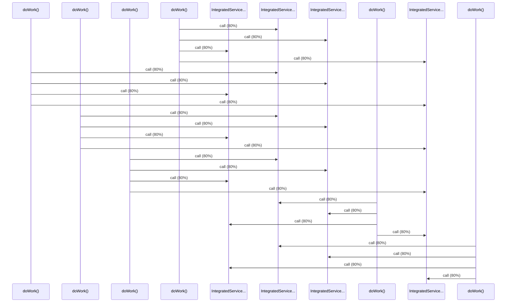

# Source Analyzer SEQUENCE Diagram (Project 1)

## 개요
- 프로젝트 ID: 1
- 다이어그램 유형: SEQUENCE
- 생성 시각: 2025-09-03 07:36:18
- 노드 수: 10
- 엣지 수: 24

## 다이어그램



## 범례

### 시퀀스 범례
- 실선 화살표: 해석된 메소드 호출
- 점선 화살표: 미해석 호출
- 숫자: 호출 순서

## 원본 데이터

<details>
<summary>원본 데이터를 보려면 클릭</summary>

노드 목록 (10)
```json
  method:41: doWork() (method)
  method:143: doWork() (method)
  method:245: doWork() (method)
  method:347: doWork() (method)
  method:449: doWork() (method)
  method:551: doWork() (method)
  method:43: IntegratedService.calculateOrderTotal() (method)
  method:44: IntegratedService.getFormattedId() (method)
  method:42: IntegratedService.getStaticUserData() (method)
  method:45: IntegratedService.log() (method)
```

엣지 목록 (24)
```json
  method:41 -> method:43 (call)
  method:41 -> method:44 (call)
  method:41 -> method:42 (call)
  method:41 -> method:45 (call)
  method:143 -> method:43 (call)
  method:143 -> method:44 (call)
  method:143 -> method:42 (call)
  method:143 -> method:45 (call)
  method:245 -> method:43 (call)
  method:245 -> method:44 (call)
  method:245 -> method:42 (call)
  method:245 -> method:45 (call)
  method:347 -> method:43 (call)
  method:347 -> method:44 (call)
  method:347 -> method:42 (call)
  method:347 -> method:45 (call)
  method:449 -> method:43 (call)
  method:449 -> method:44 (call)
  method:449 -> method:42 (call)
  method:449 -> method:45 (call)
```

</details>

---
*Source Analyzer v1.1 — 생성 시각: 2025-09-03 07:36:18*