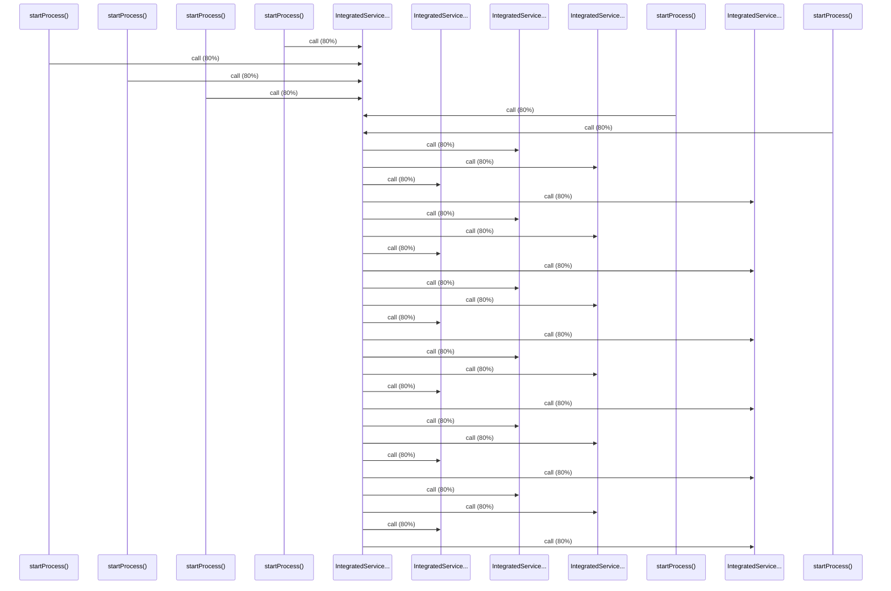

# Source Analyzer SEQUENCE Diagram (Project 1)

## 개요
- 프로젝트 ID: 1
- 다이어그램 유형: SEQUENCE
- 생성 시각: 2025-09-03 07:37:07
- 노드 수: 11
- 엣지 수: 30

## 다이어그램



## 범례

### 시퀀스 범례
- 실선 화살표: 해석된 메소드 호출
- 점선 화살표: 미해석 호출
- 숫자: 호출 순서

## 원본 데이터

<details>
<summary>원본 데이터를 보려면 클릭</summary>

노드 목록 (11)
```json
  method:40: startProcess() (method)
  method:142: startProcess() (method)
  method:244: startProcess() (method)
  method:346: startProcess() (method)
  method:448: startProcess() (method)
  method:550: startProcess() (method)
  method:41: IntegratedService.doWork() (method)
  method:43: IntegratedService.calculateOrderTotal() (method)
  method:44: IntegratedService.getFormattedId() (method)
  method:42: IntegratedService.getStaticUserData() (method)
  method:45: IntegratedService.log() (method)
```

엣지 목록 (30)
```json
  method:40 -> method:41 (call)
  method:142 -> method:41 (call)
  method:244 -> method:41 (call)
  method:346 -> method:41 (call)
  method:448 -> method:41 (call)
  method:550 -> method:41 (call)
  method:41 -> method:43 (call)
  method:41 -> method:44 (call)
  method:41 -> method:42 (call)
  method:41 -> method:45 (call)
  method:41 -> method:43 (call)
  method:41 -> method:44 (call)
  method:41 -> method:42 (call)
  method:41 -> method:45 (call)
  method:41 -> method:43 (call)
  method:41 -> method:44 (call)
  method:41 -> method:42 (call)
  method:41 -> method:45 (call)
  method:41 -> method:43 (call)
  method:41 -> method:44 (call)
```

</details>

---
*Source Analyzer v1.1 — 생성 시각: 2025-09-03 07:37:07*