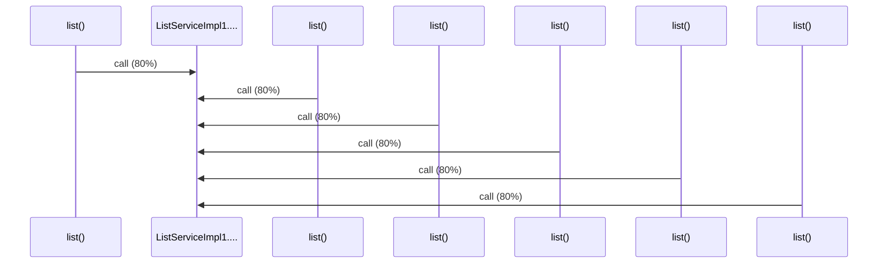

# Source Analyzer SEQUENCE Diagram (Project 1)

## 개요
- 프로젝트 ID: 1
- 다이어그램 유형: SEQUENCE
- 생성 시각: 2025-09-03 07:47:56
- 노드 수: 7
- 엣지 수: 6

## 다이어그램



## 범례

### 시퀀스 범례
- 실선 화살표: 해석된 메소드 호출
- 점선 화살표: 미해석 호출
- 숫자: 호출 순서

## 원본 데이터

<details>
<summary>원본 데이터를 보려면 클릭</summary>

노드 목록 (7)
```json
  method:101: list() (method)
  method:203: list() (method)
  method:305: list() (method)
  method:407: list() (method)
  method:509: list() (method)
  method:611: list() (method)
  method:102: ListServiceImpl1.helper() (method)
```

엣지 목록 (6)
```json
  method:101 -> method:102 (call)
  method:203 -> method:102 (call)
  method:305 -> method:102 (call)
  method:407 -> method:102 (call)
  method:509 -> method:102 (call)
  method:611 -> method:102 (call)
```

</details>

---
*Source Analyzer v1.1 — 생성 시각: 2025-09-03 07:47:56*