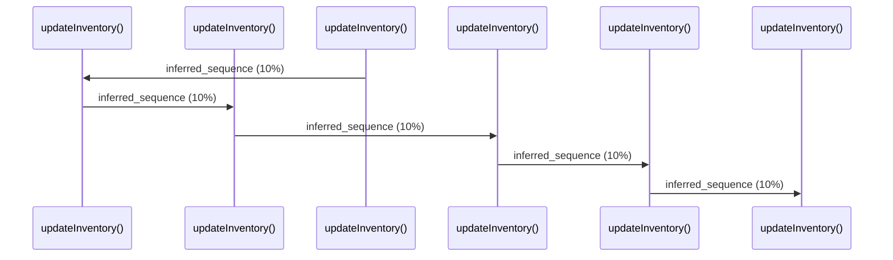

# Source Analyzer SEQUENCE Diagram (Project 1)

## 개요
- 프로젝트 ID: 1
- 다이어그램 유형: SEQUENCE
- 생성 시각: 2025-09-03 07:33:51
- 노드 수: 6
- 엣지 수: 5

## 다이어그램



## 범례

### 시퀀스 범례
- 실선 화살표: 해석된 메소드 호출
- 점선 화살표: 미해석 호출
- 숫자: 호출 순서

## 원본 데이터

<details>
<summary>원본 데이터를 보려면 클릭</summary>

노드 목록 (6)
```json
  method:28: updateInventory() (method)
  method:130: updateInventory() (method)
  method:232: updateInventory() (method)
  method:334: updateInventory() (method)
  method:436: updateInventory() (method)
  method:538: updateInventory() (method)
```

엣지 목록 (5)
```json
  method:28 -> method:130 (inferred_sequence)
  method:130 -> method:232 (inferred_sequence)
  method:232 -> method:334 (inferred_sequence)
  method:334 -> method:436 (inferred_sequence)
  method:436 -> method:538 (inferred_sequence)
```

</details>

---
*Source Analyzer v1.1 — 생성 시각: 2025-09-03 07:33:51*