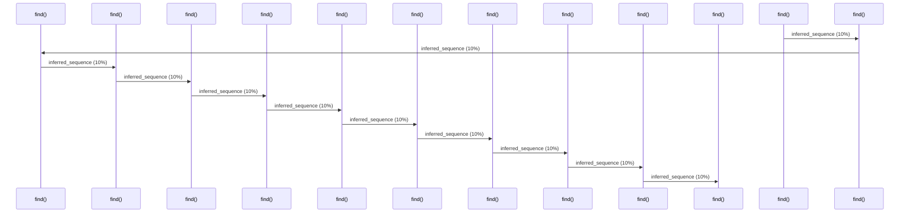

# Source Analyzer SEQUENCE Diagram (Project 1)

## 개요
- 프로젝트 ID: 1
- 다이어그램 유형: SEQUENCE
- 생성 시각: 2025-09-03 07:45:06
- 노드 수: 12
- 엣지 수: 11

## 다이어그램



## 범례

### 시퀀스 범례
- 실선 화살표: 해석된 메소드 호출
- 점선 화살표: 미해석 호출
- 숫자: 호출 순서

## 원본 데이터

<details>
<summary>원본 데이터를 보려면 클릭</summary>

노드 목록 (12)
```json
  method:83: find() (method)
  method:84: find() (method)
  method:185: find() (method)
  method:186: find() (method)
  method:287: find() (method)
  method:288: find() (method)
  method:389: find() (method)
  method:390: find() (method)
  method:491: find() (method)
  method:492: find() (method)
  method:593: find() (method)
  method:594: find() (method)
```

엣지 목록 (11)
```json
  method:83 -> method:84 (inferred_sequence)
  method:84 -> method:185 (inferred_sequence)
  method:185 -> method:186 (inferred_sequence)
  method:186 -> method:287 (inferred_sequence)
  method:287 -> method:288 (inferred_sequence)
  method:288 -> method:389 (inferred_sequence)
  method:389 -> method:390 (inferred_sequence)
  method:390 -> method:491 (inferred_sequence)
  method:491 -> method:492 (inferred_sequence)
  method:492 -> method:593 (inferred_sequence)
  method:593 -> method:594 (inferred_sequence)
```

</details>

---
*Source Analyzer v1.1 — 생성 시각: 2025-09-03 07:45:06*