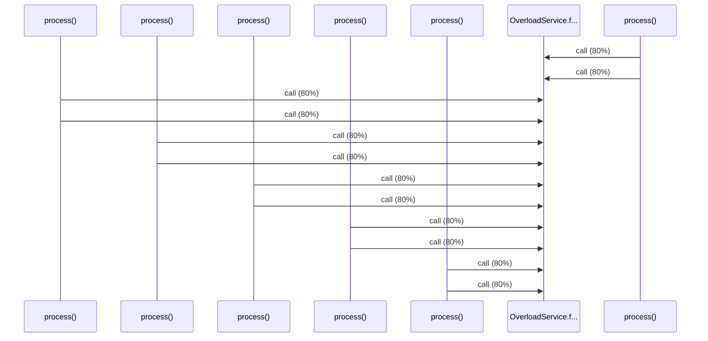

# Source Analyzer SEQUENCE Diagram (Project 1)

## 개요
- 프로젝트 ID: 1
- 다이어그램 유형: SEQUENCE
- 생성 시각: 2025-09-03 07:45:18
- 노드 수: 7
- 엣지 수: 12

## 다이어그램



## 범례

### 시퀀스 범례
- 실선 화살표: 해석된 메소드 호출
- 점선 화살표: 미해석 호출
- 숫자: 호출 순서

## 원본 데이터

<details>
<summary>원본 데이터를 보려면 클릭</summary>

노드 목록 (7)
```json
  method:85: process() (method)
  method:187: process() (method)
  method:289: process() (method)
  method:391: process() (method)
  method:493: process() (method)
  method:595: process() (method)
  method:83: OverloadService.find() (method)
```

엣지 목록 (12)
```json
  method:85 -> method:83 (call)
  method:85 -> method:83 (call)
  method:187 -> method:83 (call)
  method:187 -> method:83 (call)
  method:289 -> method:83 (call)
  method:289 -> method:83 (call)
  method:391 -> method:83 (call)
  method:391 -> method:83 (call)
  method:493 -> method:83 (call)
  method:493 -> method:83 (call)
  method:595 -> method:83 (call)
  method:595 -> method:83 (call)
```

</details>

---
*Source Analyzer v1.1 — 생성 시각: 2025-09-03 07:45:18*