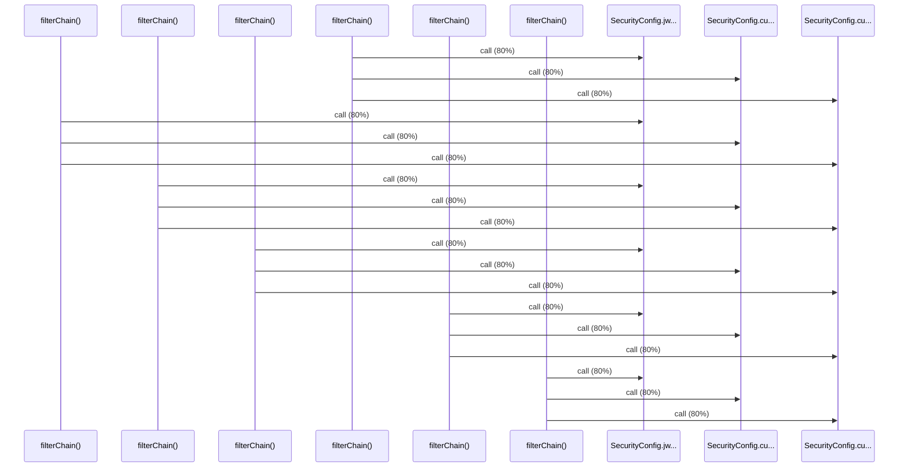

# Source Analyzer SEQUENCE Diagram (Project 1)

## 개요
- 프로젝트 ID: 1
- 다이어그램 유형: SEQUENCE
- 생성 시각: 2025-09-03 07:29:27
- 노드 수: 9
- 엣지 수: 18

## 다이어그램



## 범례

### 시퀀스 범례
- 실선 화살표: 해석된 메소드 호출
- 점선 화살표: 미해석 호출
- 숫자: 호출 순서

## 원본 데이터

<details>
<summary>원본 데이터를 보려면 클릭</summary>

노드 목록 (9)
```json
  method:4: filterChain() (method)
  method:106: filterChain() (method)
  method:208: filterChain() (method)
  method:310: filterChain() (method)
  method:412: filterChain() (method)
  method:514: filterChain() (method)
  method:6: SecurityConfig.jwtAuthenticationFilter() (method)
  method:7: SecurityConfig.customAuthenticationEntryPoint() (method)
  method:8: SecurityConfig.customAccessDeniedHandler() (method)
```

엣지 목록 (18)
```json
  method:4 -> method:6 (call)
  method:4 -> method:7 (call)
  method:4 -> method:8 (call)
  method:106 -> method:6 (call)
  method:106 -> method:7 (call)
  method:106 -> method:8 (call)
  method:208 -> method:6 (call)
  method:208 -> method:7 (call)
  method:208 -> method:8 (call)
  method:310 -> method:6 (call)
  method:310 -> method:7 (call)
  method:310 -> method:8 (call)
  method:412 -> method:6 (call)
  method:412 -> method:7 (call)
  method:412 -> method:8 (call)
  method:514 -> method:6 (call)
  method:514 -> method:7 (call)
  method:514 -> method:8 (call)
```

</details>

---
*Source Analyzer v1.1 — 생성 시각: 2025-09-03 07:29:27*