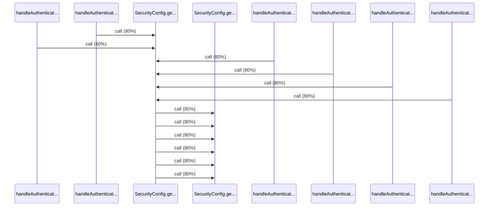

# Source Analyzer SEQUENCE Diagram (Project 1)

## 개요
- 프로젝트 ID: 1
- 다이어그램 유형: SEQUENCE
- 생성 시각: 2025-09-03 07:30:17
- 노드 수: 8
- 엣지 수: 12

## 다이어그램



## 범례

### 시퀀스 범례
- 실선 화살표: 해석된 메소드 호출
- 점선 화살표: 미해석 호출
- 숫자: 호출 순서

## 원본 데이터

<details>
<summary>원본 데이터를 보려면 클릭</summary>

노드 목록 (8)
```json
  method:12: handleAuthenticationSuccess() (method)
  method:114: handleAuthenticationSuccess() (method)
  method:216: handleAuthenticationSuccess() (method)
  method:318: handleAuthenticationSuccess() (method)
  method:420: handleAuthenticationSuccess() (method)
  method:522: handleAuthenticationSuccess() (method)
  method:14: SecurityConfig.getClientIP() (method)
  method:15: SecurityConfig.getCurrentRequest() (method)
```

엣지 목록 (12)
```json
  method:12 -> method:14 (call)
  method:114 -> method:14 (call)
  method:216 -> method:14 (call)
  method:318 -> method:14 (call)
  method:420 -> method:14 (call)
  method:522 -> method:14 (call)
  method:14 -> method:15 (call)
  method:14 -> method:15 (call)
  method:14 -> method:15 (call)
  method:14 -> method:15 (call)
  method:14 -> method:15 (call)
  method:14 -> method:15 (call)
```

</details>

---
*Source Analyzer v1.1 — 생성 시각: 2025-09-03 07:30:17*