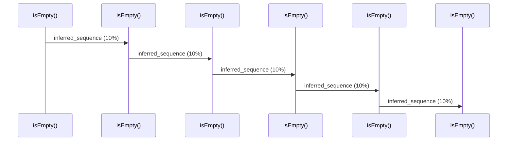

# Source Analyzer SEQUENCE Diagram (Project 1)

## 개요
- 프로젝트 ID: 1
- 다이어그램 유형: SEQUENCE
- 생성 시각: 2025-09-03 07:48:44
- 노드 수: 6
- 엣지 수: 5

## 다이어그램



## 범례

### 시퀀스 범례
- 실선 화살표: 해석된 메소드 호출
- 점선 화살표: 미해석 호출
- 숫자: 호출 순서

## 원본 데이터

<details>
<summary>원본 데이터를 보려면 클릭</summary>

노드 목록 (6)
```json
  method:100: isEmpty() (method)
  method:202: isEmpty() (method)
  method:304: isEmpty() (method)
  method:406: isEmpty() (method)
  method:508: isEmpty() (method)
  method:610: isEmpty() (method)
```

엣지 목록 (5)
```json
  method:100 -> method:202 (inferred_sequence)
  method:202 -> method:304 (inferred_sequence)
  method:304 -> method:406 (inferred_sequence)
  method:406 -> method:508 (inferred_sequence)
  method:508 -> method:610 (inferred_sequence)
```

</details>

---
*Source Analyzer v1.1 — 생성 시각: 2025-09-03 07:48:44*