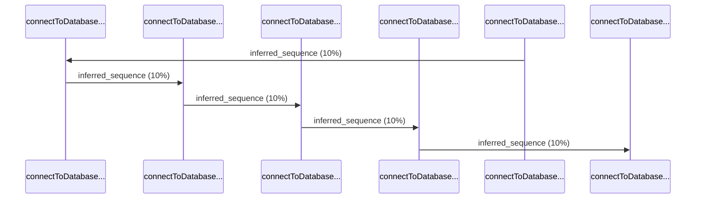

# Source Analyzer SEQUENCE Diagram (Project 1)

## 개요
- 프로젝트 ID: 1
- 다이어그램 유형: SEQUENCE
- 생성 시각: 2025-09-03 07:37:30
- 노드 수: 6
- 엣지 수: 5

## 다이어그램



## 범례

### 시퀀스 범례
- 실선 화살표: 해석된 메소드 호출
- 점선 화살표: 미해석 호출
- 숫자: 호출 순서

## 원본 데이터

<details>
<summary>원본 데이터를 보려면 클릭</summary>

노드 목록 (6)
```json
  method:53: connectToDatabase_VULNERABLE() (method)
  method:155: connectToDatabase_VULNERABLE() (method)
  method:257: connectToDatabase_VULNERABLE() (method)
  method:359: connectToDatabase_VULNERABLE() (method)
  method:461: connectToDatabase_VULNERABLE() (method)
  method:563: connectToDatabase_VULNERABLE() (method)
```

엣지 목록 (5)
```json
  method:53 -> method:155 (inferred_sequence)
  method:155 -> method:257 (inferred_sequence)
  method:257 -> method:359 (inferred_sequence)
  method:359 -> method:461 (inferred_sequence)
  method:461 -> method:563 (inferred_sequence)
```

</details>

---
*Source Analyzer v1.1 — 생성 시각: 2025-09-03 07:37:30*