# Source Analyzer CLASS Diagram (Project 1)

## 개요
- 프로젝트 ID: 1
- 다이어그램 유형: CLASS
- 생성 시각: 2025-09-03 09:13:49
- 노드 수: 20
- 엣지 수: 0

## 다이어그램

```mermaid
classDiagram
  class n1_class_1 {
    +dateUtil()
    +getConnectionString()
    +initializeDatabase()
  }
  class n2_class_2 {
    +filterChain()
    +passwordEncoder()
    +jwtAuthenticationFilter()
    +customAuthenticationEntryPoint()
    +customAccessDeniedHandler()
    +authenticationManager()
    +userDetailsService()
    +corsConfigurationSource()
    +handleAuthenticationSuccess()
    +handleAuthenticationFailure()
  }
  class n3_class_3 {
    +healthCheck()
    +processData()
    +generateReports()
  }
  class n4_class_4 {
    +home()
    +getUsers()
    +createOrder()
    +dashboard()
  }
  class n5_class_5 {
    +createOrder()
    +getOrders()
    +getOrderDetail()
    +updateOrderStatus()
    +cancelOrder()
    +updateInventory()
    +restoreInventory()
    +getOrderStatistics()
  }
  class n6_class_6 {
    +processPayment()
    +getPaymentStatus()
    +processRefund()
    +validatePaymentAmount()
    +processPartialRefund()
  }
  class n7_class_7 {
    +findDynamicData()
    +getComplexReport()
    +getOrdersWithCustomerAnsiJoin()
    +getOrdersWithCustomerImplicitJoin()
  }
  class n8_class_8 {
    +startProcess()
    +doWork()
    +getStaticUserData()
    +calculateOrderTotal()
    +getFormattedId()
    +log()
  }
  class n9_class_9 {
    +getUsersByName_VULNERABLE()
    +getUsersByName_SAFE()
    +searchUsers_VULNERABLE()
    +displayUserInfo_VULNERABLE()
    +readFile_VULNERABLE()
    +hashPassword_WEAK()
    +authenticateAdmin_VULNERABLE()
    +connectToDatabase_VULNERABLE()
    +executeCommand_VULNERABLE()
    +searchLDAP_VULNERABLE()
  }
  class n10_class_10 {
    +selectOrderById()
    +calculateOrderAmount()
    +selectOrdersByStatus()
    +getOrdersWithCustomerImplicitJoin()
    +getComplexOrderReport()
    +searchOrdersWithCriteria()
    +executeDynamicQuery()
  }
  class n11_class_11 {
    +selectAllProducts()
    +selectProductById()
    +searchProductsWithCriteria()
    +getComplexProductAnalysis()
    +executeDynamicQuery()
  }
  class n12_class_12 {
    +selectUserById()
    +selectActiveUsers()
    +searchUsersByCondition()
    +findUsersWithDynamicConditions()
    +insertUser()
    +executeDynamicQuery()
  }
  class n13_class_13 {
    +list()
  }
  class n14_class_14 {
    +calculateOrderTotal()
    +getOrdersByStatus()
    +generateOrderReport()
    +largeOrderMethod1()
    +largeOrderMethod2()
    +largeOrderMethod3()
  }
  class n15_class_15 {
    +find()
    +find()
    +process()
  }
  class n16_class_16 {
    +getProductList()
    +getProductDetails()
    +searchProducts()
    +processComplexBusiness()
    +unsafeProductSearch()
  }
  class n17_class_17 {
    +getUserById()
    +getActiveUsers()
    +createUser()
    +processWithReflection()
    +getDynamicUserData()
    +updateUserStatus()
  }
  class n18_class_20 {
    +list()
    +helper()
  }
  class n19_class_18 {
    +getCurrentDate()
    +convertDateFormat()
    +daysBetween()
  }
  class n20_class_19 {
    +isEmpty()
  }

```



## 범례

### 클래스 다이어그램 범례
- 실선 화살표: 상속 관계
- 점선 화살표: 연관 관계
- 사각형: 일반 클래스
- 점선 사각형: 추상 클래스
- `+` : public 멤버
- `-` : private 멤버
- `#` : protected 멤버
- `*` : static 멤버

## 원본 데이터

<details>
<summary>원본 데이터를 보려면 클릭</summary>

노드 목록 (20)
```json
  class:1: DatabaseConfig (class)
  class:2: SecurityConfig (class)
  class:3: ApiController (class)
  class:4: MainController (class)
  class:5: OrderController (class)
  class:6: PaymentController (class)
  class:7: IntegratedMapper (class)
  class:8: IntegratedService (class)
  class:9: VulnerabilityTestService (class)
  class:10: OrderMapper (class)
  class:11: ProductMapper (class)
  class:12: UserMapper (class)
  class:13: ListService (class)
  class:14: OrderService (class)
  class:15: OverloadService (class)
  class:16: ProductService (class)
  class:17: UserService (class)
  class:20: ListServiceImpl1 (class)
  class:18: DateUtil (class)
  class:19: Texts (class)
```

엣지 목록 (0)
```json
```

</details>

---
*Source Analyzer v1.1 — 생성 시각: 2025-09-03 09:13:49*