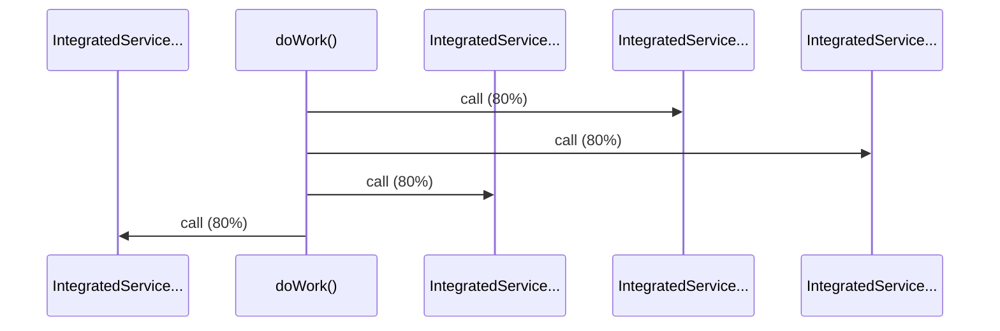

# Source Analyzer SEQUENCE Diagram (Project 1)

## 개요
- 프로젝트 ID: 1
- 다이어그램 유형: SEQUENCE
- 생성 시각: 2025-09-02 01:00:50
- 노드 수: 5
- 엣지 수: 4

## 다이어그램



## 범례

### 시퀀스 범례
- 실선 화살표: 해석된 메소드 호출
- 점선 화살표: 미해석 호출
- 숫자: 호출 순서

## 원본 데이터

<details>
<summary>원본 데이터를 보려면 클릭</summary>

노드 목록 (5)
```json
  method:6: doWork() (method)
  method:8: IntegratedService.calculateOrderTotal() (method)
  method:9: IntegratedService.getFormattedId() (method)
  method:7: IntegratedService.getStaticUserData() (method)
  method:10: IntegratedService.log() (method)
```

엣지 목록 (4)
```json
  method:6 -> method:8 (call)
  method:6 -> method:9 (call)
  method:6 -> method:7 (call)
  method:6 -> method:10 (call)
```

</details>

---
*Source Analyzer v1.1 — 생성 시각: 2025-09-02 01:00:50*