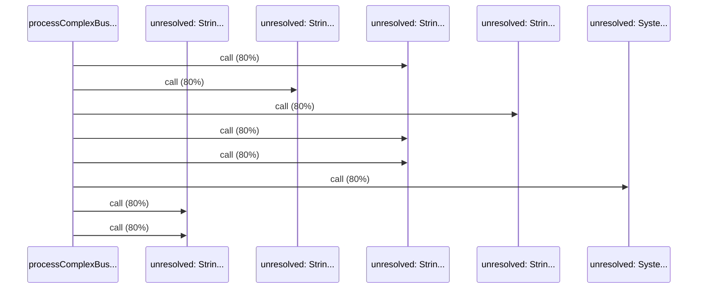

# Source Analyzer SEQUENCE Diagram (Project 1)

## 개요
- 프로젝트 ID: 1
- 다이어그램 유형: SEQUENCE
- 생성 시각: 2025-09-01 19:39:04
- 노드 수: 6
- 엣지 수: 8

## 다이어그램



## 범례

### 시퀀스 범례
- 실선 화살표: 해석된 메소드 호출
- 점선 화살표: 미해석 호출
- 숫자: 호출 순서

## 원본 데이터

<details>
<summary>원본 데이터를 보려면 클릭</summary>

노드 목록 (6)
```json
  method:54: processComplexBusiness() (method)
  unresolved:String.length: unresolved: String.length (unresolved)
  unresolved:String.contains: unresolved: String.contains (unresolved)
  unresolved:String.startsWith: unresolved: String.startsWith (unresolved)
  unresolved:System.out.println: unresolved: System.out.println (unresolved)
  unresolved:String.charAt: unresolved: String.charAt (unresolved)
```

엣지 목록 (8)
```json
  method:54 -> unresolved:String.length (call)
  method:54 -> unresolved:String.contains (call)
  method:54 -> unresolved:String.startsWith (call)
  method:54 -> unresolved:String.length (call)
  method:54 -> unresolved:String.length (call)
  method:54 -> unresolved:System.out.println (call)
  method:54 -> unresolved:String.charAt (call)
  method:54 -> unresolved:String.charAt (call)
```

</details>

---
*Source Analyzer v1.1 — 생성 시각: 2025-09-01 19:39:04*