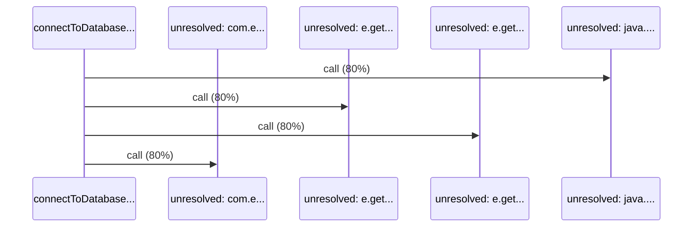

# Source Analyzer SEQUENCE Diagram (Project 1)

## 개요
- 프로젝트 ID: 1
- 다이어그램 유형: SEQUENCE
- 생성 시각: 2025-09-01 19:59:39
- 노드 수: 5
- 엣지 수: 4

## 다이어그램



## 범례

### 시퀀스 범례
- 실선 화살표: 해석된 메소드 호출
- 점선 화살표: 미해석 호출
- 숫자: 호출 순서

## 원본 데이터

<details>
<summary>원본 데이터를 보려면 클릭</summary>

노드 목록 (5)
```json
  method:18: connectToDatabase_VULNERABLE() (method)
  unresolved:java.sql.DriverManager.getConnection: unresolved: java.sql.DriverManager.getConnection (unresolved)
  unresolved:e.getMessage: unresolved: e.getMessage (unresolved)
  unresolved:e.getStackTrace: unresolved: e.getStackTrace (unresolved)
  unresolved:com.example.integrated.VulnerabilityTestService.toString: unresolved: com.example.integrated.VulnerabilityTestService.toString (unresolved)
```

엣지 목록 (4)
```json
  method:18 -> unresolved:java.sql.DriverManager.getConnection (call)
  method:18 -> unresolved:e.getMessage (call)
  method:18 -> unresolved:e.getStackTrace (call)
  method:18 -> unresolved:com.example.integrated.VulnerabilityTestService.toString (call)
```

</details>

---
*Source Analyzer v1.1 — 생성 시각: 2025-09-01 19:59:39*