# Artificial Flow: VulnerabilityTestService

**Entry Point**: com.example.integrated.VulnerabilityTestService.getUsersByName_VULNERABLE

**Category**: artificial

**Statistics**:
- Participants: 12
- Interactions: 11
- Unresolved calls: 0

```mermaid
sequenceDiagram
    participant method_11 as VulnerabilityTestService.getUsersByName_VULNERABLE()
    participant method_12 as VulnerabilityTestService.getUsersByName_SAFE()
    participant method_13 as VulnerabilityTestService.searchUsers_VULNERABLE()
    participant method_14 as VulnerabilityTestService.displayUserInfo_VULNERABLE()
    participant method_15 as VulnerabilityTestService.readFile_VULNERABLE()
    participant method_16 as VulnerabilityTestService.hashPassword_WEAK()
    participant method_17 as VulnerabilityTestService.authenticateAdmin_VULNERABLE()
    participant method_18 as VulnerabilityTestService.connectToDatabase_VULNERABLE()
    participant method_19 as VulnerabilityTestService.executeCommand_VULNERABLE()
    participant method_20 as VulnerabilityTestService.searchLDAP_VULNERABLE()
    participant method_21 as VulnerabilityTestService.deserializeData_VULNERABLE()
    participant method_22 as VulnerabilityTestService.processComplexBusiness()

    method_11->>+method_12: calls getUsersByName_SAFE()
    method_12->>+method_13: calls searchUsers_VULNERABLE()
    method_13->>+method_14: calls displayUserInfo_VULNERABLE()
    method_14->>+method_15: calls readFile_VULNERABLE()
    method_15->>+method_16: calls hashPassword_WEAK()
    method_16->>+method_17: calls authenticateAdmin_VULNERABLE()
    method_17->>+method_18: calls connectToDatabase_VULNERABLE()
    method_18->>+method_19: calls executeCommand_VULNERABLE()
    method_19->>+method_20: calls searchLDAP_VULNERABLE()
    method_20->>+method_21: calls deserializeData_VULNERABLE()
    method_21->>+method_22: calls processComplexBusiness()
```

