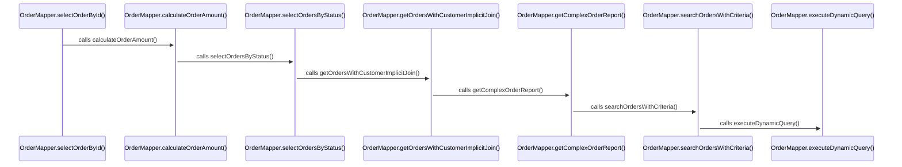

# Artificial Flow: OrderMapper

**Entry Point**: com.example.mapper.OrderMapper.selectOrderById

**Category**: artificial

**Statistics**:
- Participants: 7
- Interactions: 6
- Unresolved calls: 0

