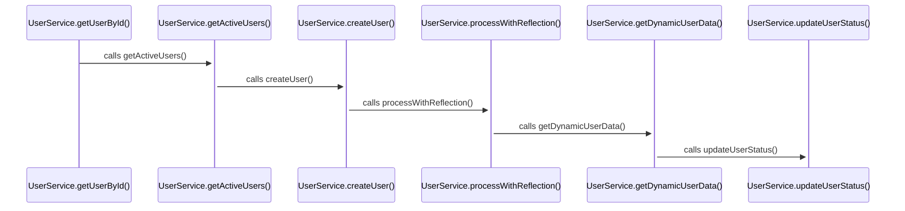

# Artificial Flow: UserService

**Entry Point**: com.example.service.UserService.getUserById

**Category**: artificial

**Statistics**:
- Participants: 6
- Interactions: 5
- Unresolved calls: 0

```mermaid
sequenceDiagram
    participant method_56 as UserService.getUserById()
    participant method_57 as UserService.getActiveUsers()
    participant method_58 as UserService.createUser()
    participant method_59 as UserService.processWithReflection()
    participant method_60 as UserService.getDynamicUserData()
    participant method_61 as UserService.updateUserStatus()

    method_56->>+method_57: calls getActiveUsers()
    method_57->>+method_58: calls createUser()
    method_58->>+method_59: calls processWithReflection()
    method_59->>+method_60: calls getDynamicUserData()
    method_60->>+method_61: calls updateUserStatus()
```
