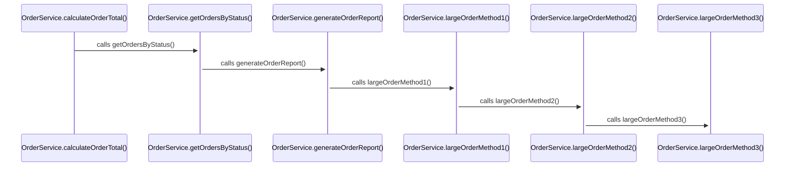

# Artificial Flow: OrderService

**Entry Point**: com.example.service.OrderService.calculateOrderTotal

**Category**: artificial

**Statistics**:
- Participants: 6
- Interactions: 5
- Unresolved calls: 0

