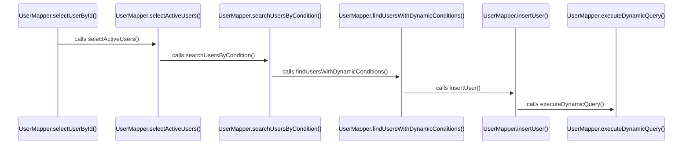

# Artificial Flow: UserMapper

**Entry Point**: com.example.mapper.UserMapper.selectUserById

**Category**: artificial

**Statistics**:
- Participants: 6
- Interactions: 5
- Unresolved calls: 0

```mermaid
sequenceDiagram
    participant method_35 as UserMapper.selectUserById()
    participant method_36 as UserMapper.selectActiveUsers()
    participant method_37 as UserMapper.searchUsersByCondition()
    participant method_38 as UserMapper.findUsersWithDynamicConditions()
    participant method_39 as UserMapper.insertUser()
    participant method_40 as UserMapper.executeDynamicQuery()

    method_35->>+method_36: calls selectActiveUsers()
    method_36->>+method_37: calls searchUsersByCondition()
    method_37->>+method_38: calls findUsersWithDynamicConditions()
    method_38->>+method_39: calls insertUser()
    method_39->>+method_40: calls executeDynamicQuery()
```
