# Source Analyzer CLASS Diagram (Project 1)

## 개요
- 프로젝트 ID: 1
- 다이어그램 유형: CLASS
- 생성 시각: 2025-08-31 20:02:15
- 노드 수: 28
- 엣지 수: 82

## 다이어그램

```mermaid
classDiagram
  class n1_class_1 {
    +findDynamicData()
    +getComplexReport()
    +getOrdersWithCustomerAnsiJoin()
    +getOrdersWithCustomerImplicitJoin()
  }
  class n2_class_15 {
    +findDynamicData()
    +getComplexReport()
    +getOrdersWithCustomerAnsiJoin()
    +getOrdersWithCustomerImplicitJoin()
  }
  class n3_class_2 {
    +startProcess()
    +doWork()
    +getStaticUserData()
    +calculateOrderTotal()
    +getFormattedId()
    +log()
  }
  class n4_class_16 {
    +startProcess()
    +doWork()
    +getStaticUserData()
    +calculateOrderTotal()
    +getFormattedId()
    +log()
  }
  class n5_class_3 {
    +getUsersByName_VULNERABLE()
    +getUsersByName_SAFE()
    +searchUsers_VULNERABLE()
    +displayUserInfo_VULNERABLE()
    +readFile_VULNERABLE()
    +hashPassword_WEAK()
    +authenticateAdmin_VULNERABLE()
    +connectToDatabase_VULNERABLE()
    +executeCommand_VULNERABLE()
    +searchLDAP_VULNERABLE()
  }
  class n6_class_17 {
    +getUsersByName_VULNERABLE()
    +getUsersByName_SAFE()
    +searchUsers_VULNERABLE()
    +displayUserInfo_VULNERABLE()
    +readFile_VULNERABLE()
    +hashPassword_WEAK()
    +authenticateAdmin_VULNERABLE()
    +connectToDatabase_VULNERABLE()
    +executeCommand_VULNERABLE()
    +searchLDAP_VULNERABLE()
  }
  class n7_class_4 {
    +selectOrderById()
    +calculateOrderAmount()
    +selectOrdersByStatus()
    +getOrdersWithCustomerImplicitJoin()
    +getComplexOrderReport()
    +searchOrdersWithCriteria()
    +executeDynamicQuery()
  }
  class n8_class_18 {
    +selectOrderById()
    +calculateOrderAmount()
    +selectOrdersByStatus()
    +getOrdersWithCustomerImplicitJoin()
    +getComplexOrderReport()
    +searchOrdersWithCriteria()
    +executeDynamicQuery()
  }
  class n9_class_5 {
    +selectAllProducts()
    +selectProductById()
    +searchProductsWithCriteria()
    +getComplexProductAnalysis()
    +executeDynamicQuery()
  }
  class n10_class_19 {
    +selectAllProducts()
    +selectProductById()
    +searchProductsWithCriteria()
    +getComplexProductAnalysis()
    +executeDynamicQuery()
  }
  class n11_class_6 {
    +selectUserById()
    +selectActiveUsers()
    +searchUsersByCondition()
    +findUsersWithDynamicConditions()
    +insertUser()
    +executeDynamicQuery()
  }
  class n12_class_20 {
    +selectUserById()
    +selectActiveUsers()
    +searchUsersByCondition()
    +findUsersWithDynamicConditions()
    +insertUser()
    +executeDynamicQuery()
  }
  class n13_class_7 {
    +list()
  }
  class n14_class_21 {
    +list()
  }
  class n15_class_8 {
    +calculateOrderTotal()
    +getOrdersByStatus()
    +generateOrderReport()
    +largeOrderMethod1()
    +largeOrderMethod2()
    +largeOrderMethod3()
  }
  class n16_class_22 {
    +calculateOrderTotal()
    +getOrdersByStatus()
    +generateOrderReport()
    +largeOrderMethod1()
    +largeOrderMethod2()
    +largeOrderMethod3()
  }
  class n17_class_9 {
    +find()
    +find()
    +process()
  }
  class n18_class_23 {
    +find()
    +find()
    +process()
  }
  class n19_class_10 {
    +getProductList()
    +getProductDetails()
    +searchProducts()
    +processComplexBusiness()
    +unsafeProductSearch()
  }
  class n20_class_24 {
    +getProductList()
    +getProductDetails()
    +searchProducts()
    +processComplexBusiness()
    +unsafeProductSearch()
  }
  class n21_class_11 {
    +getUserById()
    +getActiveUsers()
    +createUser()
    +processWithReflection()
    +getDynamicUserData()
    +updateUserStatus()
  }
  class n22_class_25 {
    +getUserById()
    +getActiveUsers()
    +createUser()
    +processWithReflection()
    +getDynamicUserData()
    +updateUserStatus()
  }
  class n23_class_14 {
    +list()
    +helper()
  }
  class n24_class_28 {
    +list()
    +helper()
  }
  class n25_class_12 {
    +getCurrentDate()
    +convertDateFormat()
    +daysBetween()
  }
  class n26_class_26 {
    +getCurrentDate()
    +convertDateFormat()
    +daysBetween()
  }
  class n27_class_13 {
    +isEmpty()
  }
  class n28_class_27 {
    +isEmpty()
  }

```



## 범례

### 클래스 다이어그램 범례
- 실선 화살표: 상속 관계
- 점선 화살표: 연관 관계
- 사각형: 일반 클래스
- 점선 사각형: 추상 클래스
- `+` : public 멤버
- `-` : private 멤버
- `#` : protected 멤버
- `*` : static 멤버

## 원본 데이터

<details>
<summary>원본 데이터를 보려면 클릭</summary>

노드 목록 (28)
```json
  class:1: IntegratedMapper (class)
  class:15: IntegratedMapper (class)
  class:2: IntegratedService (class)
  class:16: IntegratedService (class)
  class:3: VulnerabilityTestService (class)
  class:17: VulnerabilityTestService (class)
  class:4: OrderMapper (class)
  class:18: OrderMapper (class)
  class:5: ProductMapper (class)
  class:19: ProductMapper (class)
  class:6: UserMapper (class)
  class:20: UserMapper (class)
  class:7: ListService (class)
  class:21: ListService (class)
  class:8: OrderService (class)
  class:22: OrderService (class)
  class:9: OverloadService (class)
  class:23: OverloadService (class)
  class:10: ProductService (class)
  class:24: ProductService (class)
```

엣지 목록 (82)
```json
  class:1 -> class:15 (same_package)
  class:1 -> class:2 (same_package)
  class:1 -> class:16 (same_package)
  class:1 -> class:3 (same_package)
  class:1 -> class:17 (same_package)
  class:15 -> class:2 (same_package)
  class:15 -> class:16 (same_package)
  class:15 -> class:3 (same_package)
  class:15 -> class:17 (same_package)
  class:2 -> class:16 (same_package)
  class:2 -> class:3 (same_package)
  class:2 -> class:17 (same_package)
  class:16 -> class:3 (same_package)
  class:16 -> class:17 (same_package)
  class:3 -> class:17 (same_package)
  class:4 -> class:18 (same_package)
  class:4 -> class:5 (same_package)
  class:4 -> class:19 (same_package)
  class:4 -> class:6 (same_package)
  class:4 -> class:20 (same_package)
```

</details>

---
*Source Analyzer v1.1 — 생성 시각: 2025-08-31 20:02:15*