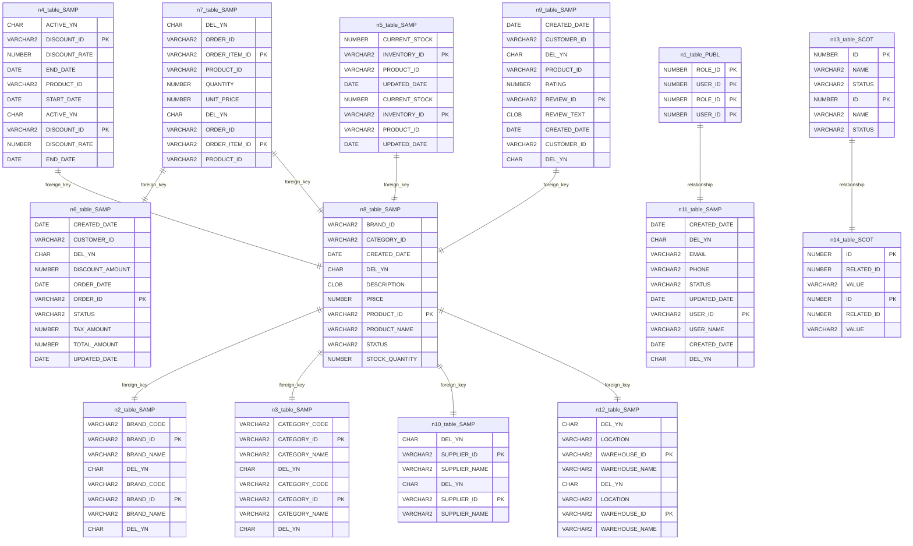

# Source Analyzer ERD Diagram (Project 1)

## 개요
- 프로젝트 ID: 1
- 다이어그램 유형: ERD
- 생성 시각: 2025-09-02 01:01:58
- 노드 수: 14
- 엣지 수: 11

## 다이어그램



## 범례

### ERD 범례
- 실선: 외래키 관계(높은 신뢰도)
- 점선: 추론된 조인 관계
- 굵은 글자: PK 컬럼
- [REQ] 마크: SQLERD 모드의 필수 필터 컬럼

## 원본 데이터

<details>
<summary>원본 데이터를 보려면 클릭</summary>

노드 목록 (14)
```json
  table:PUBLIC.USER_ROLE: PUBLIC.USER_ROLE (table)
  table:SAMPLE.BRANDS: SAMPLE.BRANDS (table)
  table:SAMPLE.CATEGORIES: SAMPLE.CATEGORIES (table)
  table:SAMPLE.DISCOUNTS: SAMPLE.DISCOUNTS (table)
  table:SAMPLE.INVENTORIES: SAMPLE.INVENTORIES (table)
  table:SAMPLE.ORDERS: SAMPLE.ORDERS (table)
  table:SAMPLE.ORDER_ITEMS: SAMPLE.ORDER_ITEMS (table)
  table:SAMPLE.PRODUCTS: SAMPLE.PRODUCTS (table)
  table:SAMPLE.PRODUCT_REVIEWS: SAMPLE.PRODUCT_REVIEWS (table)
  table:SAMPLE.SUPPLIERS: SAMPLE.SUPPLIERS (table)
  table:SAMPLE.USERS: SAMPLE.USERS (table)
  table:SAMPLE.WAREHOUSES: SAMPLE.WAREHOUSES (table)
  table:SCOTT.DYNAMIC_DATA: SCOTT.DYNAMIC_DATA (table)
  table:SCOTT.RELATED_DATA: SCOTT.RELATED_DATA (table)
```

엣지 목록 (11)
```json
  table:PUBLIC.USER_ROLE -> table:SAMPLE.USERS (relationship)
  table:SAMPLE.DISCOUNTS -> table:SAMPLE.PRODUCTS (foreign_key)
  table:SAMPLE.INVENTORIES -> table:SAMPLE.PRODUCTS (foreign_key)
  table:SAMPLE.ORDER_ITEMS -> table:SAMPLE.ORDERS (foreign_key)
  table:SAMPLE.ORDER_ITEMS -> table:SAMPLE.PRODUCTS (foreign_key)
  table:SAMPLE.PRODUCTS -> table:SAMPLE.BRANDS (foreign_key)
  table:SAMPLE.PRODUCTS -> table:SAMPLE.CATEGORIES (foreign_key)
  table:SAMPLE.PRODUCTS -> table:SAMPLE.SUPPLIERS (foreign_key)
  table:SAMPLE.PRODUCTS -> table:SAMPLE.WAREHOUSES (foreign_key)
  table:SAMPLE.PRODUCT_REVIEWS -> table:SAMPLE.PRODUCTS (foreign_key)
  table:SCOTT.DYNAMIC_DATA -> table:SCOTT.RELATED_DATA (relationship)
```

</details>

---
*Source Analyzer v1.1 — 생성 시각: 2025-09-02 01:01:58*