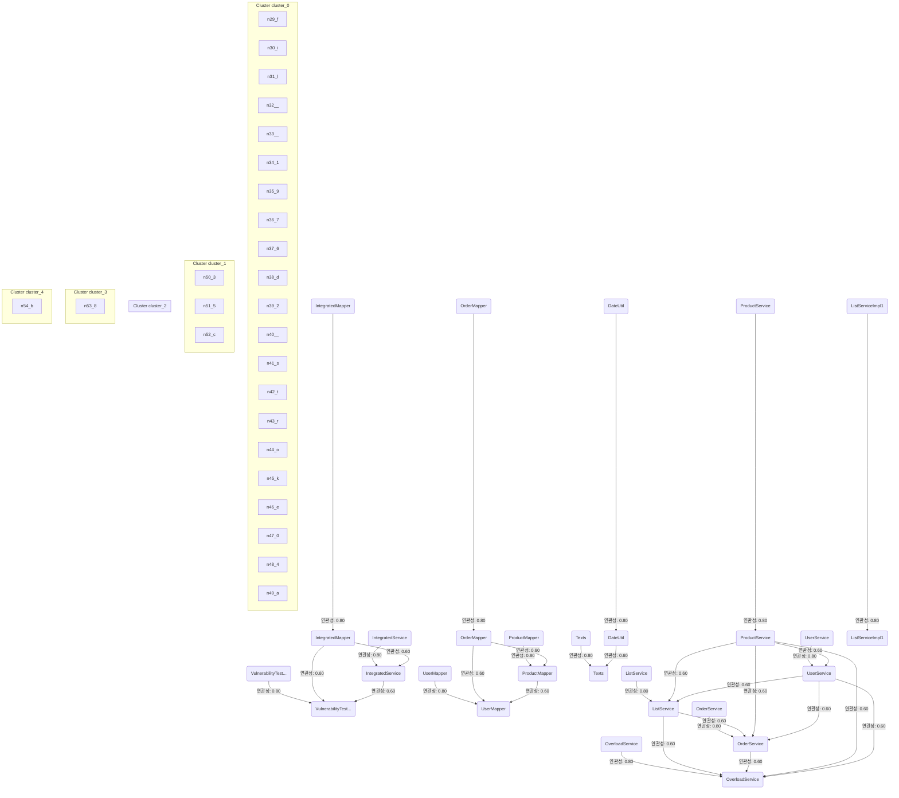

# Source Analyzer RELATEDNESS Diagram (Project 1)

## 개요
- 프로젝트 ID: 1
- 다이어그램 유형: RELATEDNESS
- 생성 시각: 2025-09-01 09:47:14
- 노드 수: 28
- 엣지 수: 31

## 다이어그램



## 범례


## 원본 데이터

<details>
<summary>원본 데이터를 보려면 클릭</summary>

노드 목록 (28)
```json
  class:1: IntegratedMapper (class)
  file:1: IntegratedMapper (file)
  class:2: IntegratedService (class)
  file:2: IntegratedService (file)
  class:3: VulnerabilityTestService (class)
  file:3: VulnerabilityTestService (file)
  class:4: OrderMapper (class)
  file:4: OrderMapper (file)
  class:5: ProductMapper (class)
  file:5: ProductMapper (file)
  class:6: UserMapper (class)
  file:6: UserMapper (file)
  class:7: ListService (class)
  file:7: ListService (file)
  class:8: OrderService (class)
  file:8: OrderService (file)
  class:9: OverloadService (class)
  file:9: OverloadService (file)
  class:10: ProductService (class)
  file:10: ProductService (file)
```

엣지 목록 (31)
```json
  class:1 -> file:1 (related)
  class:2 -> file:2 (related)
  class:3 -> file:3 (related)
  class:4 -> file:4 (related)
  class:5 -> file:5 (related)
  class:6 -> file:6 (related)
  class:7 -> file:7 (related)
  class:8 -> file:8 (related)
  class:9 -> file:9 (related)
  class:10 -> file:10 (related)
  class:11 -> file:11 (related)
  class:12 -> file:12 (related)
  class:13 -> file:13 (related)
  class:14 -> file:14 (related)
  file:1 -> file:2 (related)
  file:1 -> file:3 (related)
  file:2 -> file:3 (related)
  file:4 -> file:5 (related)
  file:4 -> file:6 (related)
  file:5 -> file:6 (related)
```

</details>

---
*Source Analyzer v1.1 — 생성 시각: 2025-09-01 09:47:14*