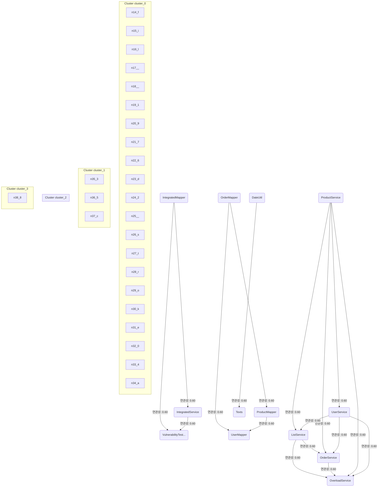

# Source Analyzer RELATEDNESS Diagram (Project 1)

## 개요
- 프로젝트 ID: 1
- 다이어그램 유형: RELATEDNESS
- 생성 시각: 2025-09-01 20:42:28
- 노드 수: 13
- 엣지 수: 17

## 다이어그램



## 범례


## 원본 데이터

<details>
<summary>원본 데이터를 보려면 클릭</summary>

노드 목록 (13)
```json
  file:1: IntegratedMapper (file)
  file:2: IntegratedService (file)
  file:3: VulnerabilityTestService (file)
  file:4: OrderMapper (file)
  file:5: ProductMapper (file)
  file:6: UserMapper (file)
  file:7: ListService (file)
  file:8: OrderService (file)
  file:9: OverloadService (file)
  file:10: ProductService (file)
  file:11: UserService (file)
  file:12: DateUtil (file)
  file:13: Texts (file)
```

엣지 목록 (17)
```json
  file:1 -> file:2 (related)
  file:1 -> file:3 (related)
  file:2 -> file:3 (related)
  file:4 -> file:5 (related)
  file:4 -> file:6 (related)
  file:5 -> file:6 (related)
  file:7 -> file:8 (related)
  file:7 -> file:9 (related)
  file:8 -> file:9 (related)
  file:10 -> file:7 (related)
  file:10 -> file:8 (related)
  file:10 -> file:9 (related)
  file:10 -> file:11 (related)
  file:11 -> file:7 (related)
  file:11 -> file:8 (related)
  file:11 -> file:9 (related)
  file:12 -> file:13 (related)
```

</details>

---
*Source Analyzer v1.1 — 생성 시각: 2025-09-01 20:42:28*