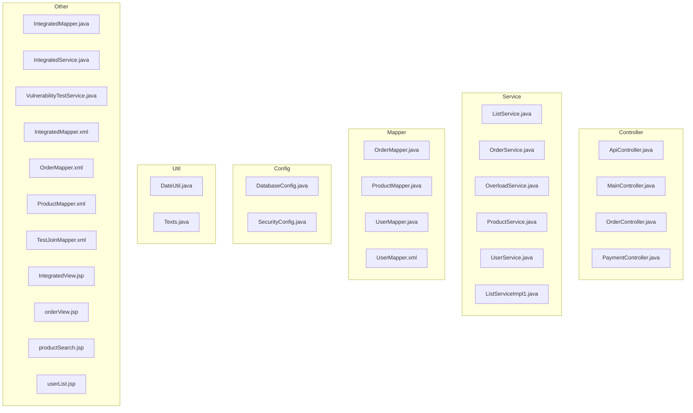

# sampleSrc 메타정보 계층도 분석 리포트

**생성 시간**: 2025-09-03T19:09:36.812578

## 📊 분석 요약

- **총 파일 수**: 31개
- **총 클래스 수**: 20개
- **총 메서드 수**: 101개
- **총 의존성 수**: 0개

## 🏗️ 레이어별 구조

### Controller 레이어 (4개)

- `ApiController.java`
- `MainController.java`
- `OrderController.java`
- `PaymentController.java`

### Service 레이어 (6개)

- `ListService.java`
- `OrderService.java`
- `OverloadService.java`
- `ProductService.java`
- `UserService.java`
- `ListServiceImpl1.java`

### Mapper 레이어 (4개)

- `OrderMapper.java`
- `ProductMapper.java`
- `UserMapper.java`
- `UserMapper.xml`

### Config 레이어 (2개)

- `DatabaseConfig.java`
- `SecurityConfig.java`

### Util 레이어 (2개)

- `DateUtil.java`
- `Texts.java`

### Other 레이어 (13개)

- `IntegratedMapper.java`
- `IntegratedService.java`
- `VulnerabilityTestService.java`
- `IntegratedMapper.xml`
- `OrderMapper.xml`
- `ProductMapper.xml`
- `TestJoinMapper.xml`
- `UserMapper.xml`
- `IntegratedView.jsp`
- `orderView.jsp`
- `productSearch.jsp`
- `userList.jsp`
- `userList.jsp`

## 📁 파일 계층도

### 트리 구조
```
sampleSrc/
├── E:\/SourceAnalyzer.git/project/sampleSrc/src/main/java/com/example/config/
│   ├── DatabaseConfig.java
│   └── SecurityConfig.java
├── E:\/SourceAnalyzer.git/project/sampleSrc/src/main/java/com/example/controller/
│   ├── ApiController.java
│   ├── MainController.java
│   ├── OrderController.java
│   └── PaymentController.java
├── E:\/SourceAnalyzer.git/project/sampleSrc/src/main/java/com/example/integrated/
│   ├── IntegratedMapper.java
│   ├── IntegratedService.java
│   └── VulnerabilityTestService.java
├── E:\/SourceAnalyzer.git/project/sampleSrc/src/main/java/com/example/mapper/
│   ├── OrderMapper.java
│   ├── ProductMapper.java
│   └── UserMapper.java
├── E:\/SourceAnalyzer.git/project/sampleSrc/src/main/java/com/example/service/
│   ├── ListService.java
│   ├── OrderService.java
│   ├── OverloadService.java
│   ├── ProductService.java
│   └── UserService.java
├── E:\/SourceAnalyzer.git/project/sampleSrc/src/main/java/com/example/service/impl/
│   └── ListServiceImpl1.java
├── E:\/SourceAnalyzer.git/project/sampleSrc/src/main/java/com/example/util/
│   ├── DateUtil.java
│   └── Texts.java
├── E:\/SourceAnalyzer.git/project/sampleSrc/src/main/resources/mybatis/
│   ├── IntegratedMapper.xml
│   ├── OrderMapper.xml
│   ├── ProductMapper.xml
│   ├── TestJoinMapper.xml
│   └── UserMapper.xml
├── E:\/SourceAnalyzer.git/project/sampleSrc/src/main/resources/mybatis/mapper/
│   └── UserMapper.xml
├── E:\/SourceAnalyzer.git/project/sampleSrc/src/main/webapp/WEB-INF/jsp/
│   └── IntegratedView.jsp
├── E:\/SourceAnalyzer.git/project/sampleSrc/src/main/webapp/WEB-INF/jsp/order/
│   └── orderView.jsp
├── E:\/SourceAnalyzer.git/project/sampleSrc/src/main/webapp/WEB-INF/jsp/product/
│   └── productSearch.jsp
├── E:\/SourceAnalyzer.git/project/sampleSrc/src/main/webapp/WEB-INF/jsp/user/
│   └── userList.jsp
├── E:\/SourceAnalyzer.git/project/sampleSrc/src/main/webapp/WEB-INF/views/
│   └── userList.jsp
```

## 🔗 의존성 관계

### 의존성 테이블

| 소스 파일 | 타겟 파일 | 관계 유형 | 신뢰도 |
|-----------|-----------|-----------|--------|

## 📈 Mermaid 다이어그램

### 파일 의존성 그래프


### 레이어 구조


## 📋 상세 정보

### 파일별 상세 정보

#### 📄 DatabaseConfig.java

- **경로**: `E:\SourceAnalyzer.git\project\sampleSrc\src\main\java\com\example\config\DatabaseConfig.java`
- **언어**: java
- **라인 수**: 20
- **클래스 수**: 3
- **의존성 수**: 0
- **의존 대상 수**: 0

**포함 클래스**:
- `com.example.config.DatabaseConfig`
- `com.example.config.DatabaseConfig`
- `com.example.config.DatabaseConfig`

#### 📄 SecurityConfig.java

- **경로**: `E:\SourceAnalyzer.git\project\sampleSrc\src\main\java\com\example\config\SecurityConfig.java`
- **언어**: java
- **라인 수**: 149
- **클래스 수**: 3
- **의존성 수**: 0
- **의존 대상 수**: 0

**포함 클래스**:
- `com.example.config.SecurityConfig`
- `com.example.config.SecurityConfig`
- `com.example.config.SecurityConfig`

#### 📄 ApiController.java

- **경로**: `E:\SourceAnalyzer.git\project\sampleSrc\src\main\java\com\example\controller\ApiController.java`
- **언어**: java
- **라인 수**: 40
- **클래스 수**: 3
- **의존성 수**: 0
- **의존 대상 수**: 0

**포함 클래스**:
- `com.example.controller.ApiController`
- `com.example.controller.ApiController`
- `com.example.controller.ApiController`

#### 📄 MainController.java

- **경로**: `E:\SourceAnalyzer.git\project\sampleSrc\src\main\java\com\example\controller\MainController.java`
- **언어**: java
- **라인 수**: 42
- **클래스 수**: 3
- **의존성 수**: 0
- **의존 대상 수**: 0

**포함 클래스**:
- `com.example.controller.MainController`
- `com.example.controller.MainController`
- `com.example.controller.MainController`

#### 📄 OrderController.java

- **경로**: `E:\SourceAnalyzer.git\project\sampleSrc\src\main\java\com\example\controller\OrderController.java`
- **언어**: java
- **라인 수**: 178
- **클래스 수**: 3
- **의존성 수**: 0
- **의존 대상 수**: 0

**포함 클래스**:
- `com.example.controller.OrderController`
- `com.example.controller.OrderController`
- `com.example.controller.OrderController`

#### 📄 PaymentController.java

- **경로**: `E:\SourceAnalyzer.git\project\sampleSrc\src\main\java\com\example\controller\PaymentController.java`
- **언어**: java
- **라인 수**: 157
- **클래스 수**: 3
- **의존성 수**: 0
- **의존 대상 수**: 0

**포함 클래스**:
- `com.example.controller.PaymentController`
- `com.example.controller.PaymentController`
- `com.example.controller.PaymentController`

#### 📄 IntegratedMapper.java

- **경로**: `E:\SourceAnalyzer.git\project\sampleSrc\src\main\java\com\example\integrated\IntegratedMapper.java`
- **언어**: java
- **라인 수**: 9
- **클래스 수**: 3
- **의존성 수**: 0
- **의존 대상 수**: 0

**포함 클래스**:
- `com.example.integrated.IntegratedMapper`
- `com.example.integrated.IntegratedMapper`
- `com.example.integrated.IntegratedMapper`

#### 📄 IntegratedService.java

- **경로**: `E:\SourceAnalyzer.git\project\sampleSrc\src\main\java\com\example\integrated\IntegratedService.java`
- **언어**: java
- **라인 수**: 35
- **클래스 수**: 3
- **의존성 수**: 0
- **의존 대상 수**: 0

**포함 클래스**:
- `com.example.integrated.IntegratedService`
- `com.example.integrated.IntegratedService`
- `com.example.integrated.IntegratedService`

#### 📄 VulnerabilityTestService.java

- **경로**: `E:\SourceAnalyzer.git\project\sampleSrc\src\main\java\com\example\integrated\VulnerabilityTestService.java`
- **언어**: java
- **라인 수**: 181
- **클래스 수**: 3
- **의존성 수**: 0
- **의존 대상 수**: 0

**포함 클래스**:
- `com.example.integrated.VulnerabilityTestService`
- `com.example.integrated.VulnerabilityTestService`
- `com.example.integrated.VulnerabilityTestService`

#### 📄 OrderMapper.java

- **경로**: `E:\SourceAnalyzer.git\project\sampleSrc\src\main\java\com\example\mapper\OrderMapper.java`
- **언어**: java
- **라인 수**: 17
- **클래스 수**: 3
- **의존성 수**: 0
- **의존 대상 수**: 0

**포함 클래스**:
- `com.example.mapper.OrderMapper`
- `com.example.mapper.OrderMapper`
- `com.example.mapper.OrderMapper`

#### 📄 ProductMapper.java

- **경로**: `E:\SourceAnalyzer.git\project\sampleSrc\src\main\java\com\example\mapper\ProductMapper.java`
- **언어**: java
- **라인 수**: 14
- **클래스 수**: 3
- **의존성 수**: 0
- **의존 대상 수**: 0

**포함 클래스**:
- `com.example.mapper.ProductMapper`
- `com.example.mapper.ProductMapper`
- `com.example.mapper.ProductMapper`

#### 📄 UserMapper.java

- **경로**: `E:\SourceAnalyzer.git\project\sampleSrc\src\main\java\com\example\mapper\UserMapper.java`
- **언어**: java
- **라인 수**: 15
- **클래스 수**: 3
- **의존성 수**: 0
- **의존 대상 수**: 0

**포함 클래스**:
- `com.example.mapper.UserMapper`
- `com.example.mapper.UserMapper`
- `com.example.mapper.UserMapper`

#### 📄 ListService.java

- **경로**: `E:\SourceAnalyzer.git\project\sampleSrc\src\main\java\com\example\service\ListService.java`
- **언어**: java
- **라인 수**: 4
- **클래스 수**: 3
- **의존성 수**: 0
- **의존 대상 수**: 0

**포함 클래스**:
- `com.example.service.ListService`
- `com.example.service.ListService`
- `com.example.service.ListService`

#### 📄 OrderService.java

- **경로**: `E:\SourceAnalyzer.git\project\sampleSrc\src\main\java\com\example\service\OrderService.java`
- **언어**: java
- **라인 수**: 58
- **클래스 수**: 3
- **의존성 수**: 0
- **의존 대상 수**: 0

**포함 클래스**:
- `com.example.service.OrderService`
- `com.example.service.OrderService`
- `com.example.service.OrderService`

#### 📄 OverloadService.java

- **경로**: `E:\SourceAnalyzer.git\project\sampleSrc\src\main\java\com\example\service\OverloadService.java`
- **언어**: java
- **라인 수**: 19
- **클래스 수**: 3
- **의존성 수**: 0
- **의존 대상 수**: 0

**포함 클래스**:
- `com.example.service.OverloadService`
- `com.example.service.OverloadService`
- `com.example.service.OverloadService`

#### 📄 ProductService.java

- **경로**: `E:\SourceAnalyzer.git\project\sampleSrc\src\main\java\com\example\service\ProductService.java`
- **언어**: java
- **라인 수**: 52
- **클래스 수**: 3
- **의존성 수**: 0
- **의존 대상 수**: 0

**포함 클래스**:
- `com.example.service.ProductService`
- `com.example.service.ProductService`
- `com.example.service.ProductService`

#### 📄 UserService.java

- **경로**: `E:\SourceAnalyzer.git\project\sampleSrc\src\main\java\com\example\service\UserService.java`
- **언어**: java
- **라인 수**: 63
- **클래스 수**: 3
- **의존성 수**: 0
- **의존 대상 수**: 0

**포함 클래스**:
- `com.example.service.UserService`
- `com.example.service.UserService`
- `com.example.service.UserService`

#### 📄 ListServiceImpl1.java

- **경로**: `E:\SourceAnalyzer.git\project\sampleSrc\src\main\java\com\example\service\impl\ListServiceImpl1.java`
- **언어**: java
- **라인 수**: 11
- **클래스 수**: 3
- **의존성 수**: 0
- **의존 대상 수**: 0

**포함 클래스**:
- `com.example.service.impl.ListServiceImpl1`
- `com.example.service.impl.ListServiceImpl1`
- `com.example.service.impl.ListServiceImpl1`

#### 📄 DateUtil.java

- **경로**: `E:\SourceAnalyzer.git\project\sampleSrc\src\main\java\com\example\util\DateUtil.java`
- **언어**: java
- **라인 수**: 46
- **클래스 수**: 3
- **의존성 수**: 0
- **의존 대상 수**: 0

**포함 클래스**:
- `com.example.util.DateUtil`
- `com.example.util.DateUtil`
- `com.example.util.DateUtil`

#### 📄 Texts.java

- **경로**: `E:\SourceAnalyzer.git\project\sampleSrc\src\main\java\com\example\util\Texts.java`
- **언어**: java
- **라인 수**: 6
- **클래스 수**: 3
- **의존성 수**: 0
- **의존 대상 수**: 0

**포함 클래스**:
- `com.example.util.Texts`
- `com.example.util.Texts`
- `com.example.util.Texts`

#### 📄 IntegratedMapper.xml

- **경로**: `E:\SourceAnalyzer.git\project\sampleSrc\src\main\resources\mybatis\IntegratedMapper.xml`
- **언어**: xml
- **라인 수**: 63
- **클래스 수**: 0
- **의존성 수**: 0
- **의존 대상 수**: 0

#### 📄 OrderMapper.xml

- **경로**: `E:\SourceAnalyzer.git\project\sampleSrc\src\main\resources\mybatis\OrderMapper.xml`
- **언어**: xml
- **라인 수**: 146
- **클래스 수**: 0
- **의존성 수**: 0
- **의존 대상 수**: 0

#### 📄 ProductMapper.xml

- **경로**: `E:\SourceAnalyzer.git\project\sampleSrc\src\main\resources\mybatis\ProductMapper.xml`
- **언어**: xml
- **라인 수**: 182
- **클래스 수**: 0
- **의존성 수**: 0
- **의존 대상 수**: 0

#### 📄 TestJoinMapper.xml

- **경로**: `E:\SourceAnalyzer.git\project\sampleSrc\src\main\resources\mybatis\TestJoinMapper.xml`
- **언어**: xml
- **라인 수**: 64
- **클래스 수**: 0
- **의존성 수**: 0
- **의존 대상 수**: 0

#### 📄 UserMapper.xml

- **경로**: `E:\SourceAnalyzer.git\project\sampleSrc\src\main\resources\mybatis\UserMapper.xml`
- **언어**: xml
- **라인 수**: 98
- **클래스 수**: 0
- **의존성 수**: 0
- **의존 대상 수**: 0

#### 📄 UserMapper.xml

- **경로**: `E:\SourceAnalyzer.git\project\sampleSrc\src\main\resources\mybatis\mapper\UserMapper.xml`
- **언어**: xml
- **라인 수**: 59
- **클래스 수**: 0
- **의존성 수**: 0
- **의존 대상 수**: 0

#### 📄 IntegratedView.jsp

- **경로**: `E:\SourceAnalyzer.git\project\sampleSrc\src\main\webapp\WEB-INF\jsp\IntegratedView.jsp`
- **언어**: jsp
- **라인 수**: 27
- **클래스 수**: 0
- **의존성 수**: 0
- **의존 대상 수**: 0

#### 📄 orderView.jsp

- **경로**: `E:\SourceAnalyzer.git\project\sampleSrc\src\main\webapp\WEB-INF\jsp\order\orderView.jsp`
- **언어**: jsp
- **라인 수**: 72
- **클래스 수**: 0
- **의존성 수**: 0
- **의존 대상 수**: 0

#### 📄 productSearch.jsp

- **경로**: `E:\SourceAnalyzer.git\project\sampleSrc\src\main\webapp\WEB-INF\jsp\product\productSearch.jsp`
- **언어**: jsp
- **라인 수**: 120
- **클래스 수**: 0
- **의존성 수**: 0
- **의존 대상 수**: 0

#### 📄 userList.jsp

- **경로**: `E:\SourceAnalyzer.git\project\sampleSrc\src\main\webapp\WEB-INF\jsp\user\userList.jsp`
- **언어**: jsp
- **라인 수**: 67
- **클래스 수**: 0
- **의존성 수**: 0
- **의존 대상 수**: 0

#### 📄 userList.jsp

- **경로**: `E:\SourceAnalyzer.git\project\sampleSrc\src\main\webapp\WEB-INF\views\userList.jsp`
- **언어**: jsp
- **라인 수**: 53
- **클래스 수**: 0
- **의존성 수**: 0
- **의존 대상 수**: 0

---
*이 리포트는 sampleSrc 프로젝트의 메타정보를 기반으로 생성되었습니다.*
*생성 시간: 2025-09-03T19:09:36.812578*