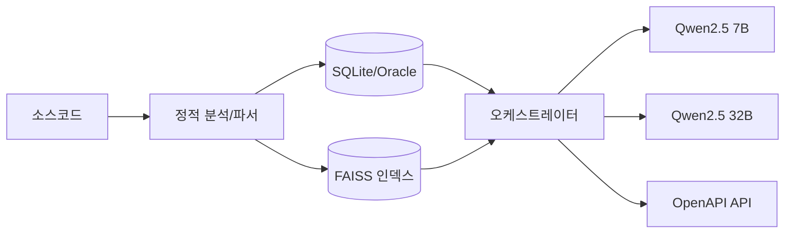

# 소스 분석·영향평가 에이전트 최종 PRD

## 1. 개요

- 목적: 대규모 레거시(Java/JSP/Spring/MyBatis/Oracle) 소스 정적 분석 및 자연어 질의응답/영향평가 제공
- 원칙: 코드/SQL 원문 미저장, 경로·라인·구조 기반 메타정보 저장
- 정책: 재현율 우선(누락 최소화), CONFIDENCE 추적, LLM 보강 로그 기록

## 2. 아키텍처

- **Phase 1 (메타정보 생성)**: 정적 파서 + LLM 보강 → SQLite/Oracle, FAISS 인덱스 저장
- **Phase 2 (오케스트레이터/RAG)**: LangChain/LangGraph + vLLM(Qwen2.5 7B 기본, 32B 폴백) → API 제공

## 3. 데이터 모델

- projects, files, classes, methods, sql_units, db_tables, db_columns 등
- edges: 호출·의존·참조 관계 저장
- joins, required_filters: 실제 조인 조건, 필수 필터 보관
- summaries, enrichment_logs, vulnerability_fixes 등 보강 정보 저장

## 4. 기술 스택

- Python 3.10+, FastAPI, LangChain/LangGraph
- JavaParser/Tree-sitter, JSQLParser/SQLGlot
- DB: SQLite(개발), Oracle 11g(운영), FAISS, Neo4j
- LLM: vLLM 기반 Qwen2.5 (7B/32B)
- 임베딩: BGE-m3, ko-sentence-transformers, codet5p-770m (이중 전략 권장)

## 5. 알고리즘

- Java/Spring: AST 분석 + 어노테이션 처리
- JSP/MyBatis: include, 동적 SQL superset 처리
- SQL: 조인·필수 필터 추출, PK/FK 매핑
- CONFIDENCE 산식: AST/Static/DB/LLM 가중 합산
- LLM guardrail: JSON 출력, temperature=0

## 6. API

- /query: 자연어 질의응답 (recall_priority 옵션 지원)
- /impact: 특정 아티팩트 영향도 분석
- /search: 구조/그래프 탐색

## 7. 품질·보안

- OWASP Top10 기반 취약점 탐지
- SQL Injection 패턴(MyBatis `${}`) 탐지
- 보안 로그 기록, 수정 제안 저장

## 8. 시각화

- Neo4j + Cytoscape.js/D3.js 그래프 시각화
- 코드 메트릭 차트 (LOC, 복잡도 등)

## 9. 테스트 기준

- 영향평가 재현율 ≥ 0.9, 정확도 ≥ 0.75
- SQL 조인/필터 식별 일치율 ≥ 0.85
- 100k LOC 분석 ≤ 30분
- API 응답 평균 2s(7B), 복잡 쿼리 ≤ 10s(32B)
