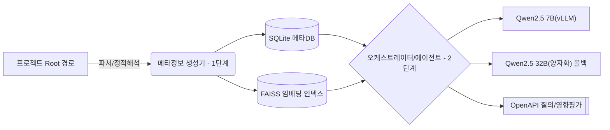

# 소스 분석·영향평가 에이전트 개발 계획 (v2.0)

**버전**: v2.0
**작성일**: 2025-08-26
**대상 환경**: 인터넷이 안되는 폐쇄망 온프레미스 서버, RHEL (A30 GPU 1장), Java 8, Python 3.10+, vLLM(Qwen2.5 7B/32B), Oracle 11g 사전정보 CSV 제공, 사용자는 Windows PC.

---

1. 1. 프로젝트 개요 및 목표

1.1. 1.1. 배경 및 핵심 목표

● 1.1.1. **배경**: JSP·Spring·Java·MyBatis·Oracle DB 기반 레거시/현행 시스템의 대규모 소스를 정적 분석하여 **정확하고 풍부한 메타정보**를 생성하고, 이를 기반으로 **자연어 질의/영향평가**를 제공합니다.
● 1.1.2. **핵심 목표**:
○ 1.1.2.1. (1단계) 원문 코드/SQL 미저장(경로/라인Range·구조만) 원칙 하에 메타정보 생성/저장 (재현율 우선(보수적 포괄 응답))
○ 1.1.2.2. (2단계) Qwen2.5 기반 RAG+오케스트레이터로 요약/탐색/영향평가 제공
○ 1.1.2.3. 대규모 소스/다국어(한국어/영어) 인식·검색, **성능·스토리지 효율** 및 **증분 분석** 지원
○ 1.1.2.4. **CONFIDENCE** 및 **LLM 보강 이력**(추론 전/후 신뢰도) 전구간 추적

1.1. 1.2. 용어 정의

● 1.2.1. **메타정보**: 코드/SQL로부터 추출/요약된 구조적·서술적 정보(원문 비저장)
● 1.2.2. **보강 이력**: LLM 전/후 비교 및 출처 모델/프롬프트/파라미터 기록
● 1.2.3. **보수적 포괄 응답**: 정확성-재현율 트레이드오프 시 재현율(누락 최소화) 우선. (영향평가시 정확성 보다는 누락이 없는게 우선)
● 1.2.4. **CONFIDENCE**: [0.0~1.0] 신뢰도. 1.0=확실, 0.5=정적 추정 등. 다이나믹 쿼리 등 정확한 분석이 어려운 경우 그 정확성의 정도에 따라 신뢰도 점수 산정.

1.1. 1.3. 사용자 스토리 (예시)

● 1.3.1. 개발자: “메소드 A 수정 시 영향받는 SQL/테이블/다른 메소드를 **빠짐없이** 보고 싶다.”
● 1.3.2. 데이터모델러: “ALL_* 코멘트가 부실/오류라서, 메타정보에 **소스 기반 의미 보강 코멘트**를 생성하고 싶다.”
● 1.3.3. "해약환급금 계산하는 소스 찾아줘"
● 1.3.4. 아키텍트: “원문 미저장 원칙을 지키면서도 **실제 조인 조건/필수 필터**(예: `DEL_YN <> 'N'`)를 추출해 RAG로 활용하고 싶다.”
● 1.3.5. 아키텍트: "월별 신계약 건수를 구하는 쿼리 개발해줘" 등과 같이 LLM이 자연어->SQL 자동 개발할 수 있도록 메타정보 구축.

---

1. 2. 시스템 아키텍처 및 데이터 모델

1.1. 2.1. 상위 아키텍처



● 2.1.1. 1단계: 정적 파이프라인(멀티스레드) + 선택적 LLM 보강 워커(동일 서버)
● 2.1.2. 2단계: 오케스트레이터(파이썬, LangChain or LangGraph) + RAG + vLLM 클라이언트(HTTP)
● 2.1.3. 저장소: SQLite(메타) Oracle 11g 전환 고려해 DDL 호환 설계, FAISS(벡터), Neo4j

1.1. 2.2. 데이터 모델 (SQLite 기준)

● 2.2.1. **원문 비저장 원칙**. 문자열 요약/코멘트는 별도 테이블로 분리하여 I/O 최소화.

```sql
-- 프로젝트/파일
CREATE TABLE projects (
  project_id INTEGER PRIMARY KEY,
  root_path TEXT NOT NULL,
  created_at TEXT, updated_at TEXT
);
CREATE TABLE files (
  file_id INTEGER PRIMARY KEY,
  project_id INTEGER, path TEXT, language TEXT,
  hash TEXT, loc INTEGER, mtime TEXT,
  FOREIGN KEY(project_id) REFERENCES projects(project_id)
);

-- 자바 구조
CREATE TABLE classes (
  class_id INTEGER PRIMARY KEY,
  file_id INTEGER, fqn TEXT, name TEXT,
  start_line INTEGER, end_line INTEGER,
  modifiers TEXT, annotations TEXT,
  FOREIGN KEY(file_id) REFERENCES files(file_id)
);
CREATE TABLE methods (
  method_id INTEGER PRIMARY KEY,
  class_id INTEGER, name TEXT, signature TEXT, return_type TEXT,
  start_line INTEGER, end_line INTEGER, annotations TEXT,
  FOREIGN KEY(class_id) REFERENCES classes(class_id)
);

-- MyBatis/SQL
CREATE TABLE sql_units (
  sql_id INTEGER PRIMARY KEY,
  file_id INTEGER, origin TEXT, mapper_ns TEXT, stmt_id TEXT,
  start_line INTEGER, end_line INTEGER, stmt_kind TEXT, -- select/insert/update/delete/procedure/function (SP/SF 포함)
  normalized_fingerprint TEXT, -- 원문 대신 구조 기반 지문
  FOREIGN KEY(file_id) REFERENCES files(file_id)
);

-- DB 사전(원 CSV)
CREATE TABLE db_tables (
  table_id INTEGER PRIMARY KEY,
  owner TEXT, table_name TEXT, status TEXT
);
CREATE TABLE db_columns (
  column_id INTEGER PRIMARY KEY,
  table_id INTEGER, column_name TEXT, data_type TEXT, nullable TEXT,
  FOREIGN KEY(table_id) REFERENCES db_tables(table_id)
);
CREATE TABLE db_pk (
  table_id INTEGER, column_name TEXT, pk_pos INTEGER,
  PRIMARY KEY(table_id, column_name),
  FOREIGN KEY(table_id) REFERENCES db_tables(table_id)
);

-- DB View 정보 (ALL_VIEWS.csv에서 로드)
CREATE TABLE db_views (
  view_id INTEGER PRIMARY KEY,
  owner TEXT, view_name TEXT, text CLOB -- 뷰 정의 SQL
);

-- 그래프(호출·의존·참조)
CREATE TABLE edges (
  edge_id INTEGER PRIMARY KEY,
  src_type TEXT, src_id INTEGER,
  dst_type TEXT, dst_id INTEGER,
  edge_kind TEXT, -- call, use_table, use_column, call_sql, calls_sp, references_view, write_table, extends, implements ...
  confidence REAL
);

-- 조인/필수 필터
CREATE TABLE joins (
  join_id INTEGER PRIMARY KEY,
  sql_id INTEGER,
  l_table TEXT, l_col TEXT, op TEXT,
  r_table TEXT, r_col TEXT,
  inferred_pkfk INTEGER, confidence REAL,
  FOREIGN KEY(sql_id) REFERENCES sql_units(sql_id)
);
CREATE TABLE required_filters (
  filter_id INTEGER PRIMARY KEY,
  sql_id INTEGER,
  table_name TEXT, column_name TEXT, op TEXT, value_repr TEXT, -- 'N', :param 등
  always_applied INTEGER, confidence REAL,
  FOREIGN KEY(sql_id) REFERENCES sql_units(sql_id)
);

-- 요약/코멘트/임베딩
CREATE TABLE summaries (
  summary_id INTEGER PRIMARY KEY,
  target_type TEXT, target_id INTEGER,
  summary_type TEXT, -- logic|vuln|perf|db_comment_suggestion
  lang TEXT, content TEXT, confidence REAL,
  created_at TEXT
);
CREATE TABLE enrichment_logs (
  enrich_id INTEGER PRIMARY KEY,
  target_type TEXT, target_id INTEGER,
  pre_conf REAL,
  post_conf REAL,
  model TEXT,
  prompt_id TEXT,
  params TEXT,
  created_at TEXT
);
CREATE TABLE chunks (
  chunk_id INTEGER PRIMARY KEY,
  target_type TEXT, target_id INTEGER,
  content TEXT, token_count INTEGER, hash TEXT,
  created_at TEXT
);
CREATE TABLE embeddings (
  chunk_id INTEGER PRIMARY KEY,
  model TEXT, dim INTEGER, faiss_vector_id INTEGER, created_at TEXT,
  FOREIGN KEY(chunk_id) REFERENCES chunks(chunk_id)
);
CREATE INDEX idx_edges_src ON edges(src_type, src_id);
CREATE INDEX idx_edges_dst ON edges(dst_type, dst_id);
CREATE INDEX idx_sql_units_file ON sql_units(file_id);
CREATE INDEX idx_joins_sql ON joins(sql_id);
CREATE INDEX idx_filters_sql ON required_filters(sql_id);
```

● 2.2.2. Oracle 11g 전환 가이드: INTEGER→NUMBER, TEXT→CLOB/VARCHAR2, BOOLEAN은 NUMBER(1)로 매핑, FK/INDEX 동일.

---

1. 3. 1단계: 메타정보 생성 및 저장

1.1. 3.1. 분석 대상 및 지원 언어/프레임워크

3.1.1. **지원 언어/프레임워크**: Java(8 호환), JSP, Spring Framework, MyBatis XML, SQL(Oracle 방언), PL/SQL, Python, JavaScript/TypeScript/React/Vue.js
● 3.1.2. **제안 기술 스택**:
○ 3.1.2.1. **백엔드 (핵심 로직 및 오케스트레이터)**:
- **언어**: Python 3.10+
- **웹 프레임워크**: FastAPI (OpenAPI, 고성능, 비동기 지원)
- **RAG/오케스트레이션**: LangChain 또는 LangGraph
- **정적 분석**:
· **Java AST**: JavaParser (또는 유사 라이브러리)
· **JSP/MyBatis/SQL**: ANTLR 기반 커스텀 파서, JSQLParser (PL/SQL)
· **Python AST**: Python 내장 `ast` 모듈
○ 3.1.2.2. **데이터베이스**:
- **메타데이터**: SQLite (개발/테스트) -> Oracle 11g (운영)
- **벡터 스토어**: FAISS
- **그래프 데이터베이스**: Neo4j Community Edition (무료 라이선스 준수)
○ 3.1.2.3. **LLM 서빙**: vLLM
● 3.1.3. **분석 대상 소스 관리**: PROJECTS 폴더 하위에 프로젝트명 폴더에 저장되며 1단계 메타정보 생성 및 2단계 검색 단계에서 활용. CLOB 성격의 데이터는 PROJECTS 폴더 내 정보를 이용. (e.g. .\PROJECT\sample-app)
● 3.1.4. **스토리지 효율**: 메타 정보에 원문 코드/SQL 저장 금지(경로·라인 범위·파생 구조만 저장)
● 3.1.5. **DB 사전 CSV**: PROJECT폴더 하위 프로젝트명 폴더 아래 DB_SCHEMA 폴더(e.g. .\PROJECT\sample-app\DB_SCHEMA)에 ALL_TABLES, ALL_TAB_COLUMNS, ALL_TAB_COMMENTS, ALL_COL_COMMENTS, PK 정보(테이블별 PK컬럼) CSV 파일 업로드 (사용자 수작업)
● 3.1.6. **메타정보 활용**: 메타정보(요약, 호출·의존 그래프, 실제 조인·필수 필터(DEL_YN='N'등))를 저장하고 2단계에서 사용.
● 3.1.7. **임베딩 인덱스 및 RAG 기반 질의응답 평가 API**: 임베딩 인덱스(FAISS) 및 RAG, 오케스트레이터 기반 질의응답평가 API
● 3.1.8. **다국어 지원**: 다국어(ko/en), 소스코드 특화된 모델을 사용하여 검색 및 응답

1.1. 3.2. 입력 및 처리 개요

● 3.2.1. **입력**: 프로젝트 Root(매개변수), 파일 필터: `*.java, *.jsp, *.xml(MyBatis), *.properties`, DB 사전 CSV: `ALL_TABLES, ALL_TAB_COLUMNS, ALL_TAB_COMMENTS, ALL_COL_COMMENTS, PK정보`
● 3.2.2. **구문/의미 분석 (다중 언어 및 프레임워크 지원)**
○ 3.2.2.1. **Java / Spring Framework**: JavaParser를 활용한 Java AST 분석을 기반으로, `@RestController`, `@GetMapping`, `@Autowired` 등 Spring의 핵심 어노테이션을 심층 분석하여 HTTP API 엔드포인트, 서비스 간 의존성(DI) 등 프레임워크 수준의 컨텍스트를 추출하고 의존성 그래프를 고도화합니다.

○ 3.2.2.2. **JSP, MyBatis, SQL**: 다른 언어와의 연관 관계 분석을 강화합니다. ANTLR 기반 커스텀 파서를 활용한 JSP 태그, 스크립틀릿, JSTL 등 구문 분석 및 정보 추출. JSP 페이지 간 포함 관계 (`<jsp:include>`) 및 백엔드 Java 코드(Servlet, Spring Controller)와의 연동 관계 분석 및 `edges` 테이블 저장.
- **의존성 연결**: Java(JDBC `CallableStatement`) 또는 MyBatis(`<select statementType="CALLABLE">`)에서 SP/SF를 호출하는 구문을 탐지합니다. 탐지된 호출 정보를 바탕으로, 해당 Java 메소드나 MyBatis 쿼리와 SP/SF 간의 `calls_sp` 의존성 관계를 `edges` 테이블에 기록하여 전체 호출 흐름을 연결합니다.
● 3.2.3. **요약 생성 및 보안 취약점 분석 (고도화)**
○ 3.2.3.1. **로직/성능 요약**: 정적 규칙의 신뢰도가 떨어지는 경우 LLM 보강을 통해 로직, 성능 이슈 가능성에 대한 요약을 생성.
○ 3.2.3.2. **결과 통합**: 모든 로직 분석 결과는 `summaries` 테이블에 통합 저장되어 RAG 파이프라인에서 일관성 있게 활용됩니다.
● 3.2.4. **정교한 코드 품질 메트릭 분석**
● 3.2.5. **데이터 흐름 분석 (Source to Sink 추적)**: 코드 내 데이터의 이동 경로를 정적으로 추적하여, "어떤 데이터가 어디에서 와서 어디로 흘러가는지"를 분석합니다. AST와 심볼 테이블을 기반으로 메소드 내 데이터 흐름을 분석하며, 식별된 데이터 흐름(Source to Sink)은 메타정보에 저장됩니다. 이는 정밀 영향 평가 및 Taint Analysis(오염원 분석) 탐지에 활용됩니다.
● 3.2.6. **호출·의존 그래프 고도화**: Java 메서드 호출 및 MyBatis SQL 유닛 간 `<include>`, `<sql>` 참조 관계 등 명시적인 의존성 관계를 파서에서 추출하여 `edges` 테이블에 저장. 메소드↔메소드 (Java 메서드 호출), MyBatis SQL 유닛 간 `<include>` 및 `<sql>` 참조 관계, 메소드↔ SQL, SQL↔테이블 /컬럼(읽기/쓰기) 방향성/가중치/CONFIDENCE 저장. 신뢰도가 낮은 경우만 더 정교한 방법으로 처리하도록 구상.
● 3.2.7. **실제 조인 조건·필수 필터 추출**: JOIN: `ON A.col = B.col`/조인 연쇄/서브쿼리 조인 조건 파악. 필수 필터: 상수/파라미터 WHERE 항 중 **동적 태그 밖** 또는 **항상 포함되는 조건**을 마크. MyBatis 동적 SQL은 ‘**최대 포함 변형**’(superset) 분석으로 **누락 최소화**.
● 3.2.8. **DB 사전 보강 코멘트 생성 (LLM 기반)**: 각 데이터베이스 컬럼에 대해, 소스 코드 전체에서 해당 컬럼을 사용하는 모든 SQL 쿼리와 Java 메소드를 역추적하여 종합적인 사용 맥락을 메타정보에 수집. 수집된 실제 사용 맥락을 근거로, LLM에게 해당 컬럼의 역할과 의미를 설명하는 고품질의 한글 코멘트를 생성(별도 필드)하도록 요청합니다. 생성된 코멘트 제안은 `summaries` 테이블에 `db_comment_suggestion` 타입으로 저장.
● 3.2.9. **메타정보 생성 작업의 선택적 실행 및 대상 지정 기능 확장**: 특정 폴더 또는 특정 파일을 지정하여 분석을 수행하는 기능 구현.
● 3.2.10. **원문 비저장 원칙**: 경로/라인Range/시그니처/정규화 토큰/해시만 저장. 변동분만 인식할 수 있도록 **암호학적 해시로 변경 추적**.

1.1. 3.3. 에러 및 신뢰도 정책

● 3.3.1. **파서 불가/모호 구문**: `confidence ≤ 0.5`로 표시, LLM 보강 시도 후 `llm_confidence` 필드에 반영
● 3.3.2. **동적 SQL/리플렉션/프록시**: **낮은 신뢰도**로 표기하고 영향평가 시 **포괄 확장**

1.1. 3.4. 성능 및 병렬화 (파일 단위 멀티스레드, 증분 분석)

● 3.4.1. **파일 단위 멀티스레드 파싱**, 대용량 XML 스트리밍 파서 구현.
● 3.4.2. **증분 분석**: 파일 해시/mtime 비교를 통한 증분 분석 및 그래프 ‘국소’ 재계산 기능 구현.

1.1. 3.5. 산출물 (저장)

● 3.5.1. **SQLite 스키마(요약)** + FAISS 인덱스 파일
● 3.5.2. **코드/SQL 원문 없음**, 요약/구조/참조/라인Range만 유지

---

1. 4. 2단계: 질의응답 및 영향평가

1.1. 4.1. 목표 및 정책

● 4.1.1. **자연어 질의**: **파일·메소드·SQL 요약/탐색/영향도 분석**
● 4.1.2. **재현율 우선**: 누락 최소화(과포함 허용), 결과에 CONFIDENCE/근거·라인Range 제시
● 4.1.3. **모델**: 기본 **Qwen2.5 7B**, 복잡도/불확실성↑ 시 **32B 양자화 폴백**

1.1. 4.2. 오케스트레이터 플로우 (Advanced RAG)

● 4.2.1. **의도 분류**: 사용자의 자연어 질의 의도를 요약, 탐색, 영향 분석 등으로 정확하게 분류하는 로직 구현.
● 4.2.2. **초기 검색 (Retrieval)**: Faiss 인덱스를 사용해 1차적으로 관련성이 높은 증거 후보군을 신속하게 검색합니다.
● 4.2.3. **증거 확장 (Multi-hop Reasoning)**: 초기 검색 결과에서 핵심 엔티티(메서드명, 클래스명 등)를 추출하고, 이를 새로운 검색어로 사용하여 2차, 3차 검색을 반복 수행하며 관련 증거를 확장 수집합니다. (최대 홉 수 조절 가능) 이를 통해 단일 검색으로는 찾기 어려운, 여러 단계에 걸친 관계를 추론할 수 있습니다.
● 4.2.4. **정밀 재랭킹 (Re-ranking)**: 확장된 증거 후보군 전체를 대상으로, 원본 질문과의 관련성을 Cross-Encoder 모델(예: `monologg/koelectra-base-v3-discriminator` 또는 `BAAI/bge-reranker-base`)을 사용해 정밀하게 재계산합니다. 관련성이 높은 순으로 증거를 정렬하여 LLM에 전달할 최종 증거 목록을 선별합니다.
● 4.2.5. **모델 선택**: 최종 증거의 평균 신뢰도(`avg_conf`)와 개수를 바탕으로, 비용 효율적인 모델(Qwen2.5 7B) 또는 고성능 폴백 모델(Qwen2.5 32B)을 동적으로 선택합니다.
● 4.2.6. **프롬프트 엔지니어링 및 답변 생성**: 구조화된 시스템 프롬프트를 사용하여 LLM에게 명확한 역할과 답변 형식(Markdown, 출처 표기 등)을 지시합니다. 정제된 최종 증거를 첨부하여 LLM이 환각(Hallucination) 없이, 근거에 기반한 답변을 생성하도록 유도합니다.
● 4.2.7. **로그**: 전체 파이프라인의 각 단계(검색, 확장, 재랭킹)에서 사용된 파라미터, 중간 결과, 최종 답변, 모델 정보 등을 상세히 기록하여 추적성과 디버깅 용이성을 확보합니다.

1.1. 4.3. API (OpenAPI 요약)

```yaml
openapi: 3.0.3
info: {title: Source Q&A/Impact API, version: 1.0.0}
paths:
  /query:
    post:
      summary: 자연어 질의응답(요약/탐색/영향)
      requestBody:
        content:
          application/json:
            schema:
              type: object
              properties:
                project_root: {type: string}
                question: {type: string}
                recall_priority: {type: boolean, default: true}
                k: {type: integer, default: 20}
                max_hops: {type: integer, default: 2}
                model_pref: {type: string, enum: [auto, qwen2.5-7b, qwen2.5-32b-quant], default: auto}
      responses:
        '200': {description: OK}
  /impact:
    post:
      summary: 특정 아티팩트(파일/메소드/SQL) 영향도 분석
  /search:
    post:
      summary: 구조/그래프 기반 탐색(필터링)
```

● 4.3.1. **자연어 질의응답**: `/query` API 엔드포인트 구현. FastAPI를 사용하여 `project_root`, `question`, `recall_priority`, `k`, `max_hops`, `model_pref`를 입력으로 받는 비동기 POST 엔드포인트를 구현합니다.
● 4.3.2. **특정 아티팩트 영향도 분석**: `/impact` API 엔드포인트 구현. FastAPI를 사용하여 특정 아티팩트(파일/메소드/SQL)의 ID와 유형을 입력으로 받아 영향도를 분석하는 비동기 POST 엔드포인트를 구현합니다.
● 4.3.3. **구조/그래프 기반 탐색**: `/search` API 엔드포인트 구현. FastAPI를 사용하여 필터링 조건을 입력으로 받아 구조/그래프 기반 탐색을 수행하는 비동기 POST 엔드포인트를 구현합니다.

---

1. 5. 알고리즘 및 규칙

1.1. 5.2. 조인 및 필수 필터 규칙

● 5.2.1. **조인**: AST에서 `Join` 노드 수집, `A.col=B.col` 등 **동치 조건** 우선, 비동치도 저장(op)
● 5.2.2. **필수 필터**: MyBatis 동적 태그 영역 **외부의 WHERE 조건** 또는 모든 분기 공통 조건 → `always_applied=1`
● 5.2.3. **실관계 vs 인조 PK**: PK CSV와 무관하게 **빈도/위치 기반** 실조인 후보 추정, `inferred_pkfk=1`

1.1. 5.3. CONFIDENCE 산식 (권장)

```
conf = w_ast*q_ast + w_static*q_static + w_db*q_db + w_llm*q_llm
- 동적 SQL/리플렉션/표현식 복잡도는 감점
- LLM 보강 시 post_conf = min(1.0, conf + delta(model, evidence))
- 전/후 및 근거를 enrichment_logs에 기록
```

---

1. 6. 임베딩 및 RAG 상세

1.1. 6.1. 임베딩

● 6.1.1. **모델**: 다국어 지원 및 소스코드에 특화된 임베딩 모델을 사용합니다. 특히 한국어 및 소스코드의 의미를 효과적으로 벡터화하기 위해 `BAAI/bge-m3` (한국어 최적화 버전) 또는 `jhgan00/ko-sentence-transformers`와 같이 한국어에 특화된 모델, 또는 코드 임베딩에 강점을 가진 모델(예: `Salesforce/codet5p-770m-multi`)을 검토합니다. `sentence-transformers/all-MiniLM-L6-v2`는 영어 기반이므로 한국어 및 소스코드 특화 모델로 대체하거나 추가 파인튜닝을 고려합니다. **(대안: `OpenAIEmbeddings`는 오프라인/무료 라이선스 기준 미충족으로 제외. `BAAI/bge-m3` 한국어 최적화 버전 또는 `Salesforce/codet5p-770m-multi`를 주요 대안으로 고려)**. 모델은 오프라인 환경에 배포됩니다.
● 6.1.2. **인덱스**: `faiss-cpu`를 사용하여 메모리 효율적인 벡터 인덱스를 구축하고(GPU도 선택적으로 사용가능하도록), 빠른 유사도 검색을 수행합니다. 파일명은 `faiss.index`입니다.
● 6.1.3. **청킹**: 분석된 메소드, SQL 구문, 요약 등을 의미 있는 단위(300-600 토큰)로 분할하여 검색 정확도를 높입니다.

1.1. 6.2. 검색

● 6.2.1. **검색 방식**: 기존의 키워드 기반 BoW(Bag-of-Words) 검색 방식과 **의미론적 검색(Semantic Search)**를 병용하고 REORDER.
● 6.2.2. **아키텍처**: 다국어 지원, 소스코드에 특화된 임베딩 라이브러리(예: LangChain의 `HuggingFaceInstructEmbeddings`와 같은 인터페이스를 활용하며, 실제 임베딩은 로컬 모델로 대체)를 통해 텍스트를 고차원 벡터로 임베딩하고, `Faiss` 벡터 데이터베이스를 사용하여 유사도 기반의 빠르고 정확한 검색을 수행합니다.

---

1. 7. 성능 및 용량 계획 (A30, 단일 서버)

7.1. **파서/ETL**: CPU 다코어 활용(멀티스레드); LLM 요청은 배치/비동기
7.2. **메모리**: SQLite WAL 모드, 인덱스 일괄 생성, 요약/코멘트 분리 저장으로 I/O 절감
7.3. **추정(예)**: 1M LOC, SQL 5k개 기준
● 7.3.1. **SQLite DB**: 1~3GB
● 7.3.2. **FAISS**: 1~2GB(임베딩 dim/압축에 의존)

---

1. 8. 배포 및 운영

1.1. 8.1. 배포 환경

● 8.1.1. **오프라인 설치**: 모든 Python 패키지(wheelhouse), Java 라이브러리(JAR 번들), LLM 및 임베딩 모델 파일, Docker 이미지를 사전에 다운로드하여 내부망 저장소에 보관하고, 이를 참조하여 오프라인 환경에서 설치 및 배포를 수행합니다. 외부 네트워크 접근 없이 모든 구성 요소가 설치 및 실행 가능하도록 패키징 전략을 수립합니다.
● 8.1.2. **컨테이너화**: Docker를 사용하여 애플리케이션 및 모든 종속성을 컨테이너화하여 배포 환경의 일관성을 보장하고 관리를 용이하게 합니다.

1.1. 8.2. 설정

● 8.2.1. **`config.yaml`**: 모델 엔드포인트, 임베딩 모델, 경로, 임계치 설정

1.1. 8.3. 증분 처리

● 8.3.1. **변경분만 재분석 가능하도록 개발**

1.1. 8.4. 로그 및 모니터링

● 8.4.1. **질의 커버리지, 모델 사용 비율(7B/32B), 평균 지연, 실패율 로깅**
● 8.4.2. **모니터링 시스템**: Prometheus와 Grafana를 통합하여 시스템 성능 지표, LLM 사용량, API 응답 시간 등을 시각화하고 모니터링합니다.

---

1. 9. 보안 및 컴플라이언스

● 9.1. **원문 코드/SQL 미저장**(경로/라인Range/해시만)
● 9.2. **내부망 전용**, 외부 통신 차단
● 9.3. **쿼리/응답 로깅 시 민감 정보 제거**(경로/라인Range만 기록)

---

1. 10. 테스트 및 수용 기준 (샘플)

● 10.1. **정확도/재현율**: 샘플 200개 영향평가 케이스에서 **재현율 ≥ 0.9**, 정확도 ≥ 0.75
● 10.2. **조인/필수 필터**: 랜덤 100 SQL에서 수동 라벨과 일치율 ≥ 0.85
● 10.3. **성능**: 100k LOC 프로젝트 전체 분석 ≤ 30분(서버 스펙 기준, LLM 보강 제외)
● 10.4. **API**: 평균 응답 2s(7B), 복잡 쿼리 32B 폴백 ≤ 10s(캐시 적중 시 5s 이하)

---

1. 11. 리스크 및 대응

● 11.1. **동적 SQL 다양성** → 최대 포함(superset) 전략 + 보수적 확장
● 11.2. **LLM 응답 일관성** → 근거 제시 강제, 스스로 검증 프롬프트, 32B 폴백

---

1. 12. 부록

1.1. 12.1. 오케스트레이터 의사코드

```python
def answer(question, project, recall_priority=True):
    intent = classify(question)
    plan = make_plan(intent, question)
    seeds = structured_search(project, plan.filters)
    hops = expand_call_graph(seeds, max_hops=plan.hops, recall_first=True)
    docs = vector_search(project, question, seeds+hops, k=plan.k)
    evidence = rank_and_merge(docs, seeds, hops)
    model = choose_model(evidence, base="qwen2.5-7b", fallback="qwen2.5-32b-quant")
    draft = llm_generate(model, question, evidence, force_citations=True)
    if recall_priority and is_low_recall(draft, evidence):
        plan = widen(plan); return answer(question, project, recall_priority)
    return finalize(draft, evidence)
```

1.1. 12.2. 프롬프트 스케치 (ko/en)

● 12.2.1. **지시**: “다음 근거만으로 답하되, 누락을 줄이기 위해 관련 항목을 **포괄**하라. 각 항목에 경로/라인Range/CONFIDENCE를 병기하라.”
● 12.2.2. **안전장치**: “원문 코드/SQL을 추정해 재현하지 마라. 제공된 요약/구조만 사용하라.”

1.1. 12.3. 품질 및 유지보수 가이드

● 12.3.1. **해시 기반 변경 감지**와 ‘국소’ 그래프 재계산
● 12.3.2. **LLM 보강은 큐 기반 비동기**(시간제한/예산제한 설정)

1. ※ 향후 개발 내역

1.1. 1. 분석 대상 및 언어/프레임워크 확장

● 1. 분석 대상 및 언어/프레임워크 확장
○ 1.1. Oracle Stored Procedure 및 Stored Function 분석 기능 확장
- Python `antlr-plsql` 라이브러리 활용 (ANTLR, Docker, Java 필요)을 통한 PL/SQL 문법 기반 AST 생성 및 정보 추출.

- **PL/SQL 파싱**: `SP/` 디렉토리의 `.sql` 파일들을 `antlr-plsql` 및 JSQLParser를 통해 파싱하여, 프로시저/함수의 이름, 파라미터, 그리고 내부에서 CRUD 작업을 수행하는 테이블 및 뷰 목록을 추출합니다.
- 1.1.2. SP/SF 간 호출 관계 (`calls_sp`) 및 다른 아티팩트(예: Java 메서드)와의 의존성 분석 및 `edges` 테이블 저장.
○ 1.2. DB 사전 확장
- 1.2.1. 프로젝트 폴더 DB_SCHME폴더에 ALL_VIEWS(뷰소스는 부명칭을 화일명으로 해서 별도 화일), ALL_PROCEDURES, SP/SF 소스는 SP/SF명을 화일명으로 해서 별도 업로드
○ 1.3. 확장된 언어 및 프레임워크 지원
- 1.3.1. Python: 파이썬 표준 라이브러리인 `ast` 모듈을 사용하여 소스 코드를 AST로 파싱합니다. 클래스, 함수 정의, 임포트 구문 등을 추출하여 구조적 정보를 DB에 저장합니다.
- 1.3.2. JavaScript/TypeScript/React/Vue.js (아키텍처 정의): 컴포넌트, props, state, `import`/`require` 구문 등을 분석하여 웹 프론트엔드 애플리케이션의 구조와 의존성을 파악하고 결과를 DB에 통합합니다.
○ 1.4. 프론트엔드 프레임워크 특화 분석 기능 (TypeScript, React, Vue.js) 확장
- 1.4.1. `tsc`, ESLint, FTA(Fast TypeScript Analyzer) 등 도구 통합을 통한 TypeScript 타입 정보, 코드 품질 및 스타일 분석.
- 1.4.2. React 및 Vue.js Best Practices, 접근성, JSX/Vue 구문 분석 및 컴포넌트 간 의존성, 데이터 흐름 분석.

● 2. 품질 및 보안 분석 고도화
○ 2.1. 메타 정보에 취약점·오류/성능 이슈 가능성 포함.
○ 2.2. 보안 취약점 분석 (OWASP Top 10 초점)
- 2.2.1. SAST 통합: Java 코드에 대해 정적 분석 보안, SQL Injection, 보안 미흡 설정, 취약한 접근 제어 등 다양한 잠재적 보안 취약점을 탐지합니다. 탐지된 내용은 신뢰도와 함께 `summaries` 테이블에 `vuln_*` 타입으로 저장됩니다.
- 2.2.2. 커스텀 규칙 (SQL Injection): MyBatis 매퍼 파일(`*.xml`) 분석 시, `${...}`와 같이 파라미터가 안전하게 처리되지 않는 패턴을 탐지하여 SQL Injection 취약점을 식별하고 보고합니다.
○ 2.3. 정교한 코드 품질 메트릭 분석 기능 확장
- 2.3.1. PMD의 중복 코드 탐지(CPD), 순환 복잡도 등 다양한 코드 품질 지표 분석 및 `duplicates`, `duplicate_instances` 테이블 스키마 정의 및 저장.
○ 2.4. 결과 저장 및 시각화
- 2.4.1. 분석된 메트릭(예: 복잡도)은 `code_metrics` 테이블에, 중복 코드 정보는 `duplicates` 및 `duplicate_instances` 테이블에 정량적으로 저장됩니다.
- 2.4.2. 위반 사항은 `summaries` 테이블에 `quality_*` 타입으로 저장되며, 대시보드의 '코드 품질 위반 유형' 차트를 통해 시각적으로 확인할 수 있습니다.

● 3. LLM 활용 및 기타 기능
○ 3.1. LLM 기반 지능형 분석 및 저장
- 3.1.1. 각 소스 및 쿼리에서 오류 발생 가능 부분, 테이블 설계 문제점 등을 LLM으로 지능적으로 파악하여 별도 메타 테이블에 저장.
- 3.1.2. LLM 기반 분석 작업의 선택적 실행 및 특정 폴더/파일 지정 기능 구현.
○ 3.2. 수정 전/후 비교를 통한 변경 내역 요약 및 수정에 대한 영향에 대한 지능적 분석 기능 개발.

● 4. UI/시각화 대시보드
○ 4.1. **의존성 그래프 시각화**:
- 4.1.1. 파일, 클래스, 메소드, SQL 유닛 등 시스템의 모든 주요 구성 요소를 노드(Node)로 표현합니다.
- 4.1.2. 각 구성 요소 간의 호출 및 참조 관계(call, use_table 등)를 엣지(Edge)로 시각화합니다.
- 4.1.3. 사용자는 그래프를 통해 전체 시스템의 구조와 특정 컴포넌트의 연결 관계를 한눈에 파악할 수 있습니다. (줌, 이동, 노드 클릭 등 인터랙션 지원)
○ 4.2. **코드 메트릭 차트**:
- 4.2.1. 파일별 코드 라인 수(LOC)와 같은 기본적인 코드 메트릭을 막대 차트로 시각화합니다.
- 4.2.2. 이를 통해 코드베이스의 복잡도 분포나 규모가 큰 파일을 쉽게 식별할 수 있습니다.