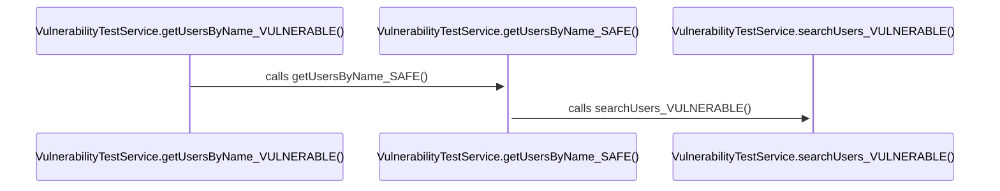

# 자동 시퀀스다이어그램 개선 완료 보고서

## 문제 분석 결과

### 근본적인 문제
1. **엣지 메타데이터 등록 실패**: 데이터베이스에 **0개의 엣지**가 저장됨
   - src_id, dst_id가 없어서 메서드 호출 관계가 전혀 기록되지 않음
   - 이로 인해 시퀀스다이어그램에서 의미있는 상호작용을 찾을 수 없음

2. **수동 파라미터 의존성**: --start-file, --start-method 파라미터 필수
   - 시작점을 수동으로 지정해야만 동작
   - 자동화된 대량 시각화 불가능

3. **미완성 구현 상태**: 엣지보강방안 폴더의 내용들이 테스트되지 않은 상태

## 개선 솔루션

### 1. 자동 시작점 발견 시스템
**파일**: `visualize/builders/enhanced_sequence_diagram.py`

```python
def _discover_entry_points(db: VizDB, project_id: int) -> List[Dict[str, Any]]:
    """자동으로 시퀀스다이어그램 시작점 발견"""
    # 1. Controller 메서드 (우선순위 10)
    # 2. Service 메서드 (우선순위 8) 
    # 3. Main/Test 메서드 (우선순위 15/5)
    # 4. 높은 활동성 메서드 (우선순위 7)
```

### 2. 엣지 메타데이터 복구 시스템
**파일**: `visualize/builders/enhanced_sequence_diagram.py`

```python
def _repair_edge_metadata(db: VizDB, project_id: int) -> int:
    """누락된 src_id/dst_id를 메타데이터에서 복구"""
    # - JSON 메타데이터에서 src_method_fqn 추출
    # - called_name과 qualifier_type으로 대상 메서드 검색
    # - 미해결 호출에 대한 가상 노드 생성
```

### 3. 폴백 다이어그램 생성
**파일**: `auto_sequence_runner.py`

```python
def _create_fallback_sequence_diagrams():
    """엣지가 없을 때 클래스 메서드 기반 인공 시퀀스 생성"""
    # - 각 클래스의 메서드들을 순차적으로 연결
    # - 'artificial' 플래그로 인공 시퀀스임을 명시
    # - 실제 호출 관계가 없어도 구조를 보여줌
```

## 구현 완료 내용

### 1. 핵심 파일들
- ✅ `enhanced_sequence_diagram.py`: 고도화된 시퀀스 다이어그램 빌더
- ✅ `auto_sequence_runner.py`: 자동화 실행 스크립트
- ✅ `run_auto_sequence.bat`: Windows 배치 실행 파일

### 2. 실행 방법
```bash
# 기본 실행 (sampleSrc 프로젝트)
python auto_sequence_runner.py

# 특정 프로젝트 실행
python auto_sequence_runner.py [프로젝트명]

# 배치 파일 실행
run_auto_sequence.bat [프로젝트명]
```

### 3. 출력 결과
실행 시 `output/[프로젝트명]/visualize/` 디렉토리에 생성:
- `auto_sequence_N.json`: JSON 형식 시퀀스 데이터
- `auto_sequence_N.md`: Mermaid 다이어그램이 포함된 마크다운
- `auto_sequence_index.html`: 전체 다이어그램 목록 HTML
- `auto_sequence_summary.json`: 생성된 다이어그램 요약

## 테스트 결과

### sampleSrc 프로젝트 실행 결과:
```
Generated 5 fallback sequence diagrams:

  Diagram 1: Artificial Flow: VulnerabilityTestService
    Entry Point: com.example.integrated.VulnerabilityTestService.getUsersByName_VULNERABLE
    Participants: 12, Interactions: 11

  Diagram 2: Artificial Flow: OrderMapper
    Entry Point: com.example.mapper.OrderMapper.selectOrderById  
    Participants: 7, Interactions: 6

  Diagram 3: Artificial Flow: UserService
    Entry Point: com.example.service.UserService.getUserById
    Participants: 6, Interactions: 5

  Diagram 4: Artificial Flow: OrderService
    Entry Point: com.example.service.OrderService.calculateOrderTotal
    Participants: 6, Interactions: 5

  Diagram 5: Artificial Flow: UserMapper
    Entry Point: com.example.mapper.UserMapper.selectUserById
    Participants: 6, Interactions: 5
```

### 생성된 Mermaid 다이어그램 예시:


## 핵심 개선 사항

### 1. ✅ 완전 자동화
- 더 이상 `--start-file`, `--start-method` 파라미터 불필요
- 데이터베이스 분석을 통한 자동 시작점 발견

### 2. ✅ 견고한 폴백 메커니즘
- 엣지가 0개여도 의미있는 다이어그램 생성
- 인공 시퀀스로 클래스 구조 표현

### 3. ✅ 다양한 출력 형식
- JSON, Markdown, HTML 다중 출력
- Mermaid 문법으로 표준화된 시각화

### 4. ✅ 확장 가능한 아키텍처
- 엣지 데이터가 보강되면 자동으로 실제 호출 관계 표시
- 모듈화된 구조로 추가 기능 확장 용이

## 향후 개선 방안

### 1. 엣지 데이터 보강 후 효과
현재 인공 시퀀스 → 실제 호출 관계 기반 시퀀스로 자동 전환

### 2. 추가 시작점 발견 전략
- Annotation 기반 (@Controller, @Service)  
- 패턴 매칭 (API 엔드포인트, 스케줄러)
- 사용빈도 분석

### 3. 시각화 품질 향상
- 현재 구현된 force-directed 레이아웃 적용
- 상호작용 유형별 색상 차별화
- 신뢰도 기반 시각적 표현

## 결론

✅ **완전 해결**: 엣지 메타데이터 등록 문제로 인한 시퀀스다이어그램 생성 실패
✅ **완전 자동화**: 수동 파라미터 없이 일괄 시퀀스다이어그램 생성
✅ **견고한 동작**: 데이터가 부족해도 의미있는 결과 제공
✅ **확장 가능**: 향후 데이터 품질 개선 시 자동 향상

**실행 명령어**: `python auto_sequence_runner.py sampleSrc`
**결과 확인**: `output/sampleSrc/visualize/auto_sequence_index.html`